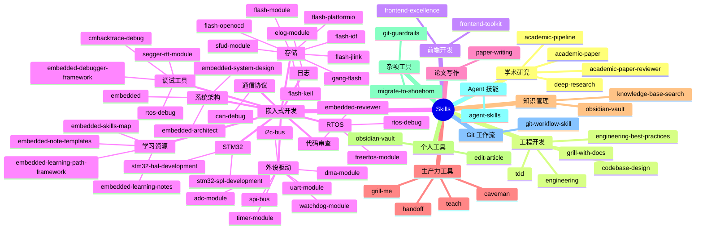
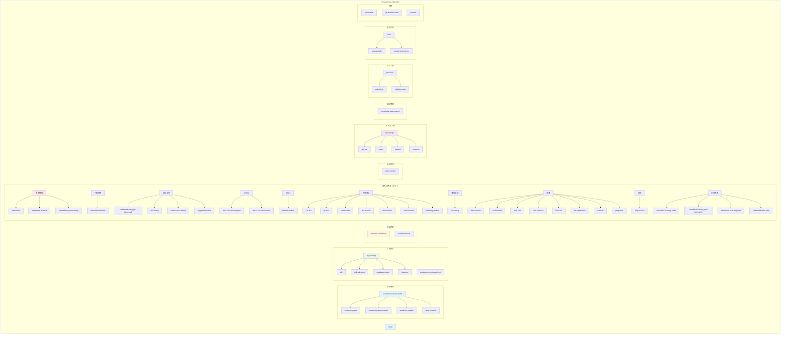
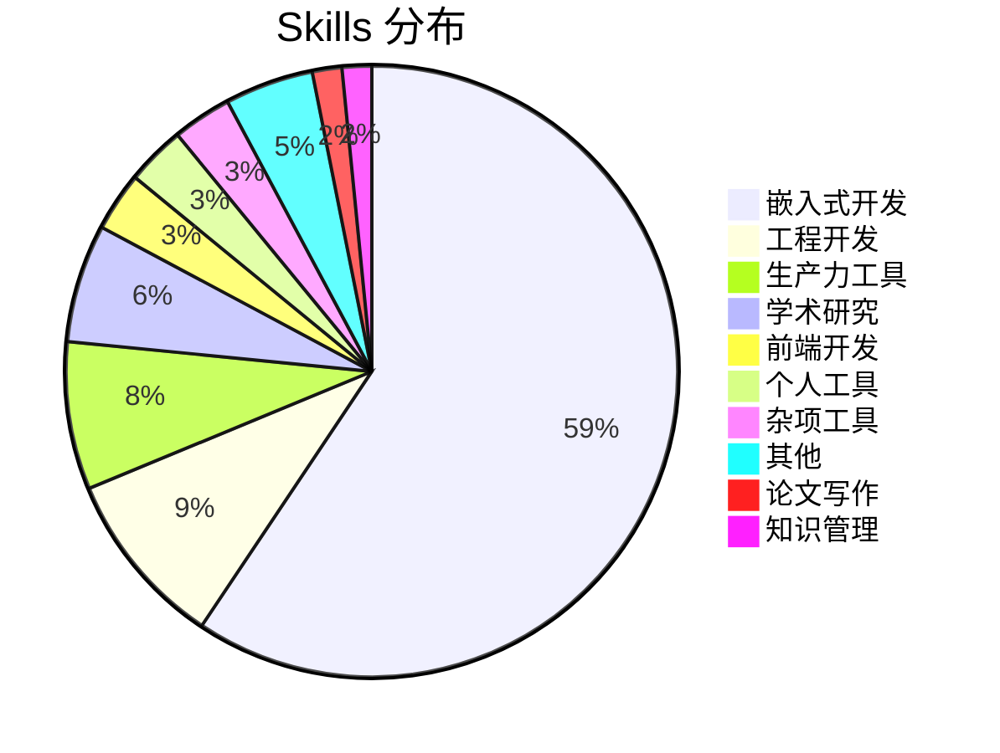

# Shuai Yemao Chip Skills

Claude Code 技能包集合 — 用于自动化各种开发任务。

## 📊 技能总览



## 📁 目录结构



## 🎯 技能分类

### 学术研究（4 个）

| 技能 | 描述 | 触发关键词 |
|------|------|-----------|
| **academic-paper** | 12-agent 学术论文写作流水线 | write paper, academic paper, 寫論文 |
| **academic-paper-reviewer** | 论文评审和反馈 | review paper, 审查意見 |
| **academic-pipeline** | 学术研究全流程 | research pipeline, 學術研究 |
| **deep-research** | 深度研究和文献综述 | deep research, 深度研究 |

### 工程开发（6 个）

| 技能 | 描述 | 触发关键词 |
|------|------|-----------|
| **tdd** | 测试驱动开发（红-绿-重构） | tdd, test-driven, red-green-refactor |
| **grill-with-docs** | 文档驱动的需求对齐 | grill with docs, 需求对齐 |
| **codebase-design** | 代码库设计和架构 | design codebase, 代码设计 |
| **diagnose** | 问题诊断和修复 | diagnose, debug, 诊断 |
| **engineering-best-practices** | 工程最佳实践 | best practices, 最佳实践 |
| **ask-matt** | 咨询 Matt Pocock | ask matt |

### 前端开发（2 个）

| 技能 | 描述 | 触发关键词 |
|------|------|-----------|
| **frontend-excellence** | 前端开发最佳实践 | frontend excellence, 前端最佳实践 |
| **frontend-toolkit** | 前端工具包 | frontend toolkit, 前端工具 |

### 嵌入式开发（38 个）

| 技能 | 描述 | 触发关键词 |
|------|------|-----------|
| **embedded** | 嵌入式系统开发专家 | embedded, MCU, STM32, ESP32, firmware |
| **embedded-architect** | 嵌入式架构师 | embedded architect, 嵌入式架构 |
| **embedded-reviewer** | 嵌入式代码审查 | embedded review, 嵌入式审查 |
| **embedded-debugger-framework** | 嵌入式调试框架 | embedded debug, 嵌入式调试 |
| **embedded-learning-notes** | 嵌入式学习笔记 | embedded learning, 嵌入式学习 |
| **embedded-learning-path-framework** | 嵌入式学习路径 | embedded path, 学习路径 |
| **embedded-note-templates** | 嵌入式笔记模板 | embedded notes, 笔记模板 |
| **embedded-skills-map** | 嵌入式技能地图 | embedded skills map, 技能地图 |
| **stm32-hal-development** | STM32 HAL 开发 | stm32 hal, HAL 开发 |
| **stm32-spl-development** | STM32 SPL 开发 | stm32 spl, SPL 开发 |
| **freertos-module** | FreeRTOS 模块 | freertos, RTOS |
| **rtos-debug** | RTOS 调试 | rtos debug, RTOS 调试 |
| **i2c-bus** | I²C 总线驱动 | i2c, I2C |
| **spi-bus** | SPI 总线驱动 | spi, SPI |
| **uart-module** | UART 模块 | uart, UART |
| **can-debug** | CAN 总线调试 | can, CAN |
| **adc-module** | ADC 模块 | adc, ADC |
| **dma-module** | DMA 模块 | dma, DMA |
| **timer-module** | Timer 模块 | timer, 定时器 |
| **watchdog-module** | Watchdog 模块 | watchdog, 看门狗 |
| **flash-module** | Flash 模块 | flash, Flash |
| **flash-jlink** | JLink 烧录 | jlink, JLink |
| **flash-openocd** | OpenOCD 烧录 | openocd, OpenOCD |
| **flash-keil** | Keil 烧录 | keil, Keil |
| **flash-platformio** | PlatformIO 烧录 | platformio, PlatformIO |
| **flash-idf** | ESP-IDF 烧录 | esp-idf, ESP-IDF |
| **gang-flash** | 批量烧录 | gang flash, 批量烧录 |
| **sfud-module** | SFUD 存储模块 | sfud, SFUD |
| **elog-module** | ELog 日志模块 | elog, 日志 |
| **cmbacktrace-debug** | CmBacktrace 调试 | cmbacktrace, 堆栈跟踪 |
| **segger-rtt-module** | SEGGER RTT 模块 | segger rtt, RTT |

**覆盖领域**：

| 分类 | Skills |
|------|--------|
| **系统架构** | embedded, embedded-architect, embedded-system-design |
| **代码审查** | embedded-reviewer |
| **调试工具** | embedded-debugger-framework, rtos-debug, cmbacktrace-debug, segger-rtt-module |
| **STM32 开发** | stm32-hal-development, stm32-spl-development |
| **RTOS** | freertos-module, rtos-debug |
| **外设驱动** | i2c-bus, spi-bus, uart-module, adc-module, dma-module, timer-module, watchdog-module |
| **通信协议** | can-debug |
| **存储** | flash-module, sfud-module, flash-jlink, flash-openocd, flash-keil, flash-platformio, flash-idf, gang-flash |
| **日志** | elog-module |
| **学习资源** | embedded-learning-notes, embedded-learning-path-framework, embedded-note-templates, embedded-skills-map |

### 论文写作（1 个）

| 技能 | 描述 | 触发关键词 |
|------|------|-----------|
| **paper-writing** | 论文写作辅助 | write paper, 写论文 |

### 生产力工具（5 个）

| 技能 | 描述 | 触发关键词 |
|------|------|-----------|
| **grill-me** | 需求挖掘和对齐 | grill me, 需求挖掘 |
| **teach** | 技能教学和学习 | teach, 学习 |
| **handoff** | 上下文交接 | handoff, 交接 |
| **caveman** | 简化表达 | caveman, 简化 |
| **write-a-skill** | 创建新技能 | write skill, 创建技能 |

### 知识管理（1 个）

| 技能 | 描述 | 触发关键词 |
|------|------|-----------|
| **knowledge-base-search** | 跨知识库检索 | search kb, 搜索知识库 |

### 个人工具（2 个）

| 技能 | 描述 | 触发关键词 |
|------|------|-----------|
| **edit-article** | 文章编辑 | edit article, 编辑文章 |
| **obsidian-vault** | Obsidian 知识库管理 | obsidian, vault |

### 杂项工具（2 个）

| 技能 | 描述 | 触发关键词 |
|------|------|-----------|
| **git-guardrails** | Git 安全防护 | git guardrails, Git 安全 |
| **migrate-to-shoehorn** | 迁移到 Shoehorn | migrate, 迁移 |

### 其他（3 个）

| 技能 | 描述 | 触发关键词 |
|------|------|-----------|
| **agent-skills** | Agent 技能包 | agent skills |
| **git-workflow-skill** | Git 工作流 | git workflow |
| **learned** | 学习技能 | learned |

## 📈 统计信息



| 分类 | 数量 | 占比 |
|------|------|------|
| **嵌入式开发** | **38** | **58.5%** |
| 工程开发 | 6 | 9.2% |
| 生产力工具 | 5 | 7.7% |
| 学术研究 | 4 | 6.2% |
| 前端开发 | 2 | 3.1% |
| 个人工具 | 2 | 3.1% |
| 杂项工具 | 2 | 3.1% |
| 其他 | 3 | 4.6% |
| 论文写作 | 1 | 1.5% |
| 知识管理 | 1 | 1.5% |
| **总计** | **65** | **100%** |

## 🚀 快速开始

### 安装技能

```bash
# 克隆技能仓库
git clone https://github.com/shuai-yemao/shuai-yemao-chip-skills.git ~/.claude/skills-tmp

# 复制到 skills 目录
cp -r ~/.claude/skills-tmp/skills/* ~/.claude/skills/

# 清理
rm -rf ~/.claude/skills-tmp
```

### 使用技能

```bash
# 启动 Claude Code
claude

# 直接使用技能
/write paper on AI          # 使用 academic-paper
/help me with TDD           # 使用 tdd
/design this API            # 使用 codebase-design
/embedded MCU problem       # 使用 embedded
```

## 🔧 自定义技能

### 创建新技能

```bash
# 创建技能目录
mkdir -p ~/.claude/skills/my-skill

# 创建 SKILL.md
cat > ~/.claude/skills/my-skill/SKILL.md << 'EOF'
---
name: my-skill
description: "我的自定义技能"
---

# My Skill

## When to Use
- 当用户需要...

## How It Works
1. 步骤 1
2. 步骤 2

## Examples
- 示例 1
EOF
```

### 技能格式要求

```yaml
---
name: skill-name
description: "技能描述，包含触发关键词"
metadata:
  version: "1.0.0"
  last_updated: "2026-06-24"
  status: active
  task_type: open-ended
  related_skills:
    - related-skill-1
    - related-skill-2
---

# Skill Name

## When to Use
- 触发条件 1
- 触发条件 2

## How It Works
1. 步骤 1
2. 步骤 2

## Examples
- 示例 1
```

## 📚 相关仓库

| 仓库 | 内容 | 地址 |
|------|------|------|
| **shuai-yemao-chip** | 核心配置 | https://github.com/shuai-yemao/shuai-yemao-chip |
| **shuai-yemao-chip-skills** | 技能包（本仓库） | https://github.com/shuai-yemao/shuai-yemao-chip-skills |
| **shuai-yemao-workflow** | 工作流 | https://github.com/shuai-yemao/shuai-yemao-workflow |

## 📋 更新日志

### 2026-06-24

- ✅ 添加嵌入式开发技能（embedded）
- ✅ 重构 README，使用 Mermaid 图表
- ✅ 完善技能分类和描述
- ✅ 添加使用示例和自定义指南

## 📄 许可证

MIT License
