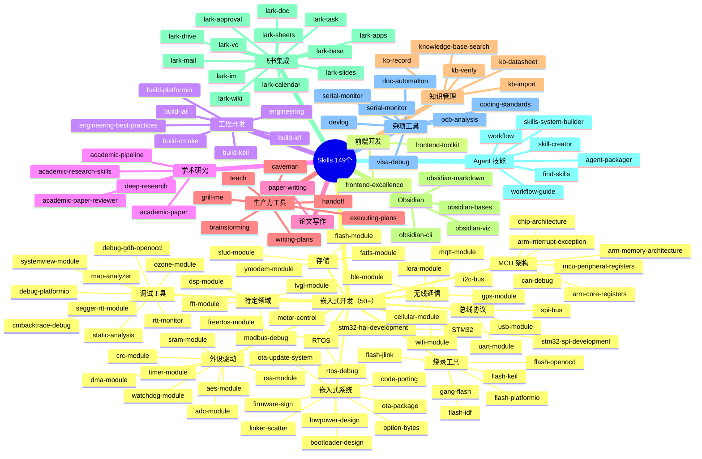
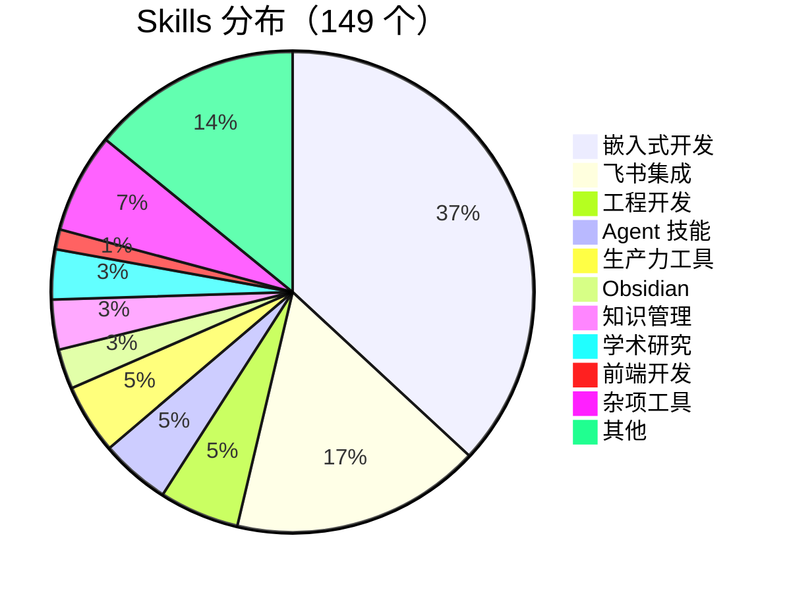

# Shuai Yemao Chip Skills

Claude Code 技能包集合 — 用于自动化各种开发任务。

## 📊 技能总览



## 📁 目录结构


## 🎯 技能分类

### 学术研究（5 个）

| 技能 | 描述 | 触发关键词 |
|------|------|-----------|
| **academic-research-skills** | 学术研究技能包 | academic research, 学术研究 |
| **academic-paper** | 12-agent 学术论文写作流水线 | write paper, academic paper, 寫論文 |
| **academic-paper-reviewer** | 论文评审和反馈 | review paper, 审查意見 |
| **academic-pipeline** | 学术研究全流程 | research pipeline, 學術研究 |
| **deep-research** | 深度研究和文献综述 | deep research, 深度研究 |

### 工程开发（8 个）

| 技能 | 描述 | 触发关键词 |
|------|------|-----------|
| **engineering** | 工程开发 | engineering, 工程 |
| **engineering-best-practices** | 工程最佳实践 | best practices, 最佳实践 |
| **build-cmake** | CMake 构建 | cmake, CMake |
| **build-iar** | IAR 构建 | iar, IAR |
| **build-keil** | Keil 构建 | keil, Keil |
| **build-idf** | ESP-IDF 构建 | idf, ESP-IDF |
| **build-platformio** | PlatformIO 构建 | platformio, PlatformIO |
| **pcb-analysis** | PCB 分析 | pcb, PCB |

### 前端开发（2 个）

| 技能 | 描述 | 触发关键词 |
|------|------|-----------|
| **frontend-excellence** | 前端开发最佳实践 | frontend excellence, 前端最佳实践 |
| **frontend-toolkit** | 前端工具包 | frontend toolkit, 前端工具 |

### 嵌入式开发（55 个）

#### MCU 架构（5 个）

| 技能 | 描述 | 触发关键词 |
|------|------|-----------|
| **arm-core-registers** | ARM 核心寄存器 | arm registers, ARM 寄存器 |
| **arm-interrupt-exception** | ARM 中断异常 | arm interrupt, ARM 中断 |
| **arm-memory-architecture** | ARM 内存架构 | arm memory, ARM 内存 |
| **chip-architecture** | 芯片架构 | chip architecture, 芯片架构 |
| **mcu-peripheral-registers** | MCU 外设寄存器 | mcu registers, MCU 寄存器 |

#### STM32（2 个）

| 技能 | 描述 | 触发关键词 |
|------|------|-----------|
| **stm32-hal-development** | STM32 HAL 开发 | stm32 hal, HAL 开发 |
| **stm32-spl-development** | STM32 SPL 开发 | stm32 spl, SPL 开发 |

#### 外设驱动（8 个）

| 技能 | 描述 | 触发关键词 |
|------|------|-----------|
| **adc-module** | ADC 模块 | adc, ADC |
| **dma-module** | DMA 模块 | dma, DMA |
| **timer-module** | Timer 模块 | timer, 定时器 |
| **watchdog-module** | Watchdog 模块 | watchdog, 看门狗 |
| **crc-module** | CRC 模块 | crc, CRC |
| **aes-module** | AES 加密模块 | aes, AES |
| **rsa-module** | RSA 加密模块 | rsa, RSA |
| **sram-module** | SRAM 模块 | sram, SRAM |

#### 总线协议（6 个）

| 技能 | 描述 | 触发关键词 |
|------|------|-----------|
| **i2c-bus** | I²C 总线驱动 | i2c, I2C |
| **spi-bus** | SPI 总线驱动 | spi, SPI |
| **uart-module** | UART 模块 | uart, UART |
| **can-debug** | CAN 总线调试 | can, CAN |
| **usb-module** | USB 模块 | usb, USB |
| **modbus-debug** | Modbus 调试 | modbus, Modbus |

#### 无线通信（6 个）

| 技能 | 描述 | 触发关键词 |
|------|------|-----------|
| **ble-module** | BLE 蓝牙模块 | ble, BLE |
| **wifi-module** | WiFi 模块 | wifi, WiFi |
| **lora-module** | LoRa 模块 | lora, LoRa |
| **gps-module** | GPS 模块 | gps, GPS |
| **cellular-module** | 蜂窝通信模块 | cellular, 蜂窝 |
| **mqtt-module** | MQTT 模块 | mqtt, MQTT |

#### RTOS（2 个）

| 技能 | 描述 | 触发关键词 |
|------|------|-----------|
| **freertos-module** | FreeRTOS 模块 | freertos, RTOS |
| **rtos-debug** | RTOS 调试 | rtos debug, RTOS 调试 |

#### 存储（4 个）

| 技能 | 描述 | 触发关键词 |
|------|------|-----------|
| **flash-module** | Flash 模块 | flash, Flash |
| **sfud-module** | SFUD 存储模块 | sfud, SFUD |
| **fatfs-module** | FATFS 文件系统 | fatfs, FATFS |
| **ymodem-module** | YMODEM 协议 | ymodem, YMODEM |

#### 调试工具（8 个）

| 技能 | 描述 | 触发关键词 |
|------|------|-----------|
| **debug-gdb-openocd** | GDB + OpenOCD 调试 | gdb openocd, GDB 调试 |
| **debug-platformio** | PlatformIO 调试 | platformio debug |
| **cmbacktrace-debug** | CmBacktrace 调试 | cmbacktrace, 堆栈跟踪 |
| **segger-rtt-module** | SEGGER RTT 模块 | segger rtt, RTT |
| **rtt-monitor** | RTT 监控 | rtt monitor, RTT 监控 |
| **ozone-module** | Ozone 调试器 | ozone, Ozone |
| **systemview-module** | SystemView 系统视图 | systemview, SystemView |
| **map-analyzer** | Map 文件分析器 | map analyzer, Map 分析 |

#### 烧录工具（6 个）

| 技能 | 描述 | 触发关键词 |
|------|------|-----------|
| **flash-jlink** | JLink 烧录 | jlink, JLink |
| **flash-openocd** | OpenOCD 烧录 | openocd, OpenOCD |
| **flash-keil** | Keil 烧录 | keil, Keil |
| **flash-platformio** | PlatformIO 烧录 | platformio, PlatformIO |
| **flash-idf** | ESP-IDF 烧录 | esp-idf, ESP-IDF |
| **gang-flash** | 批量烧录 | gang flash, 批量烧录 |

#### 嵌入式系统（10 个）

| 技能 | 描述 | 触发关键词 |
|------|------|-----------|
| **bootloader-design** | Bootloader 设计 | bootloader, Bootloader |
| **ota-update-system** | OTA 更新系统 | ota update, OTA 更新 |
| **ota-package** | OTA 包管理 | ota package, OTA 包 |
| **firmware-sign** | 固件签名 | firmware sign, 固件签名 |
| **lowpower-design** | 低功耗设计 | lowpower, 低功耗 |
| **code-porting** | 代码移植 | code porting, 代码移植 |
| **linker-scatter** | 链接器 scatter 文件 | linker scatter, 链接器 |
| **option-bytes** | Option Bytes 配置 | option bytes, 选项字节 |
| **static-analysis** | 静态分析 | static analysis, 静态分析 |
| **coding-standards** | 编码规范 | coding standards, 编码规范 |

#### 特定领域（4 个）

| 技能 | 描述 | 触发关键词 |
|------|------|-----------|
| **lvgl-module** | LVGL 图形库 | lvgl, LVGL |
| **motor-control** | 电机控制 | motor control, 电机控制 |
| **dsp-module** | DSP 数字信号处理 | dsp, DSP |
| **fft-module** | FFT 快速傅里叶变换 | fft, FFT |

#### 调试分析（2 个）

| 技能 | 描述 | 触发关键词 |
|------|------|-----------|
| **visa-debug** | VISA 调试 | visa, VISA |
| **serial-monitor** | 串口监控 | serial monitor, 串口监控 |

| 技能 | 描述 | 触发关键词 |
|------|------|-----------|
| **embedded** | 嵌入式系统开发专家 | embedded, MCU, STM32, ESP32, firmware |
| **embedded-architect** | 嵌入式架构师 | embedded architect, 嵌入式架构 |
| **embedded-reviewer** | 嵌入式代码审查 | embedded review, 嵌入式审查 |
| **embedded-debugger-framework** | 嵌入式调试框架 | embedded debug, 嵌入式调试 |
| **embedded-learning-notes** | 嵌入式学习笔记 | embedded learning, 嵌入式学习 |
| **embedded-learning-path-framework** | 嵌入式学习路径 | embedded path, 学习路径 |
| **embedded-note-templates** | 嵌入式笔记模板 | embedded notes, 笔记模板 |
| **embedded-skills-map** | 嵌入式技能地图 | embedded skills map, 技能地图 |
| **stm32-hal-development** | STM32 HAL 开发 | stm32 hal, HAL 开发 |
| **stm32-spl-development** | STM32 SPL 开发 | stm32 spl, SPL 开发 |
| **freertos-module** | FreeRTOS 模块 | freertos, RTOS |
| **rtos-debug** | RTOS 调试 | rtos debug, RTOS 调试 |
| **i2c-bus** | I²C 总线驱动 | i2c, I2C |
| **spi-bus** | SPI 总线驱动 | spi, SPI |
| **uart-module** | UART 模块 | uart, UART |
| **can-debug** | CAN 总线调试 | can, CAN |
| **adc-module** | ADC 模块 | adc, ADC |
| **dma-module** | DMA 模块 | dma, DMA |
| **timer-module** | Timer 模块 | timer, 定时器 |
| **watchdog-module** | Watchdog 模块 | watchdog, 看门狗 |
| **flash-module** | Flash 模块 | flash, Flash |
| **flash-jlink** | JLink 烧录 | jlink, JLink |
| **flash-openocd** | OpenOCD 烧录 | openocd, OpenOCD |
| **flash-keil** | Keil 烧录 | keil, Keil |
| **flash-platformio** | PlatformIO 烧录 | platformio, PlatformIO |
| **flash-idf** | ESP-IDF 烧录 | esp-idf, ESP-IDF |
| **gang-flash** | 批量烧录 | gang flash, 批量烧录 |
| **sfud-module** | SFUD 存储模块 | sfud, SFUD |
| **elog-module** | ELog 日志模块 | elog, 日志 |
| **cmbacktrace-debug** | CmBacktrace 调试 | cmbacktrace, 堆栈跟踪 |
| **segger-rtt-module** | SEGGER RTT 模块 | segger rtt, RTT |

**覆盖领域**：

| 分类 | Skills |
|------|--------|
| **系统架构** | embedded, embedded-architect, embedded-system-design |
| **代码审查** | embedded-reviewer |
| **调试工具** | embedded-debugger-framework, rtos-debug, cmbacktrace-debug, segger-rtt-module |
| **STM32 开发** | stm32-hal-development, stm32-spl-development |
| **RTOS** | freertos-module, rtos-debug |
| **外设驱动** | i2c-bus, spi-bus, uart-module, adc-module, dma-module, timer-module, watchdog-module |
| **通信协议** | can-debug |
| **存储** | flash-module, sfud-module, flash-jlink, flash-openocd, flash-keil, flash-platformio, flash-idf, gang-flash |
| **日志** | elog-module |
| **学习资源** | embedded-learning-notes, embedded-learning-path-framework, embedded-note-templates, embedded-skills-map |

### 论文写作（1 个）

| 技能 | 描述 | 触发关键词 |
|------|------|-----------|
| **paper-writing** | 论文写作辅助 | write paper, 写论文 |

### 生产力工具（7 个）

| 技能 | 描述 | 触发关键词 |
|------|------|-----------|
| **grill-me** | 需求挖掘和对齐 | grill me, 需求挖掘 |
| **teach** | 技能教学和学习 | teach, 学习 |
| **handoff** | 上下文交接 | handoff, 交接 |
| **caveman** | 简化表达 | caveman, 简化 |
| **brainstorming** | 头脑风暴 | brainstorming, 头脑风暴 |
| **executing-plans** | 执行计划 | executing plans, 执行计划 |
| **writing-plans** | 撰写计划 | writing plans, 撰写计划 |

### 知识管理（5 个）

| 技能 | 描述 | 触发关键词 |
|------|------|-----------|
| **knowledge-base-search** | 跨知识库检索 | search kb, 搜索知识库 |
| **kb-datasheet** | 数据手册管理 | kb datasheet, 数据手册 |
| **kb-import** | 知识库导入 | kb import, 导入知识库 |
| **kb-record** | 知识库记录 | kb record, 记录知识 |
| **kb-verify** | 知识库验证 | kb verify, 验证知识 |

### Obsidian（4 个）

| 技能 | 描述 | 触发关键词 |
|------|------|-----------|
| **obsidian-bases** | Obsidian 数据库 | obsidian bases, 数据库 |
| **obsidian-cli** | Obsidian 命令行 | obsidian cli, 命令行 |
| **obsidian-markdown** | Obsidian Markdown | obsidian markdown |
| **obsidian-viz** | Obsidian 可视化 | obsidian viz, 可视化 |

### 飞书集成（25 个）

| 技能 | 描述 | 触发关键词 |
|------|------|-----------|
| **lark-approval** | 飞书审批 | lark approval, 飞书审批 |
| **lark-apps** | 飞书应用 | lark apps, 飞书应用 |
| **lark-base** | 飞书多维表格 | lark base, 多维表格 |
| **lark-calendar** | 飞书日历 | lark calendar, 飞书日历 |
| **lark-doc** | 飞书文档 | lark doc, 飞书文档 |
| **lark-drive** | 飞书云盘 | lark drive, 飞书云盘 |
| **lark-im** | 飞书消息 | lark im, 飞书消息 |
| **lark-mail** | 飞书邮箱 | lark mail, 飞书邮箱 |
| **lark-sheets** | 飞书表格 | lark sheets, 飞书表格 |
| **lark-slides** | 飞书幻灯片 | lark slides, 飞书幻灯片 |
| **lark-task** | 飞书任务 | lark task, 飞书任务 |
| **lark-wiki** | 飞书知识库 | lark wiki, 飞书知识库 |
| **lark-vc** | 飞书视频会议 | lark vc, 视频会议 |
| **lark-vc-agent** | 飞书视频会议 Agent | lark vc agent |
| **lark-whiteboard** | 飞书白板 | lark whiteboard, 白板 |
| **lark-contact** | 飞书联系人 | lark contact, 联系人 |
| **lark-event** | 飞书事件 | lark event, 事件 |
| **lark-markdown** | 飞书 Markdown | lark markdown |
| **lark-minutes** | 飞书妙记 | lark minutes, 妙记 |
| **lark-note** | 飞书笔记 | lark note, 笔记 |
| **lark-okr** | 飞书 OKR | lark okr, OKR |
| **lark-openapi-explorer** | 飞书 API 探索器 | lark openapi, API 探索 |
| **lark-shared** | 飞书共享 | lark shared, 共享 |
| **lark-skill-maker** | 飞书技能创建器 | lark skill maker |
| **lark-workflow-meeting-summary** | 飞书会议纪要工作流 | lark meeting summary |
| **lark-workflow-standup-report** | 飞书站会报告工作流 | lark standup report |

### Agent 技能（7 个）

| 技能 | 描述 | 触发关键词 |
|------|------|-----------|
| **agent-packager** | Agent 打包器 | agent packager, 打包 Agent |
| **skill-creator** | 技能创建器 | skill creator, 创建技能 |
| **skills-system-builder** | 技能系统构建器 | skills system builder |
| **find-skills** | 查找技能 | find skills, 查找技能 |
| **workflow** | 工作流 | workflow, 工作流 |
| **workflow-guide** | 工作流指南 | workflow guide, 工作流指南 |

### 杂项工具（10 个）

| 技能 | 描述 | 触发关键词 |
|------|------|-----------|
| **doc-automation** | 文档自动化 | doc automation, 文档自动化 |
| **devlog** | 开发日志 | devlog, 开发日志 |
| **serial-monitor** | 串口监控 | serial monitor, 串口监控 |
| **visa-debug** | VISA 调试 | visa, VISA |

## 📈 统计信息



| 分类 | 数量 | 占比 |
|------|------|------|
| **嵌入式开发** | **55** | **36.9%** |
| **飞书集成** | **25** | **16.8%** |
| **杂项工具** | **10** | **6.7%** |
| **工程开发** | **8** | **5.4%** |
| **Agent 技能** | **7** | **4.7%** |
| **生产力工具** | **7** | **4.7%** |
| **知识管理** | **5** | **3.4%** |
| **学术研究** | **5** | **3.4%** |
| **Obsidian** | **4** | **2.7%** |
| **前端开发** | **2** | **1.3%** |
| **其他** | **21** | **14.1%** |
| **总计** | **149** | **100%** |

## 🚀 快速开始

### 安装技能

```bash
# 克隆技能仓库
git clone https://github.com/shuai-yemao/shuai-yemao-chip-skills.git ~/.claude/skills-tmp

# 复制到 skills 目录
cp -r ~/.claude/skills-tmp/skills/* ~/.claude/skills/

# 清理
rm -rf ~/.claude/skills-tmp
```

### 使用技能

```bash
# 启动 Claude Code
claude

# 直接使用技能
/write paper on AI          # 使用 academic-paper
/help me with TDD           # 使用 tdd
/design this API            # 使用 codebase-design
/embedded MCU problem       # 使用 embedded
```

## 🔧 自定义技能

### 创建新技能

```bash
# 创建技能目录
mkdir -p ~/.claude/skills/my-skill

# 创建 SKILL.md
cat > ~/.claude/skills/my-skill/SKILL.md << 'EOF'
---
name: my-skill
description: "我的自定义技能"
---

# My Skill

## When to Use
- 当用户需要...

## How It Works
1. 步骤 1
2. 步骤 2

## Examples
- 示例 1
EOF
```

### 技能格式要求

```yaml
---
name: skill-name
description: "技能描述，包含触发关键词"
metadata:
  version: "1.0.0"
  last_updated: "2026-06-24"
  status: active
  task_type: open-ended
  related_skills:
    - related-skill-1
    - related-skill-2
---

# Skill Name

## When to Use
- 触发条件 1
- 触发条件 2

## How It Works
1. 步骤 1
2. 步骤 2

## Examples
- 示例 1
```

## 📚 相关仓库

| 仓库 | 内容 | 地址 |
|------|------|------|
| **shuai-yemao-chip** | 核心配置 | https://github.com/shuai-yemao/shuai-yemao-chip |
| **shuai-yemao-chip-skills** | 技能包（本仓库） | https://github.com/shuai-yemao/shuai-yemao-chip-skills |
| **shuai-yemao-workflow** | 工作流 | https://github.com/shuai-yemao/shuai-yemao-workflow |

## 📋 更新日志

### 2026-06-24

- ✅ 添加嵌入式开发技能（embedded）
- ✅ 重构 README，使用 Mermaid 图表
- ✅ 完善技能分类和描述
- ✅ 添加使用示例和自定义指南

## 📄 许可证

MIT License
