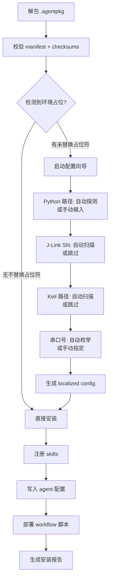

# Agent Package 标准化打包与版本管理系统

> 将 Chip（或任意嵌入式工作流 Agent）打包为工具无关的标准化格式 `*.agentpkg`。
> 任何支持 JSON manifest 的 AI 编码工具（Continue.dev、Windsurf 等）都能直接解析消费。
> 支持 semver 版本管理、差分更新、版本回滚、多平台部署。

## 解决的问题

```
现状：Chip 的 56 个 skill + 工作流绑定在 CherryStudio 生态内
      ├─ 同事实装 Cline 想复用 → 无法直接移植
      ├─ 换到 Continue.dev → 需要重新配置
      └─ 团队 5 人维护 5 份不同步的配置 → 版本混乱

目标：标准化 Agent Package
      ├─ 一个 .agentpkg 包，所有工具都能解析（VSCode .vsix 式标准）
      ├─ 版本号 + changelog → 谁在用什么版本一目了然
      ├─ 差分更新 → 只传输变更部分
      └─ 回滚 → 出问题秒级恢复到上一版本
```

## Agent Package 规范

### 文件格式

```
*.agentpkg = tar.gz 压缩包（跨平台兼容）

包内结构:
agent-package/
├── manifest.json            # [必要] 包元数据 + 版本 + 依赖清单
├── agent/                   # Agent 配置
│   ├── SOUL.md              # 人格定义
│   ├── USER.md              # 用户画像（模板化，不包含敏感信息）
│   └── FACT.md              # 持久知识
├── skills/                  # 所有 skill
│   ├── <skill-name>/
│   │   ├── SKILL.md
│   │   ├── scripts/         # 脚本（若有）
│   │   └── references/      # 参考文档
│   └── ...
├── workflow/                # 工作流流水线
│   └── scripts/
├── mcp/                     # MCP 配置模板
│   └── servers.json.template  # 占位符替代敏感信息
├── docs/                    # 文档
│   ├── README.md
│   └── CHANGELOG.md
└── .checksums               # 所有文件的 SHA256 校验和
```

### manifest.json 规范

```json
{
  "schemaVersion": "1.0",
  "name": "chip-embedded-agent",
  "version": "1.3.0",
  "type": "embedded-agent",
  "description": "嵌入式工作流 Agent — STM32/ESP32 全流程开发",
  "author": "TNSH",
  "createdAt": "2026-05-29T12:00:00Z",

  "compatibility": {
    "platforms": ["windows", "linux", "macos"],
    "hosts": ["cherrystudio", "continue", "windsurf"],
    "minPythonVersion": "3.10"
  },

  "dependencies": {
    "tools": {
      "python": ">=3.10",
      "node": ">=18.0"
    },
    "mcpServers": {
      "github": { "required": false, "description": "GitHub API 操作" },
      "exa":    { "required": false, "description": "Web 搜索" }
    },
    "externalTools": {
      "jlink":  { "required": false, "platform": "windows", "description": "J-Link Commander" },
      "keil":   { "required": false, "platform": "windows", "description": "Keil MDK UV4" },
      "openocd": { "required": false, "description": "OpenOCD" }
    }
  },

  "skills": {
    "total": 56,
    "categories": {
      "必备开发工具": 19,
      "开发板-ARM": 14,
      "常用模块": 8,
      "系统级设计": 3,
      "通信协议": 6,
      "知识管理": 5,
      "编码规范与代码质量": 4,
      "嵌入式项目文档与工作流": 4,
      "开发板-RISC-V": 2,
      "操作系统": 2,
      "中间件": 1
    },
    "required": ["stm32-hal-development", "build-keil", "flash-jlink", "workflow"],
    "optional": ["visa-debug", "motor-control"]
  },

  "workflow": {
    "version": "3.1.0",
    "pipelines": 21,
    "agents": ["build", "dev", "pm", "verify", "release", "fix"]
  },

  "entryPoints": {
    "SOUL.md": "agent/SOUL.md",
    "workflowCoordinator": "workflow/scripts/workflow_coordinator.py",
    "primarySkill": "stm32-hal-development"
  },

  "hostConfig": {},
  "changelog": [
    { "version": "1.3.0", "date": "2026-05-30", "changes": ["Agent 重命名: CherryClaw → Chip", "包名更新: cherryclaw → chip", "所有脚本中 CherryClaw 引用更新为 Chip", "manifest 版本 bump 1.2.0 → 1.3.0"] },
    { "version": "1.2.0", "date": "2026-05-29", "changes": ["新增 watchdog-module", "新增 lowpower-design"] },
    { "version": "1.1.0", "date": "2026-05-26", "changes": ["workflow 重构为多 Agent 架构 v3.0.0"] },
    { "version": "1.0.0", "date": "2026-05-24", "changes": ["初始版本"] }
  ]
}
```

### 版本号规范

严格遵循 semver 2.0：

| 版本位 | 含义 | 示例 |
|--------|------|------|
| **MAJOR** | 不兼容的 API/格式变更 | skill 体系重构、manifest schema 变更 |
| **MINOR** | 向后兼容的功能新增 | 新增 skill、新增流水线 |
| **PATCH** | 向后兼容的 bug 修复 | 脚本修复、文档修正 |

## 核心功能

### 1. 导出（export）

将当前 Agent 打包为标准 .agentpkg 文件：

```bash
# 导出当前全部配置
python scripts/agent_packager.py export \
    --agent-dir "{USER_HOME}\AppData\Roaming\CherryStudio\Data\Agents\{AGENT_ID}" \
    --skills-dir "{USER_HOME}\AppData\Roaming\CherryStudio\Data\Skills" \
    --output "chip-embedded-1.3.0.agentpkg"

# 导出并签名
python scripts/agent_packager.py export \
    --sign --private-key ./keys/private.pem \
    --output "chip-embedded-1.3.0.agentpkg"

# 导出指定版本（上一版本的快照用于差分）
python scripts/agent_packager.py export \
    --version "1.2.0" --output "chip-embedded-1.2.0.agentpkg"
```

**导出流程**：

```
  [扫描]                   [打包]                 [输出]
  agent/                   收集文件                .agentpkg
  ├─ SOUL.md      ──→     ├─ 按目录结构归档    ──→ ├─ manifest.json
  ├─ USER.md               ├─ 生成 manifest.json    ├─ agent/
  └─ FACT.md               ├─ 计算 checksums        ├─ skills/
                           ├─ 敏感信息脱敏           ├─ workflow/
  [技能目录扫描]            └─ 打包 tar.gz           ├─ mcp/
  所有 enabled skills                               └─ .checksums
```

**敏感信息脱敏规则**：

| 原文 | 脱敏后 | 说明 |
|------|--------|------|
| `{USER_HOME}\...` | `{USER_HOME}\...` | 用户目录路径 |
| 串口号 `{SERIAL_PORT}` | `{SERIAL_PORT}` | 串口占位符 |
| J-Link SN `69701612` | `{JLINK_SN}` | 探针序列号 |
| Python 路径 | `{PYTHON_PATH}` | 解释器路径 |
| 实际 MCU 型号 | 保留（属 skill 内容） | 不脱敏 |
| API Token | 删除（不进入包） | 安全 |

### 2. 导入（install / import）

将 .agentpkg 安装到目标平台：

```bash
# 安装到 CherryStudio
python scripts/agent_packager.py install \
    --package "chip-embedded-1.2.0.agentpkg" \
    --target cherrystudio \
    --agent-dir "{USER_HOME}\AppData\Roaming\CherryStudio\Data\Agents" \
    --skills-dir "{USER_HOME}\AppData\Roaming\CherryStudio\Data\Skills"

# 安装到 Continue.dev
python scripts/agent_packager.py install \
    --package "chip-embedded-1.2.0.agentpkg" \
    --target continue \
    --continue-dir "{USER_HOME}\.continue"

# 安装时指定环境配置（交互式向导）
python scripts/agent_packager.py install \
    --package "chip-embedded-1.2.0.agentpkg" \
    --target cherrystudio --interactive
```

**导入流程**：

```
  [解包]                  [校验]                  [安装]
  .agentpkg               验证 checksums          ├─ skills → register
  ├─ manifest.json    ──→ ├─ manifest 完整性      ├─ agent → 写入目标目录
  ├─ agent/               ├─ 依赖检查              ├─ workflow → 部署脚本
  ├─ skills/              ├─ 平台兼容性检查        ├─ MCP 模板 → 提示配置
  └─ workflow/            └─ 版本冲突检查          └─ 生成安装报告
                             │
                        [交互式配置向导]
                        ├─ Python 路径: _______     ← 自动探测 + 用户确认
                        ├─ J-Link SN: _______      ← 空则跳过（可选依赖）
                        ├─ Keil UV4 路径: _______
                        └─ 串口号: _______
```

**交互式配置流程**：



### 3. 版本管理（version）

```bash
# 查看包信息
python scripts/agent_packager.py info \
    --package "chip-embedded-1.2.0.agentpkg"

# 检查是否有新版本（对比远程 registry）
python scripts/agent_packager.py check-update \
    --current "chip-embedded-1.2.0.agentpkg" \
    --registry "https://registry.example.com/packages"

# 生成差分包（从 v1.1.0 到 v1.2.0）
python scripts/agent_packager.py diff \
    --from "chip-embedded-1.1.0.agentpkg" \
    --to "chip-embedded-1.2.0.agentpkg" \
    --output "chip-embedded-1.1.0-to-1.2.0.agentpatch"

# 应用差分包（升级）
python scripts/agent_packager.py apply \
    --patch "chip-embedded-1.1.0-to-1.2.0.agentpatch" \
    --target-dir "{USER_HOME}\AppData\Roaming\CherryStudio\Data\Agents\5zvr5dykd"

# 回滚到上一版本
python scripts/agent_packager.py rollback \
    --target-dir "{USER_HOME}\AppData\Roaming\CherryStudio\Data\Agents\5zvr5dykd" \
    --to "1.1.0"
```

**差分格式（.agentpatch）**：

```
agentpatch/
├── manifest.json          # 差分元数据
├── added/                 # 新增文件
│   └── skills/watchdog-module/SKILL.md
├── modified/              # 修改文件（存储完整新版本）
│   └── SOUL.md
├── deleted/               # 被删除文件列表（仅路径索引）
│   └── ...
└── manifest.json.patch    # manifest 的 JSON Patch (RFC 6902)
```

### 4. 校验（verify）

```bash
# 校验包完整性
python scripts/agent_packager.py verify \
    --package "chip-embedded-1.2.0.agentpkg"

# 校验已安装版本
python scripts/agent_packager.py verify \
    --installed --target-dir "{USER_HOME}\AppData\Roaming\CherryStudio\Data\Agents\5zvr5dykd"

# 试安装（模拟，不实际写入）
python scripts/agent_packager.py install \
    --package "chip-embedded-1.2.0.agentpkg" \
    --target cherrystudio --dry-run
```

## 目标平台适配

### CherryStudio 适配

| 包中路径 → | 目标路径 |
|-----------|---------|
| `skills/<name>/SKILL.md` | `Data/Skills/<name>/SKILL.md` |
| `skills/<name>/scripts/*.py` | `Data/Skills/<name>/scripts/*.py` |
| `agent/SOUL.md` | `Data/Agents/<id>/SOUL.md` |
| `workflow/scripts/*.py` | `Data/Skills/workflow/scripts/*.py` |
| `mcp/servers.json.template` | 提示用户手动配置 |

### Continue.dev 适配

| 包中路径 → | Continue 映射 |
|-----------|-------------|
| `skills/<name>/SKILL.md` | ~/.continue/skills/ 或通过 config.json 引用 |
| `agent/SOUL.md` | 合并到 `~/.continue/config.json` 中 system prompt |
| `mcp/` | 写入 `~/.continue/config.json` 的 MCP 配置段 |

## 签名与安全

### 数字签名

使用 Ed25519 签名保证包来源可信：

```bash
# 生成签名密钥对
python scripts/agent_packager.py generate-key \
    --output ./keys

# 导出时签名
python scripts/agent_packager.py export \
    --sign --private-key ./keys/private.pem \
    --output "chip-embedded-1.2.0.agentpkg"

# 导入时验证签名
python scripts/agent_packager.py install \
    --package "chip-embedded-1.2.0.agentpkg" \
    --verify-signature --public-key ./keys/public.pem
```

### 安全边界

```
签名验证失败 → 安装拒绝（除非 --force）
manifest.json 被篡改 → checksums 不匹配 → 拒绝
脚本含可疑代码 → 安装前扫描提示
MCP Token → 包中绝对不包含，导入时重新配置
```

## 使用场景

### 场景 1：团队分发

```bash
# 项目负责人导出
chip> python scripts/agent_packager.py export \
    --version "1.2.0" \
    --output "chip-embedded-1.2.0.agentpkg"

# 上传到共享目录 / 内网 registry

# 团队成员导入
new_team_member> python scripts/agent_packager.py install \
    --package "chip-embedded-1.2.0.agentpkg" \
    --target cherrystudio --interactive

# 安装报告示例:
# ┌─────────────────────────────────────────┐
# │ ✅ 技能注册: 56/56                       │
# │ ✅ SOUL.md 写入                          │
# │ ✅ Workflow 脚本部署                      │
# │ ⚠  J-Link SN: 未配置（可选，跳过）        │
# │ ⚠  Keil 路径: 未找到（可选，跳过）         │
# │ ✅ 串口: {SERIAL_PORT} 已探测                     │
# │ ✅ 安装完成                              │
# └─────────────────────────────────────────┘
```

### 场景 2：版本升级

```bash
# 本地已安装 v1.1.0，获取 v1.2.0 差分包
python scripts/agent_packager.py apply \
    --patch "chip-embedded-1.1.0-to-1.2.0.agentpatch"

# 升级报告:
# ┌─────────────────────────────────────────┐
# │ 升级: v1.1.0 → v1.2.0                   │
# │ ├─ 新增: watchdog-module (SKILL.md)      │
# │ ├─ 新增: lowpower-design (SKILL.md)      │
# │ ├─ 修改: embedded-skills-map (分类更新)  │
# │ ├─ 修改: SOUL.md (技能表+排查路线)        │
# │ └─ 删除: 无                             │
# │ 升级完成. 如需回滚: rollback --to 1.1.0  │
# └─────────────────────────────────────────┘
```

### 场景 3：跨平台迁移

```bash
# Windows 打包
export> .agentpkg  (tar.gz, 跨平台格式)

# Linux 解包安装（路径自动适配）
linux> python scripts/agent_packager.py install \
    --package "chip-embedded-1.2.0.agentpkg" \
    --target continue --interactive

# macOS 安装
macos> python scripts/agent_packager.py install \
    --package "chip-embedded-1.2.0.agentpkg" \
    --target continue --interactive
```

## 必要输入

| 操作 | 必要输入 | 可选输入 |
|------|---------|---------|
| export | Agent 目录、Skills 目录、输出路径 | `--version`, `--sign`, `--private-key` |
| install | 包路径、目标平台 | `--interactive`, `--dry-run`, `--verify-signature` |
| diff | 源包路径、目标包路径 | `--output` |
| apply | 差分包路径、目标目录 | — |
| rollback | 目标目录、目标版本 | — |

## 脚本架构

```
agent-packager/
├── SKILL.md                    # 本文件
├── scripts/
│   ├── agent_packager.py       # 主入口（CLI 路由）
│   ├── packager_export.py      # 导出模块
│   ├── packager_install.py     # 安装模块
│   ├── packager_diff.py        # 差分模块
│   ├── packager_version.py     # 版本管理模块
│   ├── packager_verify.py      # 校验模块
│   ├── packager_sign.py        # 签名模块
│   └── packager_platforms.py   # 目标平台适配映射
└── references/
    └── manifest-schema.json    # manifest.json JSON Schema
```

### CLI 命令树

```
agent_packager.py
├── export          # 导出 .agentpkg
│   ├── --agent-dir       Agent 目录
│   ├── --skills-dir      Skills 目录
│   ├── --output/-o       输出路径
│   ├── --version/-v      版本号（默认读取 manifest）
│   ├── --sign            签名
│   ├── --private-key     私钥路径
│   └── --include-mcp     是否包含 MCP 模板
│
├── install         # 安装 .agentpkg
│   ├── --package/-p      包路径
│   ├── --target/-t       目标平台
│   ├── --agent-dir       目标 Agent 目录
│   ├── --skills-dir      目标 Skills 目录
│   ├── --interactive/-i  交互式配置向导
│   ├── --dry-run         试运行
│   ├── --force           跳过安全警告
│   └── --verify-signature 验证签名
│
├── info            # 查看包信息
│   └── --package/-p      包路径
│
├── verify          # 校验
│   ├── --package/-p      包路径
│   ├── --installed       校验已安装版本
│   └── --target-dir      目标目录
│
├── diff            # 生成差分
│   ├── --from            源版本包
│   ├── --to              目标版本包
│   └── --output/-o       差分包路径
│
├── apply           # 应用差分
│   ├── --patch           差分包路径
│   └── --target-dir      目标目录
│
├── rollback        # 回滚
│   ├── --target-dir      目标目录
│   └── --to              目标版本
│
├── check-update    # 检查更新
│   ├── --current         当前包路径
│   └── --registry        Registry URL
│
├── generate-key    # 生成签名密钥
│   └── --output          输出目录
│
└── list-versions   # 查看本地版本历史
    └── --target-dir      目标目录
```

### 版本历史管理

```
版本历史存储在目标 Agent 目录下:
.agent-versions/
├── current -> 1.2.0        # 符号链接指向当前版本
├── 1.0.0/
│   └── manifest.json
├── 1.1.0/
│   ├── manifest.json
│   └── .checksums
├── 1.2.0/
│   ├── manifest.json
│   ├── .checksums
│   └── agent/             # 版本快照（只记录变更文件）
├── history.json            # 版本变更历史
└── rollback.json           # 回滚点
```

回滚时：
1. 读取 `history.json` 找到目标版本
2. 从 `.agent-versions/<version>/` 恢复该版本的文件
3. 更新 `current` 符号链接
4. 写入 `rollback.json` 记录回滚操作

## 与其他 skill 的协作

- 上游：`embedded-skills-map`（读取技能分类信息）
- 上游：无（agent-packager 是元级别工具）
- 输出：标准化 Agent Package 供其他工具使用
- 调试：`verify` 命令自检包完整性

## 禁止行为

- **禁止**在包中包含 API Token、密钥、密码
- **禁止**在未校验 checksums 的情况下安装包
- **禁止**跨 MAJOR 版本直接升级（需人工确认 Breaking Changes）
- **禁止**在包中包含用户本地敏感数据（完整 USER.md 需脱敏）

## 不该碰

- **不碰**目标平台已有的配置（安装时只新增/更新，不覆盖用户自定义）
- **不碰**MCP Server 的原始 Token/密钥
- **不碰**不对齐 checksums 的升级操作
- **不碰**已经 rollback 标记的版本（防止循环回滚）
