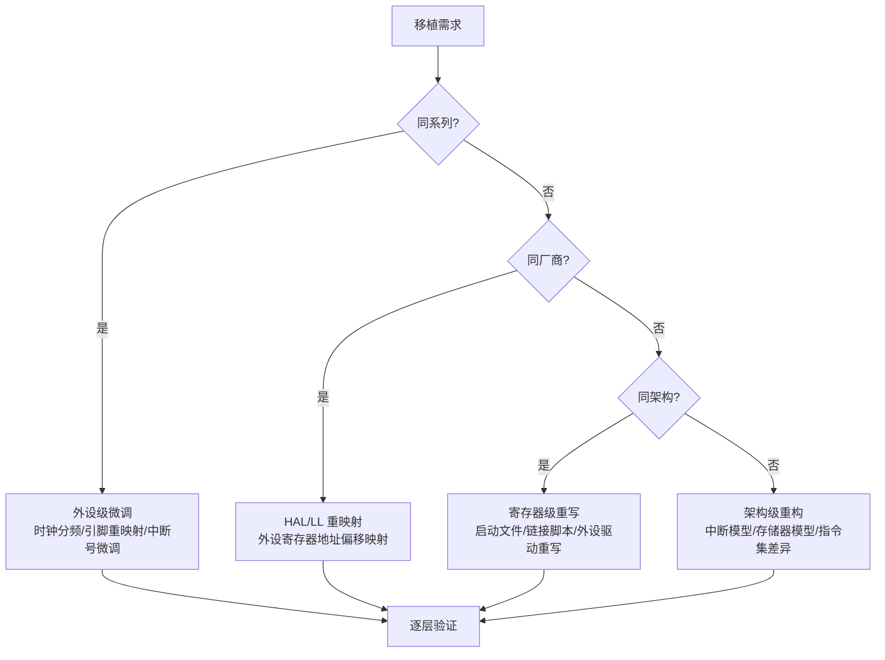
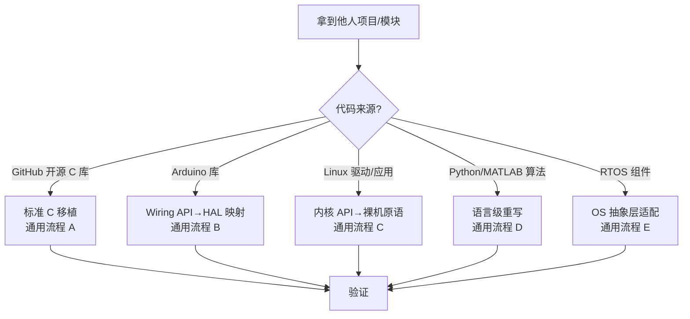
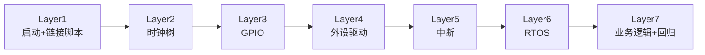
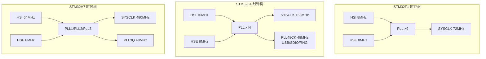
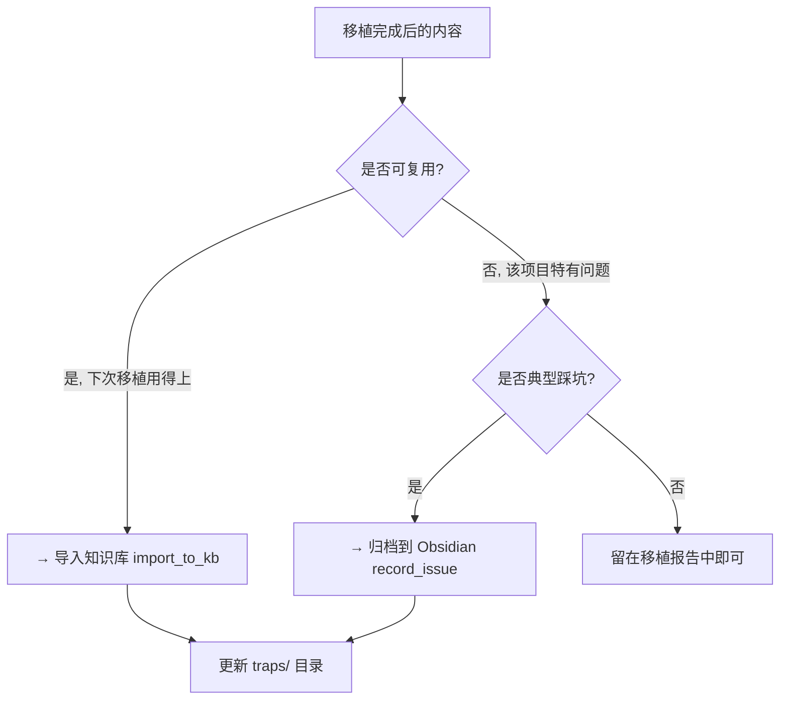

# 嵌入式代码移植——跨 MCU / HAL / IDE / RTOS 全场景移植框架

## 适用场景

- 需要将工程从一款 MCU 移植到另一款（F1->F4、F4->H7、STM32->GD32 等）
- 需要在 HAL/LL/寄存器之间切换 HAL 层
- 需要在 Keil/IAR/CMake+GCC 之间迁移工具链
- 需要从裸机迁移到 FreeRTOS/RT-Thread
- 需要将 Arduino 库/Linux 驱动/Python 算法移植到嵌入式 C 平台
- 需要从大项目中提取独立模块移植到新工程

## 必要输入

| 参数 | 说明 |
|------|------|
| 源平台 | 芯片型号 / HAL 版本 / IDE / RTOS |
| 目标平台 | 芯片型号 / HAL 版本 / IDE / RTOS |
| 移植类型 | MCU 换型 / HAL 迁移 / 工具链 / RTOS / 库移植 / 模块提取 |
| 源工程路径 | 待移植的完整工程或模块代码路径 |
| 关键外设 | UART/SPI/I2C/TIM/ADC/DMA/CAN/USB 等（影响 Layer 3-4 的修改范围）|
| 脚本参数 | `--source-chip`, `--target-chip`, `--source-hal`, `--target-hal` 等 |

## 为什么需要一个专门的移植 skill

嵌入式移植不是"换个芯片重新编译"那么简单。时钟树差异导致外设分频系数完全不同、GPIO 重映射寄存器变了地址、中断向量表维数不同、DMA stream/channel 映射全乱、编译器的 `__attribute__` 语义有细微差别——一个被忽略的细节就让整块板子跑不起来。

这个 skill 提供**逐层验证的移植方法论**，确保每层迁移完成后再推进下一层，避免跳层调试。

## 移植决策树

收到移植需求后，先确定移植类型：



**判断规则**：
- **同系列**（如 STM32F103C8 → STM32F103RE）：外设寄存器完全兼容，只改引脚和时钟分频
- **同厂商**（如 STM32F1 → STM32F4）：外设架构相似但寄存器地址/位定义不同，HAL API 层面重映射
- **同架构**（如 STM32F1 → GD32F1）：Cortex-M 内核相同，外设寄存器偏移不同，需寄存器级对照
- **跨架构**（如 Cortex-M3 → Cortex-M7）：启动文件/FPU/MPU/Cache/双精度浮点全部需要重构

## 分层架构视角下的移植影响范围

移植的本质是理解**换什么层、不动什么层**。以下是基于分层架构（参考 `embedded-architect/references/layered-architecture-model.md`）的移植影响矩阵：

```mermaid
flowchart TD
    subgraph 换芯片
        DRV1[Driver 层: 全换] --> CORE1[Core 层: 实现重写<br/>接口不变]
        CORE1 --> BSP1[BSP 层: 不用动]
        BSP1 --> OS1[OS 层: 不用动]
        OS1 --> APP1[APP 层: 不用动]
    end

    subgraph 换平台/工具链
        DRV2[Driver 层: 寄存器→HAL<br/>可能重新生成]
        CORE2[Core 层: 全换]
        BSP2[BSP 层: Core API 接口不变<br/>实现可能微调]
        OS2[OS 层: 取决于 RTOS 是否移植]
    end

    subgraph 换板子（同芯片）
        BSP3[BSP 层: 全换]
        CORE3[Core 层: 引脚分配重配]
        DRV3[Driver 层: 不用动]
    end
```

### 各场景的修改范围

| 移植场景 | Driver 层 | Core 层 | BSP 层 | OS 层 | APP 层 |
|---------|-----------|---------|--------|-------|--------|
| 同系列换大封装 | 不变 | 引脚微调 | 引脚微调 | 不变 | 不变 |
| 跨系列（如 F1→F4） | **全换** | **实现重写** | **接口不变** | 不考虑 | 不变 |
| 国产替代（F1→GD32） | **寄存器偏移映射** | 可能微调 | 不变 | 不变 | 不变 |
| 换工具链（Keil→GCC） | 链接脚本+启动文件换 | 编译器属性宏适配 | 不变 | 可能需适配 | 不变 |
| 裸机→RTOS | 不变 | 不变 | 不变 | **加入OS层** | **重构为 task** |
| 换板子（同芯片） | 不变 | 引脚重配 | **全换** | 不变 | 不变 |
| Arduino 库移植 | — | **用 Core 层 API 重写** | 变成新 BSP 驱动 | 可选 | 不考虑 |

**核心结论**：
- BSP 层代码在换芯片时**不用改**（前提是 Core 层接口不变）
- Core 层接口设计决定了移植成本——接口标准化越彻底，BSP 和 APP 层的移植工作量越小
- Driver + Core 是 MCU 换型时修改量最大的两层，占全部修改的 70%以上

## 第三方项目/模块代码移植

这是一类**独立于 MCU 换型**的移植场景：把他人写好的功能模块（开源库、Arduino 库、Linux 驱动、算法实现等）适配到你的目标平台。这类移植的核心挑战不是"芯片差异"，而是**编程范式差异**（Wiring→HAL、Linux→裸机、Python→C、动态内存→静态内存）。

### 移植决策树（项目/模块版）



### 通用流程 A：标准 C 库 → 嵌入式平台

**适用场景**：GitHub 上的纯 C 开源库（如 FatFs、CMSIS-DSP、littlefs、u8g2、nanopb、mbedTLS 等）。

**分析清单**（拿到的第一步，逐项检查）：


| 检查项 | 风险 | 典型修复 |
|--------|------|---------|
| **编译系统** | Makefile/CMakeLists 不是为目标 MCU 写的 | 重新配置 CMake toolchain file 或手动提取源文件 |
| **标准库依赖** | 用了 `stdlib.h` `stdio.h` `math.h` `time.h` `string.h` 等 | 嵌入式 newlib-nano 已提供大部分，缺的自行实现 |
| **系统调用** | `printf` `malloc` `fopen` `time` `gettimeofday` | newlib syscall stubs (`_sbrk`, `_write`, `_read`, `_gettimeofday`) |
| **动态内存** | `malloc`/`free` 频繁调用（可能有碎片问题） | 改用静态池/内存池/FreeRTOS heap_4 |
| **文件系统** | `fopen`/`fread`/`fwrite` | 对接 FatFs 的 `f_open`/`f_read` API（非标准 C） |
| **线程/锁** | `pthread`/`mutex`/`semaphore` | 映射到 FreeRTOS 信号量/互斥锁 |
| **网络** | `socket`/`connect`/`send` | 映射到 lwIP socket API（接口类似 Berkeley sockets） |
| **浮点** | 大量 double 运算（CM3 无硬件 FPU） | CM3: 软件浮点性能差→改单精度/定点; CM4F/CM7: 改 `-mfloat-abi=hard` |
| **断言** | `assert()` 在生产代码中触发 | 改自定义 `ASSERT`（记录后复位或忽略） |
| **全局变量** | 大量全局/静态缓冲区（可能超过 SRAM） | 检查总大小，必要时分页或减小缓冲区 |
| **字节序** | `htons`/`htonl` / `ntohl` / 位域顺序 | Cortex-M 小端通常没问题，通信协议需确认 |

**移植步骤**：

1. 剥离原项目的 OS 依赖层（`#ifdef __linux__` / `_WIN32` 等条件编译分支）
2. 创建 `platform_port.h` 头文件，定义这个库需要的平台抽象接口
3. 实现每个接口的嵌入式版本（ST  HAL 实现）
4. 编译验证（逐文件加入工程，不一次性全加）
5. 功能测试（用最小测试用例验证核心功能）

### 通用流程 B：Arduino 库 → STM32 HAL

**适用场景**：大量传感器/显示器/通信模块的 Arduino 库需要移植到 STM32。

**Wiring API ↔ HAL 映射表**：

| Arduino / Wiring | STM32 HAL 等价实现 | 说明 |
|-----------------|-------------------|------|
| `pinMode(pin, OUTPUT)` | `HAL_GPIO_Init(pin_port, &GPIO_InitStruct)` | 需要先知道 GPIO 端口和引脚号 |
| `digitalWrite(pin, HIGH)` | `HAL_GPIO_WritePin(port, pin, GPIO_PIN_SET)` | Arduino pin→port/pin 映射表 |
| `digitalRead(pin)` | `HAL_GPIO_ReadPin(port, pin)` | 同上 |
| `analogWrite(pin, val)` | `__HAL_TIM_SET_COMPARE(&htim, channel, val)` | 需要先配置 TIM PWM |
| `analogRead(pin)` | `HAL_ADC_Start(&hadc); HAL_ADC_PollForConversion(&hadc, timeout)` | 需先配 ADC |
| `delay(ms)` | `HAL_Delay(ms)` | 接近等价 |
| `delayMicroseconds(us)` | DWT 周期计数器或 TIM 微秒延时 | Arduino 内部用定时器 |
| `millis()` | `HAL_GetTick()` | 等价 |
| `micros()` | DWT->CYCCNT / SystemCoreClock 计算 | Arduino 内部用定时器 |
| `attachInterrupt(pin, ISR, mode)` | `HAL_GPIO_EXTI_RegisterCallback()` + `HAL_NVIC_EnableIRQ()` | 涉及 EXTI 配置 |
| `Wire.begin()` / `Wire.endTransmission()` | `HAL_I2C_Master_Transmit()` | I2C API 映射 |
| `SPI.begin()` / `SPI.transfer()` | `HAL_SPI_TransmitReceive()` | SPI API 映射 |
| `Serial.begin(baud)` / `Serial.print()` | `HAL_UART_Transmit()` + `printf` 重定向 | 波特率配置+发送 |
| `Servo.write(angle)` | `__HAL_TIM_SET_COMPARE()` + TIM 周期=20ms | 需要先配 PWM 为 50Hz |
| `EEPROM.write/read` | `HAL_FLASH_Program()` / 指针读取 | 操作方式完全不同 |
| `random()` / `randomSeed()` | 自行实现（常用 LCG 或硬件 RNG） | 无标准库等价 |
| `tone(freq, duration)` | TIM PWM + 定时器控制时长 | 需要占用一个定时器 |

**移植步骤**：

1. 分析 Arduino 库文件结构（通常 `.cpp` + `.h`，C++ 语法）
2. 识别所有 Wiring API 调用点
3. 建立 `ArduinoAPI_Map.md` 映射表（一个文件记录所有映射关系）
4. 用 `#ifdef ARDUINO` / `#ifdef STM32_HAL` 宏隔离平台相关代码
5. 或重写 `wiring_digital.c` `wiring_analog.c` 等价层
6. 注意：Arduino 库可能用了 C++ 特性（class、virtual、new/delete），需要评估编译器支持

### 通用流程 C：Linux 驱动/应用 → 裸机/RTOS

**适用场景**：把 Linux 下的传感器驱动、通信协议栈、音视频处理代码移植到嵌入式环境。

**Linux API ↔ 裸机原语映射表**：

| Linux API | 裸机/RTOS 等价 | 说明 |
|-----------|---------------|------|
| `open("/dev/i2c-X")` / `ioctl()` | `HAL_I2C_Master_Transmit()` | 直接调用外设 HAL |
| `read(fd, buf, len)` | HAL UART/SPI/I2C 接收函数 | 无文件描述符概念 |
| `write(fd, buf, len)` | HAL 发送函数 | 同上 |
| `usleep(us)` / `nanosleep()` | `HAL_Delay()` 或 TIM 延时 | 精度不同，需适配 |
| `gettimeofday()` | `HAL_GetTick()` 或 RTC | 精度从 μs 降到 ms |
| `pthread_create()` | `xTaskCreate()` (FreeRTOS) | 完全不同的线程模型 |
| `pthread_mutex_lock()` | `xSemaphoreTake(mutex)` | 信号量互斥锁 |
| `sem_wait()` / `sem_post()` | `xSemaphoreTake(binary)` | 信号量 |
| `malloc()` / `free()` | `pvPortMalloc()` / `vPortFree()` (FreeRTOS) 或静态池 | 仅在 RTOS 环境中 |
| `mmap()` | 链接脚本定义段地址 + 指针访问 | 裸机无虚拟内存 |
| `ioctl()` / `sysfs` | HAL 函数调用 | Linux 特有抽象层，直接移除 |
| `signal()` (SIGINT 等) | 无等价（裸机无进程） | 全部移除 |
| `printf()` / `fprintf()` | `printf` 重定向到 UART 或 RTT | newlib syscall |
| `fopen()` / `fread()` | FATFS `f_open` / `f_read` | 文件系统接口完全不同 |
| `opendir()` / `readdir()` | FATFS `f_opendir` / `f_readdir` | 同上 |
| `socket()` / `connect()` | lwIP `netconn_connect()` / BSD socket | lwIP 提供相似 API |
| `select()` / `poll()` | lwIP `netconn_select()` 或 FreeRTOS+Select | |

**移植策略**：

1. 分析原项目代码中使用了哪些 Linux API
2. 对每个 API，确定嵌入式平台上的等价实现
3. 创建 `posix_port.h` 抽象层，用宏/内联函数将 Linux API 重映射
4. 无法映射的功能（`fork()`、`mmap()`、`signal()`、`procfs`）直接标记为不支持
5. 特别注意：Linux 驱动的 probe/bind 模型在裸机上不存在，改为显式初始化函数

### 通用流程 D：算法/数据处理 → 嵌入式 C

**适用场景**：Python/MATLAB 写好的信号处理、控制算法、ML 模型移植到嵌入式。

| 差异维度 | 源环境 (Python/MATLAB) | 目标环境 (嵌入式 C) | 移植要点 |
|---------|----------------------|-------------------|---------|
| **数据类型** | 任意精度/自动类型 | 固定位宽 (int8/16/32/float) | 需显式选型，避免溢出 |
| **浮点** | double 默认 | 单精度或定点 | CM3 软件双精度极慢，改单精度/定点 |
| **动态内存** | GC 自动管理 | 静态分配或手动管理 | 无 GC，必须预防泄漏 |
| **数组** | 可变长度/动态增长 | 固定长度或最大长度预分配 | 按最大尺寸开缓冲区 |
| **数学库** | numpy/scipy 全功能 | arm_math.h / CMSIS-DSP 子集 | 核对每个函数是否存在 |
| **复数** | 原生支持 | arm_cffr_f32 / 自定义结构体 | 需要改用 CMSIS-DSP |
| **矩阵运算** | numpy 广播语义 | 逐元素循环或 CMSIS-DSP | 展开所有广播操作 |
| **FFT** | numpy.fft | arm_rfft_fast_f32 | 数据排列方式不同 |
| **滤波** | scipy.signal | arm_biquad_cascade_df1_f32 | IIR/FIR 系数移植 |
| **PID** | 简单公式 | 抗积分饱和 + 限幅 + 微分滤波 | 嵌入式 PID 需要更多保护 |
| **查找表** | numpy.interp | 线性插值或二分查找 | 预计算表格，存放在 Flash |
| **随机数** | numpy.random | LCG / Xorshift / 硬件 RNG | 伪随机质量不同 |

**移植策略**：

1. 先用 Python 生成浮点/定点测试向量（输入+预期输出）
2. 将算法核心用 C 重写（先用 double 确保功能正确）
3. 用 CM3/CM4F/CM7 编译器测试，对比输出与 Python 参考值
4. 验证误差允许范围（通常 1e-4 以内）
5. 用定点/单精度替换 double（如果需要性能优化）
6. 将测试向量固化到 Flash，作为单元测试用例

### 通用流程 E：模块提取与独立移植

**适用场景**：从一个大项目中提取某个功能模块（如通信协议、算法引擎、文件格式解析）单独移植到目标平台。

**模块提取步骤**：

1. **依赖分析**：识别模块引用哪些文件/头文件/外部函数
   ```bash
   # 查看模块引用了哪些外部函数
   grep -rn "extern\|#include" module_dir/ | sort -u
   ```
2. **依赖剪枝**：
   - 移除对项目其他模块的强依赖
   - 用宏隔离平台相关代码
   - 提供 stub/Mock 实现不可移植的部分
3. **接口封装**：定义清晰的 `module_port.h` 抽象层
4. **最小编译**：只把模块源文件加入工程，先用 stub 编译通过
5. **逐步实现 stub**：每个 stub 用目标平台 HAL 实现

**常见场景**：
- 从 Linux 蓝牙协议栈中提取 BLE HCI 层
- 从桌面应用中提取 PNG/JPEG 解码库
- 从 ROS 节点中提取 SLAM 前端算法
- 从 OpenCV 中提取特征提取/匹配模块

## 依赖

- Python 3.8+（辅助脚本依赖）
- `arm-none-eabi-gcc` 工具链（编译验证用）
- 源平台和目标平台的 Reference Manual（对照寄存器差异）
- 辅助脚本见 `scripts/` 目录

## 执行步骤

### 逐层移植策略（7层模型）

每层完成编译零警告后，再进入下一层。**严禁跨层跳跃调试**。



### Layer 1：启动文件与链接脚本

| 项目 | 移植要点 |
|------|---------|
| 启动文件 | 替换为对应系列的 startup_xxx.s（CMSIS 或厂商提供） |
| 堆栈大小 | 检查目标 MCU SRAM 容量，调整 Stack_Size/Heap_Size |
| 中断向量表 | 核对各系列 NVIC 通道数（F1=68, F4=82, H7=96） |
| 链接脚本 | `.icf`(IAR) / `.ld`(GCC) / `.sct`(ARMCC) 格式互转 |
| 内存映射 | 核对 Flash/SRAM/Peripheral 基地址（各系列差异大） |
| 可选初始化 | F7/H7 需添加 FPU 使能、Cache 使能、MPU 配置 |

**检查清单**：
- [ ] 启动文件汇编指令集匹配（`.syntax unified` / `THUMB`）
- [ ] 堆栈大小不超过目标 SRAM 的 80%
- [ ] 向量表对齐到 512 字节（VTOR 要求）
- [ ] Flash 起始地址正确（0x08000000 for STM32）
- [ ] 链接脚本 SECTION 布局合理（.isr_vector → .text → .rodata → .data → .bss → heap → stack）

### Layer 2：时钟树与系统时钟

这是最容易出错的一层。各系列的时钟树架构完全不同：



**移植对照表**：

| 参数 | F1 | F4 | H7 | G0 | G4 |
|------|-----|-----|-----|-----|-----|
| HSI | 8MHz | 16MHz | 64MHz | 16MHz | 16MHz |
| SYSCLK max | 72MHz | 180MHz | 480MHz | 64MHz | 170MHz |
| APB1 max | 36MHz | 45MHz | 120MHz | 32MHz | 85MHz |
| APB2 max | 72MHz | 90MHz | 120MHz | 64MHz | 85MHz |
| AHB max | 72MHz | 180MHz | 480MHz | 64MHz | 170MHz |
| PLL 结构 | 1路PLL | 2路PLL | 3路PLL | 单PLL | 2路PLL |
| USB 48MHz | 无专用 | PLL48CK | PLL3Q | 无 | PLL |
| VCO 范围 | 156-320MHz | 192-432MHz | 128-560MHz | 96-344MHz | 128-560MHz |
| Flash 等待 | 0-2WS | 0-5WS | 0-4WS(单Bk)/0-12WS(双Bk) | 0-4WS | 0-4WS |

**常见陷阱**：
- F1→F4：F4 有 PLL48CK 专门给 USB/SDIO，F4 的 SystemCoreClock 宏从 `72` 变 `168`，所有硬编码延时全变
- F4→H7：H7 的 APB1/APB2 最大频率不同（F4: 42/84MHz, H7: 120/120MHz），USART 波特率分频重算
- 国产芯片：GD32F1 时钟树兼容 STM32F1，但 AT32F4 的 PLL 计算公式不同

### Layer 3：GPIO 与外设引脚重映射

**七层引脚审查**（移植时每处 GPIO 宏定义都必须验证）：

1. GPIO 端口/引脚号——与目标芯片数据手册一致
2. 复用功能(AF)号——F1 用 GPIO_Remap，F4+ 用 AFRL/AFRH
3. 时钟使能——F1: RCC_APB2Periph_GPIOx, F4+: RCC_AHB1Periph_GPIOx
4. 上下拉状态——F1 需写 BSRR/CRL 手动控制（PULLUP 在 F1 不生效）
5. 输出速度——F1: 2/10/50MHz, F4+: Low/Medium/High/VeryHigh
6. EXTI 映射——GPIO_EXTILineConfig PortSource/PinSource
7. ISR 路由——EXTI0~4 → 固定 ISR, EXTI5~9 → EXTI9_5_IRQn

**AF 号对照表**：

| 外设 | F1 方式 | F4/G0/G4 | H7 |
|------|--------|-----------|-----|
| USART1_TX | GPIO_Remap_USART1 (AFIO) | GPIO_AF7_USART1 | GPIO_AF7_USART1 |
| SPI1_SCK | GPIO_Remap_SPI1 (AFIO) | GPIO_AF5_SPI1 | GPIO_AF5_SPI1 |
| I2C1_SCL | GPIO_Remap_I2C1 (AFIO) | GPIO_AF4_I2C1 | GPIO_AF4_I2C1 |

**关键差异**：F1 的 GPIO 复用通过 `GPIO_PartialRemap`/`GPIO_FullRemap` 宏 + AFIO 时钟使能实现；F4+ 用 `GPIO_AFx_xxx` + SYSCFG 时钟使能。

### Layer 4：外设驱动

逐外设检查关键差异。详细外设对照表见 `references/cross-series-peripheral-map.md`。

| 外设 | 关键差异点 |
|------|-----------|
| **USART** | F1 波特率公式 USARTDIV=fCK/(16×Baud)，F4/H7 多了 OVER8 位；F1 无 RTO，F4/H7 有 |
| **SPI** | F1 无 SPI4/5/6，H7 有；F1 BSY 假死可 CR1 SPE 复位 |
| **I2C** | F1 的 I2C 有 BUSY 锁死 BUG（需要 9 脉冲恢复），F4+ 的 I2C v2 无此问题 |
| **TIM** | F1 无 TIM9~14，F4/G4/H7 有；高级定时器刹车功能 F1 与 F4 位定义不同 |
| **ADC** | F1 是 12位 1μs，F4/G4/H7 可到 12位 0.5μs；F1 注入组仅 4 通道 |
| **DMA** | F1 只有 DMA1(7ch), DMA2(5ch)；F4 有 DMA1/2(8 stream ea.)；H7 有 MDMA+BDMA |
| **CAN** | F1 bxCAN 兼容 F4，F4 多了 CAN3 |
| **USB** | F1 只有 Device FS，F4 OTG FS/HS，H7 OTG HS + ULPI |

### Layer 5：中断向量与优先级

| 项目 | 移植要点 |
|------|---------|
| 中断号 | 核对每个外设的 IRQn 编号（各系列不同） |
| NVIC 优先级 | F1 只有 4 位抢占优先级（NVIC_PriorityGroup_2），F4+ 可配置 |
| EXTI 路由 | F1/F4/H7 的 EXTI 线到 ISR 的映射规则一致 |
| PendSV/SysTick | FreeRTOS 依赖优先级最小的 2 个中断（PendSV+SVCall） |
| 中断嵌套 | ARMCC 用 `__irq`，GCC 用 `__attribute__((interrupt))` |

### Layer 6：RTOS 移植

裸机→RTOS：仅需此步。已有 RTOS→另一 RTOS：整层重构。

| 项目 | FreeRTOS 适配点 |
|------|----------------|
| 时钟源 | configCPU_CLOCK_HZ, configTICK_RATE_HZ |
| PendSV/SVCall | FreeRTOS 实现不依赖芯片，但优先级设置需匹配 |
| 堆内存 | configTOTAL_HEAP_SIZE 不能超过实际 SRAM |
| 临界区 | ARMCC/GCC 的 `__disable_irq()` 语义一致 |
| 浮点 | CM4F/CM7 需 `configENABLE_FPU=1`，CM0/CM3 无 FPU |

### Layer 7：业务逻辑适配与回归测试

执行 `references/porting-checklist.md` 的完整预检清单。

## 自动化脚本

`scripts/` 目录提供以下辅助脚本：

| 脚本 | 用途 | 调用方式 |
|------|------|---------|
| `check_reg_compat.py` | 检查寄存器级代码中哪些寄存器/位字段在目标芯片上不存在 | `python check_reg_compat.py --src <dir> --target <chip>` |
| `gen_macro_map.py` | 基于源/目标芯片头文件，生成宏定义映射表 Markdown | `python gen_macro_map.py --source STM32F1 --target STM32F4` |
| `cmp_vectors.py` | 对比两个 startup 文件的向量表差异 | `python cmp_vectors.py --old startup_stm32f1xx.s --new startup_stm32f4xx.s` |
| `diff_ld.py` | 对比两个链接脚本的 SECTION 差异 | `python diff_ld.py --old STM32F1.ld --new STM32F4.ld` |

## 常见移植陷阱库

### STM32F1 → F4

| 陷阱 | 说明 | 修复 |
|------|------|------|
| AFIO→SYSCFG | F1 用 AFIO，F4 用 SYSCFG | `#ifdef STM32F1` → RCC_APB2Periph_AFIO; `#ifdef STM32F4` → RCC_APB2Periph_SYSCFG |
| RCC 时钟使能 | F1 APB2 vs F4 AHB1 | GPIO 时钟：F1=`RCC_APB2Periph_GPIOx`, F4=`RCC_AHB1Periph_GPIOx` |
| I2C BUSY bug | F1 I2C 的 BUSY 标志卡死 BUG | 加 9 脉冲恢复或改用 I2C v2 的 F4 原生处理 |
| TIM 补货差异 | F1/F4 的 TIM 捕获 DMA 请求映射不同 | check TIM_DMACapture on target |
| DMA 架构 | F1 的 7ch DMA vs F4 的 8 stream DMA | 彻底重写 DMA 配置 |

### STM32F4 → H7

| 陷阱 | 说明 | 修复 |
|------|------|------|
| D-Cache 一致性 | H7 有 D-Cache，DMA buffer 必须维护一致性 | `SCB_CleanInvalidateDCache_by_Addr()` |
| D2 Domain | H7 的 D2 Domain 外设（USART3/SPI2/I2C2 等）时钟分开使能 | `__HAL_RCC_D2Domain1_...` / `__HAL_RCC_D2Domain2_...` |
| MDMA/BDMA | H7 新增 MDMA 和 BDMA，DMA 请求号重排 | check DMAMUX 同步配置 |
| 双精度浮点 | H7 支持双精度，ARMCC 默认 softfp 可能不生成双精度指令 | `--fp_mode=dp` for GCC / `--fpu=FPv5-D16` for ARMCC |
| PLL3 | H7 有 3 路 PLL，USB 48MHz 来自 PLL3Q | 非 F4 的 PLL48CK |

### GD32/AT32/CH32 国产替代

| 陷阱 | 说明 | 修复 |
|------|------|------|
| 外设地址偏移 | GD32 外设可能偏移几个字节 | 核对 RM 中每个外设基地址 |
| 时钟树差异 | AT32 的 PLL 计算公式不同 | 读目标 RM 重算分频系数 |
| 中断号 | 国产芯片 NVIC 通道数可能不同 | GPT 生成差异表 |
| 调试器 | 需要对应调试器（GD-Link/AT-Link/WCH-Link） | 修改烧录算法 |
| RCC 寄存器 | 国产芯片 RCC 寄存器布局可能不同 | 寄存器级代码逐个核对 |

### ARMCC → GCC

| 差异 | ARMCC | GCC |
|------|-------|-----|
| 中断属性 | `__irq` | `__attribute__((interrupt("IRQ")))` |
| 弱符号 | `__weak` | `__attribute__((weak))` |
| 对齐 | `__align(8)` | `__attribute__((aligned(8)))` |
| 位段 | `__attribute__((__packed__))` 等价 | 内存布局完全一致 |
| 内联汇编 | `__asm` | `__asm__` |
| Section | `__attribute__((section(".xxx")))` | 兼容 |
| long long | 8 字节对齐 | 4 字节对齐（某些平台） |

## 验证策略

每一层移植完成后的验证标准：

```
Layer1: 编译零错误零警告 ✓
Layer2: SystemClock_Config 返回 HAL_OK，HAL_GetTick 正常计数 ✓
Layer3: GPIO 读写验证（LED 闪烁）✓
Layer4: 每个外设 loopback/回环测试通过 ✓
Layer5: 每个中断触发并进入对应 ISR ✓
Layer6: RTOS task 调度正常，无 HardFault ✓
Layer7: 功能等价性测试 + 性能基线对比 ✓
```

## 移植文档输出与知识归档闭环

**每完成一次移植任务，必须执行以下 3 步，缺少任何一步都不算完成。**


### Step 1：生成移植教程文档

移植完成后，使用 `scripts/gen_porting_report.py` 脚本或按以下模板手动生成 Markdown 文档。

**输出位置**：`<project>/docs/移植文档/<移植类型>-<日期>.md`

**必须包含的内容**：

```markdown
# 移植报告：<源平台> → <目标平台>

## 1. 移植概要

| 项目 | 内容 |
|------|------|
| 源平台 | 芯片/HAL/IDE/RTOS 版本 |
| 目标平台 | 芯片/HAL/IDE/RTOS 版本 |
| 移植类型 | MCU 换型 / HAL 迁移 / 工具链 / RTOS / 库移植 / 模块移植 |
| 移植用时 | X 小时/X 天 |
| 移植结论 | □ 全部功能正常 □ 部分可用（见已知问题）|

## 2. 逐层修改记录

### Layer 1：启动文件与链接脚本

| 修改项 | 源 | 目标 | 说明 |
|--------|-----|------|------|
| 启动文件 | startup_stm32f1xx.s | startup_stm32f4xx.s | 替换为 F4 系列 |
| 中断向量数 | 68 | 82 | F4 新增 14 个向量 |
| Flash 起始 | 0x08000000 | 0x08000000 | 不变 |
| Stack_Size | 0x400 | 0x800 | SRAM 更大，栈加倍 |

### Layer 2：时钟树

| 参数 | 旧值 | 新值 | 差异原因 |
|------|------|------|---------|
| HSI | 8MHz | 16MHz | F4 HSI 不同 |
| SYSCLK | 72MHz | 168MHz | F4 更高频率 |
| APB1 | 36MHz | 42MHz | ... |

### Layer 3~7：...（同上述格式）

## 3. 移植陷阱记录

记录这次移植中实际踩到的坑：

| # | 症状 | 根因 | 修复方案 | 排查耗时 |
|---|------|------|---------|---------|
| 1 | USART 波特率一半 | 忘了 OVER8 默认使能 | `USART_CR1` 清 OVER8 位 | 30min |
| 2 | DMA 传输不完成 | F4 stream 模型和 F1 channel 映射不同 | 参考 `dma-module` skill 重配 | 2h |

## 4. 修改文件清单

按 git diff 统计：

| 文件 | 修改类型 | 行数 |
|------|---------|------|
| Core/Src/main.c | 修改 | +45/-22 |
| Core/Src/stm32f4xx_hal_msp.c | 新增 | +120 |
| MDK-ARM/startup_stm32f4xx.s | 替换 | +280/-0 |
| Drivers/.../stm32f4xx_hal_conf.h | 修改 | +5/-3 |

## 5. 测试结果

| 测试项 | 结果 | 说明 |
|--------|------|------|
| 编译 0 Error 0 Warning | [OK] | |
| LED 闪烁 | [OK] | |
| USART 发送 hello world | [OK] | 115200 8N1 |
| SPI 读写 flash | [OK] | 回环测试通过 |
| ... | | |

## 6. 已知问题与待办

- [ ] FreeRTOS 任务优先级需要重新分配
- [ ] 低功耗 STOP 模式尚未验证
- [ ] ...（按需）

## 7. 下次优化建议

- 这次踩了 OVER8 的坑，下次同类型移植应提前检查
- 可考虑创建一个移植模板脚本来自动化 Layer 1 的文件替换
```

**报告命名规范**：
- MCU 换型：`F103C8-F411CEU6-移植-2026-05-25.md`
- 库移植：`DHT22-Arduino-STM32-移植-2026-05-25.md`
- 工具链：`Keil5-CMake-移植-2026-05-25.md`

### Step 2：归档到 Obsidian

利用现有的 `kb-record` skill（对应 `record_issue.py`）将移植过程中的关键问题记录归档：

```bash
# 记录移植中遇到的每个坑
python record_issue.py new \
  --project <项目名> \
  --title "F4 OVER8 导致 USART 波特率翻倍" \
  --symptom "配置 115200 波特率实际得到 230400" \
  --root-cause "F4 默认 OVER8=1，USARTDIV 公式分母从 16 变 8" \
  --solution "USART_CR1 的 OVER8 位清 0" \
  --verification "串口工具验证 115200 正常收发"
```

也可以用一个命令归档完整移植报告到 Obsidian 问题记录：

```bash
python record_issue.py new \
  --project <项目名> \
  --title "<源芯片>→<目标芯片> 移植记录" \
  --symptom "见附件：移植报告链接" \
  --root-cause "见逐层修改记录" \
  --solution "见移植报告" \
  --verification "全部 7 层验证通过"
```

这样下次搜索同类型问题时，Obsidian 会命中历史移植记录。`record_issue.py` 的更多用法（append/summary/search）参考 `kb-record` skill。

### Step 3：高价值内容导入知识库

移植过程中产生的**可复用知识**（非项目特有问题）用 `kb-import` skill（对应 `import_to_kb.py`）导入 CherryStudio 主知识库：

**适合导入的内容**：

| 内容类型 | 示例 | 导入原因 |
|---------|------|---------|
| API 映射表 | Arduino→HAL 映射关系 | 下次跨平台移植可复用 |
| 陷阱修复 | OVER8 波特率翻倍的根因 | 所有 F1→F4 移植者都可能遇到 |
| 时钟树配置模板 | F4 168MHz 时钟配置参数 | 可复用到其他 F4 项目 |
| 编译器差异 | `__irq`→`__attribute__((interrupt))` 对照 | 工具链迁移通用知识 |
| 脚本/工具 | 移植辅助脚本 | 团队共享 |

```bash
# 按类型导入
python import_to_kb.py text \
  --title "F1→F4 USART 移植注意事项" \
  --content "F4 默认 OVER8=1...（详细内容）" \
  --tags "移植,F1,F4,USART,陷阱"

# 导入文件
python import_to_kb.py file \
  --file "docs/移植文档/Arduino-HAL-API-Mapping.md" \
  --tags "移植,Arduino,HAL,API映射"

# 批量导入
python import_to_kb.py batch \
  --dir "docs/移植文档/" \
  --tags "移植"
```

## 错误处理

| 错误 | 原因 | 解决方案 |
|------|------|---------|
| 编译零错误烧录后不运行 | 启动文件/链接脚本/时钟树配置错 | 从 Layer 1 逐层验证 |
| 外设不工作 | 寄存器地址移位或 HAL API 差异 | 核对 RM 中寄存器地址和 HAL API 签名 |
| HardFault 不断触发 | 栈溢出/中断向量表错/FPU 配置错 | 核对向量表维数 + 栈大小 + FPU 使能 |
| FreeRTOS 调度不起来 | PendSV/SysTick 优先级不匹配 | 检查 configMAX_SYSCALL_INTERRUPT_PRIORITY |

## 输出约定

移植完成后输出以下文档：
- 移植报告 Markdown（含逐层修改记录、陷阱记录、测试结果）
- 移植脚本和自动化工具输出
- 归档记录（可选：导入 KB / 记录到 Obsidian）

## 边界定义

### 不该激活
- 用户只需要修改同一系列 MCU 的引脚配置（如 F103C8 -> F103RE，但仍是 M3）
- 用户只需要重新生成 CubeMX 初始化代码
- 用户的问题不涉及平台/芯片/工具链的变更，纯功能性问答

### 不该做
- **禁止**跨层跳跃调试（必须先验证低层再推进高层）
- **禁止**一次性将新平台的代码全部集成（逐层+逐文件验证）
- **禁止**不经核实直接使用目标芯片的默认时钟配置
- **禁止**忽略编译警告就进行下一层移植

### 不该碰
- **不触碰** BSP 层以上代码：Driver + Core 以下层移植完成后 BSP/APP 层不应修改
- **不触碰**第三方库源码（只适配接口层，不改核心算法）
- **不触碰**生产环境数据（仅在开发板上验证）

## 交接关系

- 上层：`embedded-architect`（分层架构参考）
- 下层：`stm32-hal-development`（目标芯片 HAL 用法）
- 辅助：`dma-module`、`timer-module`、`uart-module` 等外设 skill（逐外设对照）
- 验证：`build-cmake` / `build-keil`（编译验证）+ `flash-jlink`（烧录验证）
- 调试：`debug-gdb-openocd`（逐层调试）+ `arm-core-registers`（HardFault 分析）

### 知识归档决策表

移植完成后，按此表决定每项内容去哪：



**经验教训**：每次移植踩到的坑都有 70% 的概率在下次同类移植中重现。不归档 = 下次重新踩一遍。

### 自动化归档脚本

`scripts/gen_porting_report.py` 提供半自动生成报告 + 归档的功能：

```bash
# 交互式生成移植报告
python gen_porting_report.py --interactive

# 从 diff 数据快速生成
python gen_porting_report.py \
  --source-chip STM32F103C8 \
  --target-chip STM32F411CEU6 \
  --type mcu-port \
  --layers "1,2,3,4,5" \
  --output "docs/移植文档/"

# 生成后自动归档到 Obsidian（调用 record_issue）
python gen_porting_report.py \
  --source-chip ... \
  --target-chip ... \
  --output "docs/移植文档/" \
  --archive-obsidian \
  --project "UART_PRINTF_V1"

# 生成后自动导入知识库（调用 import_to_kb）
python gen_porting_report.py \
  --source-chip ... \
  --target-chip ... \
  --output "docs/移植文档/" \
  --import-kb \
  --tags "移植,F1→F4,USART"
```
