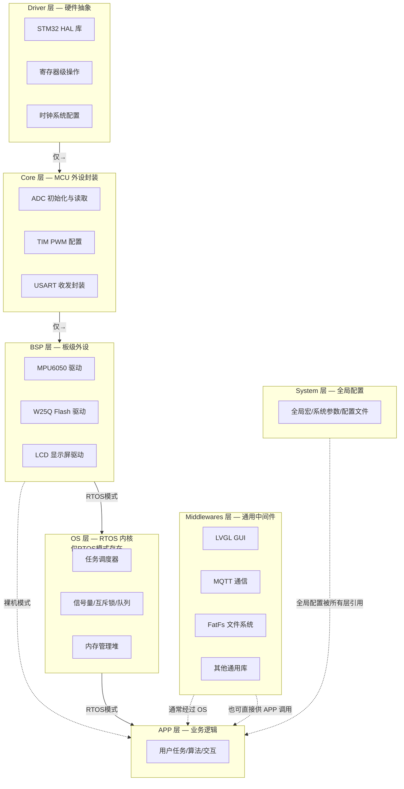
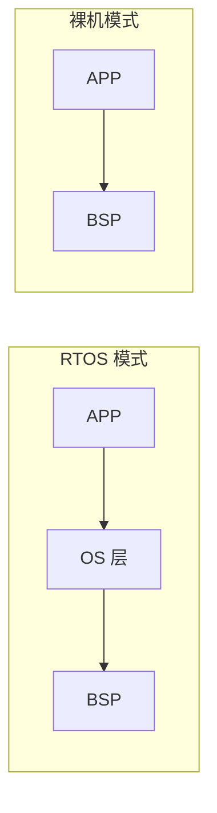

# 嵌入式软件分层架构参考模型

> 本文件定义嵌入式软件的标准 7 层架构，作为所有相关 skill（driver开发/代码审查/架构评审/移植）的共享参考依据。
> 所有代码生成、审查、移植工作必须遵循此分层规则，**禁止跨层操作**。
>
> **关键区分**：裸机（无 RTOS）和 RTOS 两种模式下，层间连接方式不同——详见"裸机 vs RTOS 依赖规则"章节。

## 架构全景



## 逐层定义

### Driver 层（硬件抽象层）

| 属性 | 内容 |
|------|------|
| **定义** | CPU 厂商/MCU 厂商提供的驱动库，用于 CPU 和片上外设编程 |
| **代表** | STM32 HAL/LL 库、CMSIS-Core、寄存器操作封装 |
| **职责** | 提供 GPIO/UART/SPI/I2C/TIM/ADC 等片上外设的底层接口 |
| **约束** | 直接操作寄存器实现时钟系统、总线控制、中断 |
| **换芯片** | 更换芯片**必须**修改此层代码 |
| **通信** | **仅为 Core 层提供硬件操作接口，不与 BSP 层通信** |
| **抽象粒度** | 对硬件（寄存器）的抽象 |

```c
// Driver 层示例: STM32 HAL 的 GPIO 初始化
// 文件: Driver/STM32F4xx_HAL_Driver/Src/stm32f4xx_hal_gpio.c

void HAL_GPIO_Init(GPIO_TypeDef *GPIOx, GPIO_InitTypeDef *GPIO_Init)
{
    uint32_t position;
    for (position = 0; position < 16; position++)
    {
        // 直接操作 GPIOx->MODER, ->OTYPER, ->OSPEEDR, ->PUPDR 寄存器
        // 不包含任何业务逻辑
    }
}
```

**面向对象映射**：`GPIO_TypeDef` = 类（封装寄存器地址），`HAL_GPIO_Init` = 方法（操作成员寄存器）

---

### Core 层（MCU 外设封装层）

| 属性 | 内容 |
|------|------|
| **定义** | 面向 MCU 编程，初始化 MCU 内部外设，包含 main.c |
| **代表** | ADC_init()/TIM_PWM_Start()/UART_Send() 等封装函数 |
| **职责** | 统一外设接口，使上层开发无需关注芯片硬件差异 |
| **约束** | 调用 Driver 层 API，对常用外设进行高层封装，**标准化接口** |
| **换芯片** | 接口不变但实现需要重写（因为 Driver 层变了） |
| **通信** | 调用 Driver 层，为 BSP 层提供服务 |

```c
// Core 层示例: 统一 UART 接口封装
// 文件: Core/Src/uart_core.c

// ── Core 层接口（BSP 层的调用入口）──
void UART_Init(uint32_t baudrate)
{
    // 调用 Driver 层 HAL API
    huart.Instance = USART1;
    huart.Init.BaudRate = baudrate;
    huart.Init.WordLength = UART_WORDLENGTH_8B;
    huart.Init.StopBits = UART_STOPBITS_1;
    huart.Init.Parity = UART_PARITY_NONE;
    HAL_UART_Init(&huart);
}

void UART_Send(uint8_t *data, uint16_t len)
{
    HAL_UART_Transmit(&huart, data, len, HAL_MAX_DELAY);
}
```

**面向对象映射**：`UART_Init()/UART_Send()` = 类的公开方法，隐藏了 `huart` 句柄（私有成员）

---

### BSP 层（板级外设驱动层）

| 属性 | 内容 |
|------|------|
| **定义** | 面向板上外设编程（如 MPU6050、W25Q、LCD） |
| **代表** | MPU6050_ReadAccel() / W25Q_WritePage() |
| **职责** | 调用 Core 层 API 封装外设的操作流程（初始化→发送指令→接收数据→校验→转换） |
| **约束** | **不与 Driver 层交互**，只调用 Core 层 |
| **换板子** | 同一芯片的不同板卡需单独适配 BSP 层 |
| **通信** | 调用 Core 层 API |
| **调用者** | **RTOS 模式**：被 OS 层任务调用（通过 xTaskCreate 创建的任务函数） |
| | **裸机模式**：被 APP 层 main 循环直接调用（此时 APP=BSP 是允许的架构路径） |

```c
// BSP 层示例: MPU6050 驱动
// 文件: BSP/MPU6050/mpu6050.c

void MPU6050_Init(void)
{
    uint8_t data = 0x00;
    // 调用 Core 层 I2C API（不直接调用 HAL_I2C_Master_Transmit）
    I2C_Write(MPU6050_ADDR, MPU6050_REG_PWR_MGMT_1, &data, 1);
}

float MPU6050_ReadTemperature(void)
{
    uint8_t buf[2];
    // 调用 Core 层 I2C API
    I2C_Read(MPU6050_ADDR, MPU6050_REG_TEMP_H, buf, 2);
    // 数据转换（业务语义）
    int16_t raw = (buf[0] << 8) | buf[1];
    return (raw / 340.0f) + 36.53f;
}
```

**面向对象映射**：`MPU6050_Init()/MPU6050_ReadTemperature()` = 类方法，`I2C_Read/Write` = 依赖注入接口

---

### OS 层（实时操作系统层）

| 属性 | 内容 |
|------|------|
| **定义** | 提供多任务调度、资源管理、同步互斥能力 |
| **代表** | FreeRTOS / RT-Thread / ThreadX |
| **职责** | 调度器、信号量/互斥锁/队列、内存管理（堆）、避免死锁和优先级反转 |
| **约束** | 调用 OS API 时要考虑死锁问题和优先级反转问题 |
| **通信** | 调用 BSP 层驱动，为 APP 层和 Middlewares 层提供任务调度服务 |

```c
// OS 层示例: 创建任务
// 文件: OS/Tasks/task_definitions.c

void Task_SensorRead(void *params)
{
    MPU6050_Init();  // 调用 BSP 层
    while (1)
    {
        float temp = MPU6050_ReadTemperature();  // 调用 BSP 层
        xQueueSend(temp_queue, &temp, portMAX_DELAY);  // RTOS 通信
        vTaskDelay(pdMS_TO_TICKS(100));
    }
}
```

---

### Middlewares 层（中间件层）

| 属性 | 内容 |
|------|------|
| **定义** | 项目间通用的外设抽象程序，模块化设计可快速开发 |
| **代表** | LVGL（GUI）、MQTT（通信）、FatFs（文件系统）、mbedTLS（加密） |
| **职责** | 提供跨项目复用的功能模块 |
| **约束** | 通过 OS 层运行，底层依赖通过移植接口接入 |
| **通信** | 调用 OS 层 API（任务/内存/锁），或直接通过移植接口访问 BSP/Core |

---

### System 层（系统配置层）

| 属性 | 内容 |
|------|------|
| **定义** | 系统全局宏定义、全局参数、配置文件 |
| **代表** | FreeRTOSConfig.h、stm32f4xx_hal_conf.h、全局类型定义、错误码枚举 |
| **职责** | 定义对全局系统有影响的参数和文件 |
| **约束** | 被所有层引用，但不依赖任何层 |
| **通信** | 无（全局配置，被所有层引用） |

---

### APP 层（业务逻辑层）

| 属性 | 内容 |
|------|------|
| **定义** | 结合实际需求的业务逻辑实现，task 文件存放位置 |
| **代表** | 人机交互界面、物联网通信协议、机械臂运动算法 |
| **职责** | 调用 OS 层和 Middlewares 层完成逻辑算法，保证代码独立性 |
| **换项目** | 业务逻辑完全可替换，底层驱动不变 |
| **约束（RTOS）** | **只调用 OS 层和 Middlewares 层**，不直接访问 BSP/Core/Driver |
| **约束（裸机）** | **可调用 BSP 层**（无 OS 层），但不能直接调 Core/Driver |

```c
// ── RTOS 模式 ──
// 文件: APP/Tasks/app_temp_report.c

void App_TempReportTask(void *params)
{
    while (1)
    {
        float temp;
        // ✅ 正确: 通过 OS 层队列获取数据（间接访问 BSP）
        xQueueReceive(temp_queue, &temp, portMAX_DELAY);

        // ✅ 正确: 调用中间件发送
        MQTT_Publish("sensor/temp", &temp, sizeof(temp), 0);

        // ❌ 禁止 (RTOS 模式): 直接调用 BSP 层
        // MPU6050_ReadTemperature();  // 跨层！不经过 OS 调度
    }
}

// ── 裸机模式 ──
// 文件: APP/main.c

int main(void)
{
    // 初始化 (Core 层)
    SystemClock_Config();
    UART_Init(115200);
    I2C_Init(100000);

    // 初始化 (BSP 层)
    MPU6050_Init();  // 直接调用 BSP — 裸机模式下允许

    while (1)
    {
        // ✅ 正确 (裸机): APP 直接调 BSP
        float temp = MPU6050_ReadTemperature();

        // ✅ 正确: 通过 Core 层 API 发送
        UART_Send((uint8_t*)&temp, sizeof(temp));

        // ❌ 禁止: 直接调 Driver 层
        // HAL_UART_Transmit(&huart1, (uint8_t*)&temp, sizeof(temp), 1000);

        HAL_Delay(1000);  // 通过 Core 层延时
    }
}
```

---

## 分层铁律

### 裸机 vs RTOS 依赖规则

**关键区分**：OS 层在裸机模式下**不存在**，所以 APP→BSP 的连接方式取决于是否有 RTOS。



| 连接 | RTOS 模式 | 裸机模式 |
|------|-----------|---------|
| APP→BSP | **禁止**（必须经过 OS 调度） | **允许**（无 OS 层，直接调用） |
| APP→Core | 禁止 | 禁止 |
| BSP→Driver | 禁止 | 禁止 |
| APP→Driver | 禁止 | 禁止 |

### 依赖方向（单向）

```
RTOS 模式：Driver → Core → BSP → OS → APP
裸机模式：Driver → Core → BSP → APP
                   ↑
              Middlewares
                   ↑
            System (全局配置)
```

**核心原则**：
- **Driver → Core → BSP** 这条链在任何模式下都固定不变
- BSP **始终**不能直接调 Driver
- OS 层仅在 RTOS 模式下存在，裸机时可直接跳过
- APP 在 RTOS 模式下必须通过 OS 访问 BSP；在裸机模式下可直接调 BSP

### 禁止行为

| 违规 | 后果 | 正确做法 |
|------|------|---------|
| BSP 直接调用 HAL | 换芯片时 BSP 也要改，失去分层意义 | BSP → Core API → Driver HAL |
| APP 直接调用 Core | 跳过 BSP 层的板级适配，换板子时 APP 也要改 | APP → BSP → Core |
| APP 直接调用 Driver | 完全绕过所有抽象层，芯片换不了 | APP → BSP → Core → Driver |
| Core 直接包含业务逻辑 | 外设驱动与业务耦合，复用性差 | Core 只做外设封装，不包含业务 |
| ISR 中调 BSP/APP 函数 | ISR 不受 RTOS 管理，可能死锁 | ISR 仅做标志位或 fromISR API |

### 允许的例外

- **中断服务函数**：ISR 可以调用 Driver 层（寄存器操作）和 Core 层（外设操作），**但需标记为跨层操作并特别审查**
- **System 层**：全局宏和配置可以被任何层引用
- **调试阶段**：printf 直接从任意层到 UART（通过 `_write` syscall），正式版本应约束
- **裸机 APP → BSP**：这是架构允许的正确路径，不是违规——只要项目中确实没有 OS 层

---

## 面向对象思想在 C 语言中的实现

嵌入式 C 代码通过以下模式实现 OOP 的三大特性：

### 封装（Encapsulation）

```c
// ── 头文件（公开接口）──
// Core/Inc/uart_core.h
typedef struct {
    USART_TypeDef *Instance;
    uint32_t BaudRate;
} UART_Handle_t;

void UART_Init(UART_Handle_t *huart);
void UART_Send(UART_Handle_t *huart, uint8_t *data, uint16_t len);

// ── 源文件（私有实现）──
// Core/Src/uart_core.c
static uint8_t tx_buffer[256];  // 私有变量，外部不可见
void UART_Init(UART_Handle_t *huart) { /* ... */ }
```

### 继承（通过结构体包含实现）

```c
// "基类": 通用设备接口
typedef struct {
    void (*init)(void);
    void (*read)(uint8_t *buf, uint16_t len);
    void (*write)(uint8_t *buf, uint16_t len);
} Device_t;

// "子类": MPU6050 继承 Device_t
typedef struct {
    Device_t base;       // "基类"成员（必须在第一个字段）
    float accel_offset;  // 子类特有
    uint8_t i2c_addr;    // 子类特有
} MPU6050_t;
```

### 多态（通过函数指针表实现）

```c
// ── 统一的传感器接口 ──
typedef struct {
    void (*init)(void);
    float (*read_temperature)(void);
    float (*read_humidity)(void);
} SensorOps_t;

// ── 不同的传感器实现同一接口 ──
SensorOps_t DHT22_Ops = { DHT22_Init, DHT22_ReadTemp, DHT22_ReadHumidity };
SensorOps_t SHT30_Ops = { SHT30_Init, SHT30_ReadTemp, SHT30_ReadHumidity };
SensorOps_t MPU6050_Ops = { MPU6050_Init, MPU6050_ReadTemp, NULL };
```

---

## 架构在技能中的映射

| 技能 | 对应层 | 说明 |
|------|--------|------|
| `stm32-hal-development` | Driver | HAL 库使用指南 |
| `mcu-peripheral-registers` | Driver | 寄存器级操作 |
| `arm-core-registers` | Driver | Cortex-M 内核寄存器 |
| `i2c-bus` / `spi-bus` / `uart-module` 等 | Driver + Core | 总线协议 + MCU 外设封装 |
| `peripheral-driver` | BSP | 板级外设驱动 |
| `freertos-module` | OS | RTOS 内核 |
| `fatfs-module` | Middlewares | 文件系统中间件 |
| `code-porting` | 跨层 | 涉及 Driver/Core/BSP 三层的修改 |
| `embedded-architect` | 全层 | 所有层的架构决策 |
| `embedded-code-reviewer-framework` | 全层 | 所有层的代码审查 |
