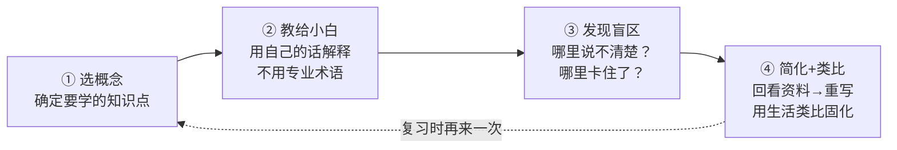
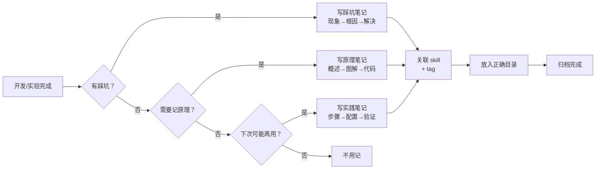

# 嵌入式学习笔记管理

> 将开发中的经验、实验、知识点沉淀为结构化 Obsidian 笔记。
> - **嵌入式相关** → `领域/嵌入式/`（7 层架构组织）
> - **AI/工具/其他** → `领域/AI/`
>
> 配合 `embedded-learning-path-framework` 使用：路径框架规划「学什么」，本 skill 记录「学到了什么」。

---

## 场景

- **做完实验想记下来** — 移植验证通过了，想把踩坑过程归档
- **学新知识想结构化** — 刚搞懂 CmBacktrace 栈回溯原理，想写篇能长期复习的笔记
- **需要复习旧知识** — 三个月前调通的 I2C，现在要改配置忘了细节
- **想关联技能和笔记** — SKILL.md 里的知识点和 Obsidian 笔记互相跳转
- **分类不知道放哪** — 这个笔记该放「通信协议」还是「中间件」？

---

## 费曼学习法笔记法（核心方法）

所有笔记以 **费曼学习法** 四步为基底：



每篇笔记强制包含费曼核⼼三问：
1. **用一句话怎么跟非嵌入式的人解释？**（小白测试）
2. **这个知识点和之前学过的什么类似？**（类比连接）
3. **如果现在要我写一段 demo，哪里会卡住？**（盲区自检）

---

## 笔记分类体系（4 型 + 7 层）

### 4 种笔记类型（均嵌入费曼结构）

| 类型 | 英文 | 费曼侧重点 | 结构 |
|------|------|-----------|------|
| **费曼原理** | `feynman-principle` | 用自己的话解释原理+类比 | 小白解释 → 原理图解 → 类比 → 盲区 |
| **实践记录** | `practice` | 步骤可复现 | 环境 → 步骤 → 验证 → 关键配置 |
| **踩坑记录** | `pitfall` | 根因+预防 | 现象 → 根因 → 费曼版解释 → 解决 |
| **速查** | `quickref` | 快速查阅 | 一句话→核心参数→示例→注意事项 |

### 7 层目录架构

```
领域/嵌入式/
├── Driver 硬件抽象/          (寄存器/HAL/CMSIS)
├── BSP 板级外设/             (ADC/DMA/TIM/Flash)
├── 通信协议/                 (I2C/SPI/UART/USB/BLE/WiFi)
├── 中间件/                   (FATFS/AES/LVGL/CmBacktrace/SFUD/RTT/elog)
├── 操作系统/                 (FreeRTOS/RT-Thread)
├── 系统级设计/               (低功耗/Bootloader/OTA)
└── APP 业务逻辑/             (架构设计/业务代码)
```

---

## 笔记模板（费曼版）

### 费曼原理笔记（最常用）

```markdown
---
tags: [category, feynman-principle]
created: {{date}}
---

# {{title}} 原理

## 用一句话跟非嵌入式的朋友解释

> （不许出现任何专业缩写/术语，假设对方是初中生）

## 它解决了什么问题

## 工作原理

### 核心思想（把大象放进冰箱分几步）

### 图解

```mermaid
<!-- 流程图/时序图/状态机 -->
```

### 核心代码/寄存器

```c
// 最精简的可运行片段
```

## 找类比

> 这个机制和日常生活中的什么很像？

| 嵌入式概念 | 生活类比 | 为什么像 |
|-----------|---------|---------|
| e.g. 中断 | e.g. 你正在做饭，门铃响了 | 暂停当前工作→处理紧急事件→恢复 |

## 盲区自检

- [ ] 我能不看资料画出流程图吗？
- [ ] 如果面试官让我用生活中的例子解释，我会卡住吗？
- [ ] 我知道什么场景下这个方案不适用吗？

## 关联

- 「[[skill-name]]」 — SKILL.md
- [[相关笔记]]
- [[踩坑: 相关坑]]

## 参考

- 数据手册章节 / 博客链接
```

### 踩坑笔记（诊断流程基底）

基底参考：[嵌入式系统诊断流程模板](领域/嵌入式/嵌入式项目文档/嵌入式系统诊断流程模板.md)

```markdown
---
tags: [category, pitfall]
created: {{date}}
---

# {{title}} 踩坑记录

## 一、问题的描述

### 现象

### 复现路径

1. 工程环境：
2. 触发条件：

### 预期 vs 实际

| 预期 | 实际 |
|------|------|
| 应该输出 X | 实际输出了 Y |

## 二、根因分析

### 初步 checklist

- [ ] 排除硬件问题（换一块板子/已知正常的固件试过？）
- [ ] 栈溢出？（增大栈试试）
- [ ] 编译优化过度？（调 -O0）
- [ ] 指针为空？
- [ ] API 用错？
- [ ] 死锁/信号量？

### 根因

## 三、排查过程

### 实验 1: [实验名称]

**假设**：
**步骤**：
**结果**：
**分析**：

### 实验 2: [实验名称]

**假设**：
**步骤**：
**结果**：
**分析**：

## 四、解决方案

### 最终解决

```c
// 修复后的关键代码
```

## 五、预防

- 下次遇到类似问题先检查什么？
- 代码/配置上可以做哪些防护？

## 六、关联

- [[相关原理笔记]]
- 「[[skill-name]]」
- [[其他踩坑]]

```

---

## 目录归属速查

### 嵌入式 → `领域/嵌入式/`

| 主题 | 目录 | 举例 |
|------|------|------|
| HAL/寄存器/内核 | `Driver 硬件抽象/` | GPIO 寄存器、Cortex-M NVIC |
| 外设驱动 | `BSP 板级外设/` | ADC 采样、DMA 配置、PWM |
| 通信接口 | `通信协议/有线通信协议/` | I2C 时序、SPI 模式 |
| 无线通信 | `通信协议/无线通信协议/` | BLE 广播、WiFi 配网 |
| 加密/校验/文件系统/GUI | `中间件/` | AES、CRC、LVGL |
| 日志/故障诊断 | `中间件/` | CmBacktrace、EasyLogger |
| Flash 存储驱动 | `中间件/` | SFUD、FATFS |
| RTT 调试 | `中间件/` | SEGGER RTT |
| FreeRTOS | `操作系统/` | 任务、队列、信号量 |
| 低功耗/Bootloader/OTA | `系统级设计/` | 低功耗模式、OTA 策略 |

### AI/其他 → `领域/AI/`

| 主题 | 目录 | 举例 |
|------|------|------|
| LLM/AI 工具 | `领域/AI/LLM/` | Claude 使用技巧、Prompt |
| 自动化脚本 | `领域/AI/Tools/` | Python 脚本、工作流 |
| 工具配置 | `领域/AI/Config/` | JLink、Keil、环境变量 |

---

## 命名规范

```
{目录}/{主题}/{主题}_{笔记类型}.md

示例:
领域/嵌入式/中间件/CmBacktrace/CmBacktrace库原理与实践.md
领域/嵌入式/通信协议/I2C/I2C总线_踩坑_总线死锁恢复.md
领域/嵌入式/操作系统/FreeRTOS/FreeRTOS任务通知_API参考.md
```

---

## 与学习路径配合

```
embedded-learning-path-framework                  embedded-learning-notes
──────────┬──────────                             ──────────┬──────────
          │  规划阶段                                        │  记录阶段
          ▼                                                   ▼
三阶段进阶模型        ──→  选定当前阶段   ──→  创建阶段笔记
├─ 阶段一：HAL使用者   ──→  掌握 GPIO/TIM   ──→  实践笔记「STM32定时器配置」
├─ 阶段二：寄存器理解者  ──→  理解外设寄存器   ──→  原理笔记「GPIO寄存器详解」
└─ 阶段三：系统设计者   ──→  设计低功耗方案   ──→  实践笔记「低功耗移植记录」

每次路径框架推荐一个学习方向后，用本 skill 创建笔记归档。
```

## 工作流



---

## 输出

每次使用后输出：
1. **新建笔记路径** — `领域/嵌入式/.../xxx.md`
2. **笔记概要** — 3-5 行内容摘要
3. **关联清单** — 关联的 skill 和已有笔记
4. **Tag 列表** — 便于 Obsidian 检索

---

## 边界

- **不覆盖 Obsidian 基本操作**（创建仓库、插件管理） — 那是 `obsidian-cli` 等 skill
- **不覆盖学习路径规划** — 那是 `embedded-learning-path-framework`
- **不覆盖问题记录归档** — 那是 `kb-record`
- **不直接操作文件系统** — 推荐在 Obsidian 中编写笔记，本 skill 提供结构和模板
- 与 `embedded-learning-path-framework` 组成**学习流闭环**：路径框架规划「学什么」→ 本 skill 记录「学到了什么」→ 复习后反馈调整路径
- 与 `kb-record` 互补：问题记录偏向 Bug 追踪，本 skill 偏向知识积累
