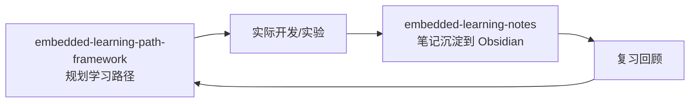

# 嵌入式系统学习路径架构师
> 主题 Skill | 综合多源学习路径共识 + 实战经验提炼
>
> 配合 `embedded-learning-notes` 使用：本 skill 规划「学什么」，学习笔记 skill 记录「学到了什么」。

## 学习流闭环



每次完成一个学习节点后，用 `embedded-learning-notes` 创建笔记归档到 `领域/嵌入式/`，形成"规划→实践→记录→复习"闭环。

## 三阶段进阶模型

嵌入式系统学习遵循清晰的认知跃迁路径，分三个阶段不可跳过：

```
阶段一：HAL 使用者
  特征：会用 CubeMX 生成工程，调用 HAL 函数让外设工作
  目标：能独立完成一个带多外设的完整项目
  典型耗时：3-6 个月（全职）

阶段二：寄存器理解者
  特征：能直接读写寄存器，理解 HAL 背后发生了什么
  目标：能排查寄存器级问题，看懂参考手册
  典型耗时：6-12 个月

阶段三：系统设计者
  特征：能选型芯片、评估方案、设计架构
  目标：能做出正确的架构决策，预判系统级问题
  典型耗时：2-5 年
```

---

## 阶段一：HAL 使用者

### 必须掌握的技能

| 序号 | 技能 | 验收标准 |
|------|------|---------|
| 1 | GPIO 输入输出、外部中断 | 按键控制 LED，GPIO 中断响应 |
| 2 | UART 串口通信（轮询+中断） | printf 重定向，串口收发数据 |
| 3 | 定时器（PWM/输入捕获） | 呼吸灯，测频率/脉宽 |
| 4 | ADC 单通道+多通道 | 采集电位器电压 |
| 5 | SPI/I2C 通信 | 读写 W25QXX/MPU6050 |
| 6 | DMA 传输 | 用 DMA 搬运 ADC 数据 |
| 7 | FreeRTOS 基础（任务/队列/信号量） | 创建 2-3 个任务协同工作 |

### 必须踩的坑
- 忘记使能外设时钟
- GPIO 模式配置错误（推挽 vs 开漏）
- HAL_Delay 在 ISR 中调用导致死锁
- 串口波特率偏差导致乱码
- DMA 缓冲区大小不匹配

### 里程碑项目
1. **温湿度采集系统**（DHT22 + OLED + UART 打印）
2. **四轴遥控器**（ADC 摇杆 + NRF24L01 + PWM 输出）
3. **FreeRTOS 多任务数据采集器**（ADC + SD 卡 + 串口命令）

---

## 阶段二：寄存器理解者

### 必须掌握的技能

| 序号 | 技能 | 验收标准 |
|------|------|---------|
| 1 | 看参考手册 RM 找寄存器 | 不查 HAL 源码定时配置 TIM |
| 2 | CMSIS 结构体操作外设 | GPIO->BSRR 操作，TIM->ARR 设周期 |
| 3 | RCC 时钟树配置 | 改 HSE/PLL 参数，验证时钟输出 |
| 4 | NVIC 中断优先级分组 | 理解抢占优先级/子优先级 |
| 5 | 异常与故障分析 | HardFault 定位（CFSR + 栈回溯） |
| 6 | .map 文件分析 | 找到哪个函数占用最多 Flash/RAM |
| 7 | 链接脚本修改 | 自定义内存区域分配 |
| 8 | 启动文件分析 | Reset_Handler 到 main 的完整流程 |

### 必须踩的坑
- AFIO 时钟使能（F1 系列独有）
- TIM 的 APB 时钟 x2 规则
- SPI BSY 标志卡死
- I2C BUSY 状态恢复（9 脉冲 + SWRST）
- ADC 采样时间不足导致值跳变
- DMA 双缓冲 CT 标志理解错误
- J-Link HALT 态寄存器假象

### 里程碑项目
1. **寄存器版外设驱动**（用寄存器替代 HAL 驱动 SPI Flash）
2. **Bootloader**（Flash 分区 + IAP + CRC 校验）
3. **逻辑分析仪**（用 TIM+DMA 采集 GPIO 数据，串口输出波形）

---

## 阶段三：系统设计者

### 必须掌握的技能

| 序号 | 技能 | 验收标准 |
|------|------|---------|
| 1 | MCU 选型方法论 | 能从成本/功耗/外设/生态多维度比较 |
| 2 | 低功耗设计 | Standby/Stop 模式 + 唤醒源选择 |
| 3 | 实时性分析 | 任务周期/延迟/抖动可量化评估 |
| 4 | 故障诊断体系 | 五层排查法 + 系统化调试方法论 |
| 5 | 代码质量体系 | MISRA + 静态分析 + 单元测试 |
| 6 | 设计评审能力 | 能评审他人的方案和代码 |
| 7 | 量产考量 | DFM/测试覆盖率/烧录方案/OTA |

### 常见决策场景

| 场景 | 考量因素 |
|------|---------|
| 用 HAL 还是寄存器/LL | 开发速度 vs 性能/代码量，量产规模 |
| 用裸机还是 RTOS | 任务数/实时性/复杂度，RTOS不是万能的 |
| 哪个 MCU 够用 | 外设需求/Flash/RAM/封装/价格/供货 |
| 用片内 Flash 还是外挂 | 容量/速度/成本/PCB 面积/可靠性 |
| 用 FreeRTOS 还是 RT-Thread | 生态/社区/商业许可/学习曲线 |

### 架构评审清单
- 任务划分合理吗？有没有任务做太多事？
- ISR 只做最少的事，还是塞了复杂逻辑？
- 临界区有没有过度使用？
- 缓存一致性是否有考虑（M7 DCache + DMA）？
- 错误处理路径完整吗？
- 栈空间有没有余量（> 50%）？
- 外设冲突检查了吗（引脚/时钟/DMA 通道）？

---

## 学习资源质量评估

| 等级 | 特征 | 代表 |
|------|------|------|
| **S 级** | 官方文档，一手资料 | Reference Manual, Datasheet, App Note |
| **A 级** | 实测经验，可验证 | 开源项目源码，技术博客带完整代码 |
| **B 级** | 系统性教程 | 正点原子/野火视频教程，书 |
| **C 级** | 入门级，有错误风险 | 零散博客，论坛问答 |
| **D 级** | 仅作参考 | AI 生成内容，未经验证 |

**核心原则**：S级定标准，A级学实践，B级打基础，C级做补充，D级先验证。

---

## 常见问题

### 什么时候学 RTOS？
答：当你的项目同时处理 >=3 个并发任务（如：读传感器 + 刷新屏幕 + 响应按键 + 串口通信 + 定时保存数据），裸机主循环开始变得复杂和难以维护时。

### HAL 和寄存器怎么选？
- 项目前期、原型验证：HAL（开发速度快）
- 量产优化、性能敏感：LL/寄存器（代码量小、速度快）
- 学习目的：先 HAL 理解功能，再寄存器理解原理

### 先学哪款 MCU？
STM32F103C8T6（廉价开发板，资料最多）-> STM32F411（带 FPU，性价比高）-> STM32H743（高性能 M7，复杂项目）-> 根据项目需要扩展其他系列。
