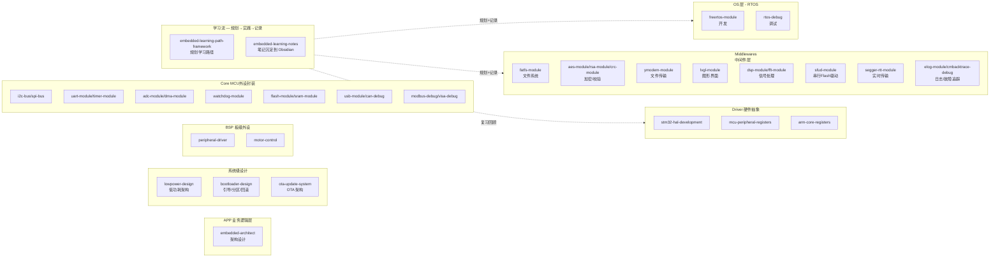

# 嵌入式 Skill 完整分类映射表

> 参照 Obsidian `领域/嵌入式/` 目录结构组织。包含已启用和已禁用的嵌入式相关 skills。
>
> 分层架构参考：`embedded-architect/references/layered-architecture-model.md`

## 技能与分层架构对应关系

按嵌入式 7 层架构归类各 skill，标明每层覆盖范围：

| 层 | Skill | 说明 |
|----|-------|------|
| **APP** | `embedded-architect` | 系统架构设计与需求分析 |
| **OS** | `freertos-module` | FreeRTOS 开发指南 |
| **OS** | `rtos-debug` | RTOS 感知调试 |
| **Middlewares** | `fatfs-module` | 文件系统中间件 |
| **Middlewares** | `aes-module` / `rsa-module` | 加密/解密/签名中间件 |
| **Middlewares** | `crc-module` | CRC 校验中间件 |
| **Middlewares** | `ymodem-module` | Ymodem 文件传输中间件 |
| **Middlewares** | `lvgl-module` | 嵌入式 GUI 中间件 |
| **Middlewares** | `dsp-module` / `fft-module` | DSP/FFT 信号处理中间件 |
| **Middlewares** | `sfud-module` | 串行 Flash 通用驱动中间件 |
| **Middlewares** | `segger-rtt-module` | SEGGER RTT 实时传输中间件 |
| **Middlewares** | `elog-module` | EasyLogger 日志库中间件 |
| **Middlewares** | `cmbacktrace-debug` | CmBacktrace 故障追踪中间件 |
| **Middlewares** | `doc-automation` | minunit 测试生成+运行 |
| **SYS** | `lowpower-design` | 系统低功耗设计（跨层：Driver→Core→BSP） |
| **SYS** | `bootloader-design` | Bootloader 引导设计（跨层：Core→BSP） |
| **SYS** | `ota-update-system` | OTA 系统架构（跨层：Core→APP） |
| **BSP** | `peripheral-driver` | 板级外设驱动开发 |
| **BSP** | `motor-control` | 电机控制（BSP 级算法） |
| **Core** | `i2c-bus` / `spi-bus` | 总线外设封装 |
| **Core** | `uart-module` / `timer-module` | 通信/定时器外设封装 |
| **Core** | `adc-module` / `dma-module` | 采集/数据传输封装 |
| **Core** | `watchdog-module` | 看门狗（IWDG/WWDG）封装 |
| **Core** | `flash-module` / `sram-module` | 存储外设封装 |
| **Core** | `usb-module` / `can-debug` | 高速通信封装 |
| **Core** | `modbus-debug` / `visa-debug` | 工业通信/仪器控制 |
| **Driver** | `stm32-hal-development` | STM32 HAL 库使用 |
| **Driver** | `mcu-peripheral-registers` | 寄存器级操作 |
| **Driver** | `arm-core-registers` | Cortex-M 内核寄存器 |
| **跨层** | `code-porting` | 涉及 Driver+Core+BSP 的移植工作 |
| **跨层** | `embedded-reviewer` | 全层代码审查 (吸收自 code-reviewer-framework) |
| **跨层** | `embedded-skills-map` | 全层技能地图索引 |
| **学习流** | `embedded-learning-path-framework` | 三阶段进阶规划 |
| **学习流** | `embedded-learning-notes` | Obsidian 笔记沉淀 |

## 通信协议

| Skill | 类型 | Obsidian 对应路径 | 状态 | 配合参考 |
|-------|------|------------------|------|---------|
| `i2c-bus` | 总线协议 | `通信协议/有线通信协议/I2C` | [OK] | `peripheral-driver`（设备驱动）, `stm32-hal-development`（HAL 初始化） |
| `spi-bus` | 总线协议 | `通信协议/有线通信协议/SPI` | [OK] | `peripheral-driver`（设备驱动）, `stm32-hal-development`（HAL 初始化） |
| `uart-module` | 外设模块 | `通信协议/有线通信协议/UART` | [OK] | `serial-monitor`（日志）, `stm32-hal-development` 6b（DMA+IDLE） |
| `usb-module` | 外设模块 | `通信协议/有线通信协议/USB` | [OK] | `dma-module`（DMA 模式）, `stm32-hal-development` |
| `can-debug` | 总线调试 | `通信协议/有线通信协议/CAN` | [OK] | — |
| `modbus-debug` | 协议调试 | `通信协议/物联网协议与专用协议/Modbus` | [OK] | `uart-module`（底层串口） |
| `ble-module` | 无线通信 | 通信协议/无线通信协议 | [OK] | `lowpower-design`（BLE 功耗）|
| `wifi-module` | 无线通信 | 通信协议/无线通信协议 | [OK] | `mqtt-module`（WiFi+MQTT 方案）|
| `lora-module` | 无线通信 | 通信协议/远距离无线 | [OK] | `spi-bus`（SX1278 SPI）|
| `cellular-module` | 蜂窝通信 | 通信协议/蜂窝网络 | [OK] | `mqtt-module`（MQTT over LTE）|
| `gps-module` | 定位 | 通信协议/定位 | [OK] | `uart-module`（NMEA 串口）|
| `mqtt-module` | 物联网协议 | 通信协议/物联网协议与专用协议 | [OK] | `wifi-module`, `cellular-module` |

## 开发板 — ARM 架构

| Skill | 类型 | Obsidian 对应路径 | 状态 | 配合参考 |
|-------|------|------------------|------|---------|
| `stm32-hal-development` | HAL 开发 | `开发板/ARM架构/STM32F411CEU6` | [OK] | 全系列 skill 的上层入口 |
| `arm-core-registers` | 内核寄存器 | `开发板/ARM架构` | [OK] | `mcu-peripheral-registers`, `rtos-debug` |
| `mcu-peripheral-registers` | 外设寄存器 | `开发板/ARM架构` | [OK] | `arm-core-registers`, `stm32-hal-development` |
| `lowpower-design` | 系统低功耗 | `开发板/ARM架构`（电源管理） | [OK] | `watchdog-module`（低功耗狗行为）, `sram-module`（SRAM保持） |
| `flash-jlink` | 烧录 | `必备开发工具/kile5`（JLink 工具链） | [OK] | `build-keil`, `debug-gdb-openocd` |
| `flash-openocd` | 烧录 | `必备开发工具` | [OK] | `debug-gdb-openocd` |
| `debug-gdb-openocd` | 调试 | `必备开发工具` | [OK] | `flash-openocd`, `rtos-debug` |
| `flash-keil` | 烧录 | `必备开发工具/kile5` | [OK] | `build-keil` |
| `build-keil` | 编译 | `必备开发工具/kile5` | [OK] | `flash-keil`, `workflow` |
| `build-iar` | 编译 | `必备开发工具` | [OK] | — |
| `build-cmake` | 编译 | `必备开发工具/cmake` | [OK] | `static-analysis` |
| `build-platformio` | 编译 | `必备开发工具` | [OK] | `flash-platformio`, `debug-platformio` |
| `flash-platformio` | 烧录 | `必备开发工具` | [OK] | `build-platformio` |
| `debug-platformio` | 调试 | `必备开发工具` | [OK] | `build-platformio` |

## 开发板 — RISC-V 架构

| Skill | 类型 | Obsidian 对应路径 | 状态 | 配合参考 |
|-------|------|------------------|------|---------|
| `build-idf` | 编译 | `开发板/RISC-V架构/ESP32-S3 ESP-IDF学习` | [OK] | `flash-idf` |
| `flash-idf` | 烧录 | `开发板/RISC-V架构/ESP32-S3 ESP-IDF学习` | [OK] | `build-idf` |

## 操作系统

| Skill | 类型 | Obsidian 对应路径 | 状态 | 配合参考 |
|-------|------|------------------|------|---------|
| `freertos-module` | RTOS 开发 | `操作系统/FreeRTOS` | [OK] | `rtos-debug`（调试互补）, `arm-core-registers`（NVIC/SysTick） |
| `rtos-debug` | RTOS 调试 | `操作系统/FreeRTOS` | [OK] | `debug-gdb-openocd`, `arm-core-registers` |

## 常用模块

| Skill | 类型 | Obsidian 对应路径 | 状态 | 配合参考 |
|-------|------|------------------|------|---------|
| `adc-module` | 外设模块 | `常用模块/传感器`（用于传感器采样） | [OK] | `timer-module`（定时触发）, `stm32-hal-development` |
| `dma-module` | 外设模块 | `开发板/ARM架构`（DMA 子系统） | [OK] | `adc-module`（DMA 传输）, `stm32-hal-development` |
| `timer-module` | 外设模块 | `开发板/ARM架构/STM32F411CEU6/时钟系统与定时器` | [OK] | `adc-module`（定时触发ADC）, `arm-core-registers`（NVIC 配置） |
| `flash-module` | 存储模块 | `开发板/ARM架构`（Flash 存储器） | [OK] | `sram-module`（内存互补）, `option-bytes` |
| `sram-module` | 存储模块 | `开发板/ARM架构`（SRAM 存储器） | [OK] | `flash-module`（存储互补）, `dma-module`（DMA 缓冲区） |
| `watchdog-module` | 看门狗 | `开发板/ARM架构`（IWDG/WWDG 子系统） | [OK] | `option-bytes`（硬件IWDG模式）, `lowpower-design`（Stop下狗行为） |
| `motor-control` | 电机控制 | `常用模块/电机` | [OK] | `timer-module`（PWM+编码器）, `adc-module`（电流采样） |
| `peripheral-driver` | 设备驱动 | `常用模块/传感器`, `常用模块/显示屏` 等 | [OK] | `i2c-bus`, `spi-bus`（总线层） |

## EDA/原理图分析

| Skill | 类型 | Obsidian 对应路径 | 状态 | 配合参考 |
|-------|------|------------------|------|---------|
| `pcb-analysis` | 原理图分析 | `必备开发工具` | [OK] | `workflow`（schematic-review 流水线） |

## 必备开发工具

| Skill | 类型 | Obsidian 对应路径 | 状态 | 配合参考 |
|-------|------|------------------|------|---------|
| `serial-monitor` | 日志工具 | `必备开发工具` | [OK] | `uart-module`, `workflow` |
| `rtt-monitor` | 日志工具 | `必备开发工具` | [OK] | `workflow` |
| `static-analysis` | 静态分析 | `必备开发工具` | [OK] | `misra-c2012-standard`, `lixin-c-coding-standard-zh` |
| `doc-automation` | 测试生成+运行(minunit) | `嵌入式项目文档与工作流` | [OK] | — |
| `map-analyzer` | 分析工具 | `必备开发工具` | [OK] | `build-keil`, `build-cmake` |
| `gang-flash` | 量产工具 | `必备开发工具` | [OK] | `flash-jlink`, `flash-openocd` |
| `firmware-sign` | 安全工具 | `必备开发工具` | [OK] | `ota-package` |
| `ota-package` | 升级工具 | `必备开发工具` | [OK] | `firmware-sign`, `build-idf` |
| `option-bytes` | 配置工具 | `必备开发工具` | [OK] | `flash-jlink` |
| `visa-debug` | 仪器控制 | `必备开发工具` | [OK] | `uart-module`（串口仪器） |
| `agent-packager` | 打包工具 | `必备开发工具` | [OK] | `workflow`（打包工作流）, `embedded-skills-map`（读取分类） |
| `skills-system-builder` | 技能系统搭建规范 | `Agent 管理` | [OK] | `embedded-skills-map`, `skill-creator` |
| `chip-architecture` | 芯片架构对比参考 | `开发板 — ARM` | [OK] | `code-porting`, `uart-module`, `i2c-bus`, `spi-bus` 等外设 skill |
| `sfud-module` | 串行 Flash 通用驱动 | `中间件` | [OK] | `spi-bus`（SPI调试）, `flash-module`（内部 Flash）, `fatfs-module`（文件系统） |
| `segger-rtt-module` | SEGGER RTT 实时传输 | `中间件` | [OK] | `elog-module`（日志输出后端）, `rtt-monitor`（RTT运行时监控）, `flash-jlink`（JLink调试） |
| `elog-module` | EasyLogger 日志库 | `中间件` | [OK] | `segger-rtt-module`（RTT后端）, `cmbacktrace-debug`（故障诊断互补）, `sfud-module`（Flash后端） |
| `cmbacktrace-debug` | CmBacktrace 故障追踪 | `中间件` | [OK] | `embedded-debugger-framework`（五层诊断）, `arm-core-registers`（CFSR解码）, `freertos-module`（FreeRTOS集成） |

## 编码规范与代码质量

| Skill | 类型 | 状态 | 配合参考 |
|-------|------|------|---------|
| `lixin-c-coding-standard-zh` | 编码规范 | [OK] | `misra-c2012-standard`（优先级协议）, `static-analysis` |
| `misra-c2012-standard` | MISRA 规范 | [OK] | `static-analysis`（cppcheck_misra）, `lixin-c-coding-standard-zh` |
| `simplify` | 代码优化 | [OK] | `static-analysis` |
| `embedded-reviewer` | 审查框架 (吸收自 code-reviewer-framework) | [OK] | `lixin-c-coding-standard-zh`, `misra-c2012-standard`, `coding-standards` |

## 嵌入式项目文档与工作流

| Skill | 类型 | Obsidian 对应路径 | 状态 | 配合参考 |
|-------|------|------------------|------|---------|
| `workflow` | 流水线编排 | `嵌入式项目文档/项目开发流程` | [OK] | `build-keil`, `flash-jlink`, `serial-monitor` 等 |
| `devlog` | 日志生成 | `嵌入式项目文档/开发日志` | [OK] | `workflow` |
| `doc-automation` | 文档自动化 | `嵌入式项目文档` | [OK] | `workflow`, `coding-standards` |
| `embedded-debugger-framework` | 诊断框架 | `嵌入式项目文档/嵌入式系统诊断流程模板` | [OK] | `arm-core-registers`（HardFault）, `rtos-debug` |
| `cmbacktrace-debug` | 故障自动追踪 | `嵌入式项目文档/CmBacktrace` | [OK] | `embedded-debugger-framework`（五层诊断）, `arm-core-registers`（CFSR解码）, `freertos-module`（FreeRTOS集成） |
| `embedded-learning-path-framework` | 学习规划 | `嵌入式项目文档` | [OK] | `embedded-reviewer` |
| `embedded-learning-notes` | 笔记管理 | `嵌入式项目文档` | [OK] | `embedded-learning-path-framework`, `kb-record` |

## 工作流辅助

| Skill | 类型 | 状态 | 配合参考 |
|-------|------|------|---------|
| `brainstorming` | 需求对齐/意图澄清 | [OK] | `writing-plans`, `workflow`（project-dev refining） |
| `writing-plans` | 方案设计/实施计划 | [OK] | `brainstorming`, `executing-plans`, `workflow`（project-dev planning） |
| `executing-plans` | 计划执行/审查 | [OK] | `writing-plans`, `workflow` |

## 知识管理

| Skill | 类型 | Obsidian 对应路径 | 状态 | 配合参考 |
|-------|------|------------------|------|---------|
| `knowledge-base-search` | 检索引擎 | `必备开发工具` | [OK] | `kb-verify`, `kb-import`, `kb-datasheet` |
| `kb-verify` | 验证引擎 | `必备开发工具` | [OK] | `knowledge-base-search` |
| `kb-import` | 导入工具 | `必备开发工具` | [OK] | `knowledge-base-search` |
| `kb-record` | 记录工具 | `嵌入式项目文档/问题记录` | [OK] | `embedded-debugger-framework` |
| `kb-datasheet` | 数据手册 | `必备开发工具` | [OK] | `knowledge-base-search` |

## 中间件

| Skill | 类型 | Obsidian 对应路径 | 状态 | 配合参考 |
|-------|------|------------------|------|---------|
| `fatfs-module` | 文件系统 | `操作系统/文件系统/FatFs` | [OK] | `flash-module`（底层存储）, `sram-module`（缓冲区） |
| `aes-module` | 加密 | `中间件/加密` | [OK] | `crc-module`（完整性校验互补）, `rsa-module`（混合加密方案）, `ota-update-system`（OTA加密） |
| `rsa-module` | 签名/加密 | `中间件/加密` | [OK] | `aes-module`（混合加密）, `firmware-sign`（固件签名）, `bootloader-design`（安全引导） |
| `crc-module` | 校验 | `中间件/校验` | [OK] | `ymodem-module`（帧校验）, `ota-update-system`（固件完整性）, `aes-module`（加密+校验） |
| `ymodem-module` | 文件传输 | `中间件/文件传输` | [OK] | `bootloader-design`（Ymodem OTA）, `uart-module`（底层串口）, `crc-module`（帧校验） |
| `lvgl-module` | GUI | `中间件/GUI` | [OK] | `timer-module`（刷新定时器）, `sram-module`（帧缓冲）, `peripheral-driver`（LCD驱动） |
| `dsp-module` | 信号处理 | `中间件/信号处理` | [OK] | `fft-module`（频谱分析互补）, `adc-module`（采样源）, `timer-module`（定时触发） |
| `fft-module` | 频谱分析 | `中间件/信号处理` | [OK] | `dsp-module`（滤波预处理）, `adc-module`（采样）, `arm-core-registers`（FPU配置） |
| `sfud-module` | 串行Flash驱动 | `中间件/存储` | [OK] | `spi-bus`（SPI调试）, `flash-module`（内部Flash互补）, `fatfs-module`（文件系统） |
| `segger-rtt-module` | 实时传输 | `中间件/日志` | [OK] | `elog-module`（日志输出后端）, `rtt-monitor`（RTT监控）, `flash-jlink`（JLink调试） |
| `elog-module` | 日志库 | `中间件/日志` | [OK] | `segger-rtt-module`（RTT后端）, `cmbacktrace-debug`（故障互补）, `sfud-module`（Flash后端） |
| `cmbacktrace-debug` | 故障追踪 | `中间件/调试` | [OK] | `embedded-debugger-framework`（五层诊断）, `arm-core-registers`（CFSR解码）, `freertos-module`（FreeRTOS集成） |

## 已安装但禁用（嵌入式相关）

| Skill | 原因 |
|-------|------|
| `st-stm32` | draft 状态，被 `stm32-hal-development` 完全替代 |

## Skill 分布统计

| 一级分类 | 数量 | 占比 |
|---------|------|------|
| 必备开发工具 | 18 | 23% |
| 开发板 — ARM | 15 | 19% |
| 常用模块 | 8 | 10% |
| 系统级设计 | 3 | 4% |
| 通信协议 | 12 | 15% |
| 知识管理 | 5 | 6% |
| 编码规范与代码质量 | 4 | 5% |
| 嵌入式项目文档与工作流 | 4 | 5% |
| 工作流辅助 | 3 | 4% |
| 开发板 — RISC-V | 2 | 3% |
| 操作系统 | 2 | 3% |
| **中间件** | **12** | **15%** |
| **学习流** | **2** | **2%** |
| EDA/原理图分析 | 1 | 2% |
| Agent 管理 | 1 | 2% |
| **总计** | **81** | 100% |

> 注：一个 skill 可能归属多个分类（如 `stm32-hal-development` 同时是开发板和项目文档的基础），上表按主要归属统计。
