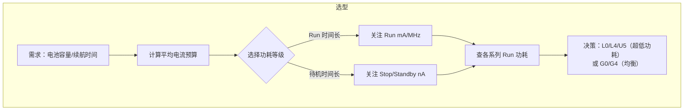

# STM32 系统低功耗设计指南

> 低功耗设计不只是调一个「进入睡眠」的函数——它是从芯片选型、时钟规划、外设管理到唤醒架构的系统工程。
> 与 `watchdog-module`（低功耗下看门狗行为）互补：本 skill 覆盖完整的功耗模式决策树、电源架构和唤醒策略。
> 与 `sram-module`（SRAM 保持策略）互补：本 skill 覆盖不同功耗模式下的内存保持配置。

## 适用场景

- 电池供电产品功耗预算分析与优化
- STM32 睡眠/停止/待机/关机模式选择与配置
- 唤醒源设计（RTC/EXTI/LPUART/LPTIM/比较器）
- 时钟门控与外设时钟禁用策略
- 电压缩放（VOS）调节性能与功耗
- SMPS vs LDO 电源方案决策
- 低功耗外设（LPTIM/LPUART）应用
- RTC + 备份域保持（备份寄存器 + 备份 SRAM）
- 低功耗调试（电流测量、唤醒源溯源、功耗异常排查）
- 量产功耗测试方法

## 必要输入

- MCU 型号（各系列功耗模式差异大）
- 目标功耗预算（运行 mA / 睡眠 μA / 待机 nA）
- 唤醒条件（定时/WFI/外部事件/通信唤醒）
- 最大唤醒时间要求（从低功耗模式到代码执行）
- 需要保持的 SRAM 容量
- RTC 是否需要运行
- 供电方式（电池/LDO/SMPS/能量采集）

## STM32 低功耗模式全景

### 四种核心模式

```
                           ┌──────────────┐
                           │   Run (运行)  │ ← 正常运行，全速时钟
                           └──────┬───────┘
                                  │
                         ┌────────┴────────┐
                    ┌────▼────┐      ┌─────▼─────┐
                    │  Sleep  │      │  Stop      │ ← 内核时钟停，外设可选
                    │ (睡眠)  │      │ (停止)     │    SRAM 保持
                    └────┬────┘      └─────┬─────┘
                         │                 │
                         │          ┌──────┴──────┐
                         │     ┌────▼───┐    ┌─────▼───┐
                         │     │ Stop0  │    │ Stop1/2  │
                         │     │(H7/G4) │    │(L4/L5)   │
                         │     └────┬───┘    └────┬────┘
                         │          │              │
                    ┌────▼──────────┴──────────────▼────┐
                    │          Standby (待机)            │
                    │  SRAM 丢失，备份域保持               │
                    └────────────────┬──────────────────┘
                                     │
                    ┌────────────────▼─────────────────┐
                    │          Shutdown (关机)           │
                    │  备份域丢失，完整冷启动              │
                    └──────────────────────────────────┘
```

### 各模式核心差异

| 特性 | Sleep | Stop (Stop0/1/2) | Standby | Shutdown |
|------|-------|------------------|---------|----------|
| CPU | 停（但可被事件立即唤醒） | 停 | 掉电 | 掉电 |
| Flash | 运行 | 可关闭（可选） | 掉电 | 掉电 |
| SRAM | 全部保持 | 全部或部分保持（系列差异） | **丢失**（仅备份SRAM可选） | 全部丢失 |
| 备份域 (RTC/BKP) | 保持 | 保持 | **保持** | **丢失** |
| 电压调节器 | MR | MR (Stop0) / LPR (Stop1) / ULP (Stop2) | 掉电 | 掉电 |
| 唤醒源 | 任意中断/事件 | EXTI/RTC/LPUART/LPTIM/USB/比较器等 | EXTI/RTC/LPUART/比较器/NRST | 仅 NRST + 特定唤醒引脚 |
| 唤醒时间 | ≈ 几 μs | 3~15 μs (Stop0) / 30~200 μs (Stop2) | ≈ 30~300 μs | ≈ 1~5 ms |
| 典型功耗 | ~mA 级 | ~μA~mA 级 | ~nA~μA 级 | ~nA 级 |

### 各系列功耗模式支持矩阵

| 系列 | Sleep | Stop0 | Stop1 | Stop2 | Standby | Shutdown |
|------|-------|-------|-------|-------|---------|----------|
| F0   | ✓ | - | - | - | ✓ | - |
| F1   | ✓ | - | - | - | ✓ | - |
| F3   | ✓ | - | - | - | ✓ | - |
| F4   | ✓ | - | - | - | ✓ | - |
| F7   | ✓ | - | - | - | ✓ | - |
| G0   | ✓ | ✓ | - | ✓ | ✓ | ✓ |
| G4   | ✓ | ✓ | - | ✓ | ✓ | - |
| H5   | ✓ | ✓ | ✓ | ✓ | ✓ | ✓ |
| H7   | ✓ | ✓ | ✓ | - | ✓ | - |
| L0   | ✓ | - | ✓ | ✓ | ✓ | - |
| L4   | ✓ | - | ✓ | ✓ | ✓ | - |
| L5   | ✓ | - | ✓ | ✓ | ✓ | ✓ |
| U5   | ✓ | ✓ | ✓ | ✓ | ✓ | ✓ |
| WB   | ✓ | - | - | ✓ | ✓ | - |
| WL   | ✓ | - | ✓ | ✓ | ✓ | - |

### 各系列典型功耗速查

> 以下为**粗略参考值**（芯片个体、温度、供电电压、代码均会影响）：
> 实际数据请以对应型号数据手册（DS）的 Electrical Characteristics 章节为准。

| 系列 | Run (mA/MHz) | Sleep (mA) | Stop (μA) | Standby (nA) | 备注 |
|------|-------------|-----------|-----------|-------------|------|
| F1   | ~0.5 | ~10 | ~10 | ~1,000 | 旧工艺，功耗较高 |
| F4   | ~0.6 | ~25 | ~180 | ~3,000 | 高性能系列 |
| F7   | ~0.5 | ~17 | ~40 | ~1,500 | |
| G0   | ~0.1 | ~3 | ~0.4 | ~150 | 经济型低功耗 |
| G4   | ~0.2 | ~6 | ~0.5 | ~200 | |
| H7   | ~0.5~0.7 | ~50 | ~700 | ~4,000 | 高性能，功耗高 |
| L0   | ~0.1 | ~2 | ~0.3 | ~300 | 超低功耗入门 |
| L4   | ~0.1 | ~2 | ~0.03 (Stop2) | ~30 | 超低功耗主流 |
| L5   | ~0.1 | ~2 | ~0.03 (Stop2) | ~30 | 超低功耗+安全 |
| U5   | ~0.06 | ~1.2 | ~0.6 (Stop0) / ~3 (Stop2) | ~16 | 极低功耗 |
| WB   | ~0.2 | ~4 | ~0.6 | ~600 | BLE SoC |
| WL   | ~0.2 | ~4 | ~1.5 | ~600 | LoRa + BLE SoC |

## 电源架构

### 电压调节器

STM32 的电源管理核心是**电压调节器**，不同模式下使用不同的调节器：

| 调节器模式 | 缩写 | 输出 | 适用功耗模式 | 说明 |
|-----------|------|------|------------|------|
| Main Regulator | MR | 1.2V (或 1.1V/1.0V) | Run, Sleep, Stop0 | 全功耗，响应最快 |
| Low Power Regulator | LPR | 1.0V~1.2V | Stop1 (L4/L5), Stop (G0), 部分系列 Sleep | 降低功耗，较长唤醒时间 |
| Ultra Low Power Regulator | ULP | ~1.0V (限流) | Stop2 | 最低保持功耗，最长唤醒时间 |
| 掉电 | 无 | 0V | Standby, Shutdown | 内核完全断电 |

```c
// HAL 接口选择调节器模式
HAL_PWR_EnterSTOPMode(PWR_LOWPOWERREGULATOR_ON, PWR_STOPENTRY_WFI);
//                      ^^^^^^^^^^^^^^^^^^^^^^ LPR (如果支持)
//                      PWR_MAINREGULATOR_ON  → MR
```

### SMPS vs LDO

L4+/L5/U5/H5 等较新系列支持内置 SMPS（开关稳压器）：

| 特性 | LDO（线性稳压器） | SMPS（开关稳压器） |
|------|----------------|-------------------|
| 效率 (Vin=3.3V→1.2V) | ~36% | ~85% |
| 纹波 | 无（低噪声） | ~10~50mV |
| BOM | 无需外围元件 | 外接 1 电感 + 1 电容 |
| EMI | 无 | 有（关注 EMI 布局） |
| Run 功耗 | 较高 | **降低 ~50% run 电流** |
| 适用 | 噪声敏感（音频/ADC） | 功耗优先（电池供电） |

```c
// L4+/L5/U5 系列 CubeMX 配置 SMPS
// 在 CubeMX Pinout → Power 选项卡中选择 "SMPS + LDO" 模式
// 核心里面没有寄存器配置——SMPS 模式在复位时通过 SMPS 引脚电平选择
```

### 供电电压对功耗的影响

```
VDD 从 3.3V 降到 1.8V 时，STM32 功耗约降低 30~50%
    └─ 不是因为 VDD 直接供内核（内核经调节器），而是 I/O 和模拟电路功耗降低

关键：在数据手册允许的电压范围内选择最低电压
  └─ 如 L4 系列 VDD 范围 1.71V~3.6V，运行在 1.8V 比 3.3V 省电
```

### 电压缩放 (VOS)

部分系列（H7/L4/L5/G4/U5）支持电压缩放——动态调节内核电压以平衡性能与功耗：

| VOS | H7 内核电压 | H7 频率上限 | L4/L5 内核电压 | L4/L5 代码执行 |
|-----|-----------|-----------|--------------|--------------|
| VOS0 | 1.35V (H7) | 550 MHz | - | - |
| VOS1 | 1.25V (H7) / 1.2V (L4) | 480 MHz / 80 MHz | 1.2V | 全速 |
| VOS2 | / | - | 1.0V | 降频 ~26MHz |
| VOS3 | 0.95V (H7) | 200 MHz | 0.9V | 降频 ~2MHz |

```c
// L4: 设置 VOS
HAL_PWREx_ControlVoltageScaling(PWR_REGULATOR_VOLTAGE_SCALE1);  // VOS1 (高性能)
HAL_PWREx_ControlVoltageScaling(PWR_REGULATOR_VOLTAGE_SCALE2);  // VOS2 (低功耗)
HAL_PWREx_ControlVoltageScaling(PWR_REGULATOR_VOLTAGE_SCALE3);  // VOS3 (超低功耗)

// H7: VOS 定义不同
HAL_PWREx_ControlVoltageScaling(PWR_REGULATOR_VOLTAGE_SCALE0);  // VOS0 (超频)
HAL_PWREx_ControlVoltageScaling(PWR_REGULATOR_VOLTAGE_SCALE1);  // VOS1 (480MHz)
HAL_PWREx_ControlVoltageScaling(PWR_REGULATOR_VOLTAGE_SCALE3);  // VOS3 (200MHz)
```

**VOS 切换时序**：切换后需等待调整完成：

```c
// L4 切换 VOS 后等待电压稳定
HAL_PWREx_ControlVoltageScaling(PWR_REGULATOR_VOLTAGE_SCALE3);
while (__HAL_PWR_GET_FLAG(PWR_FLAG_VOS) != 0) {}    // 等待 VOS 就绪
```

## 时钟门控策略

### 基本原则

> 不用的时钟全部关掉。每个使能的时钟都在消耗动态功耗。

### RCC 时钟门控 — AHB/APB 外设时钟

```c
// === 启动时只使能必须的外设时钟 ===
__HAL_RCC_GPIOA_CLK_ENABLE();   // 只使能需要的 GPIO 端口
// 无需在 CubeMX 中一次性使能所有外设时钟

// === 不用的外设关闭时钟（这是最大的功耗来源之一） ===
__HAL_RCC_GPIOB_CLK_DISABLE();
__HAL_RCC_TIM2_CLK_DISABLE();
__HAL_RCC_SPI1_CLK_DISABLE();
```

### 关闭 HSI/HSE/PLL

进入 Stop/Standby 前，应确保关闭不必要的时钟源：

```c
void PrepareEnterStop(void)
{
    /* 1. 禁用不用的外设时钟 */
    DeinitUnusedPeripherals();

    /* 2. 切换到 HSI 或 MSI（如果目标模式不需要 HSE） */
    /*    某些系列在 Stop 模式下会自动切换，无需手动操作 */

    /* 3. 关闭 PLL（如果自动切换不处理的话） */
    if (__HAL_RCC_GET_FLAG(RCC_FLAG_PLLRDY))
    {
        HAL_RCC_DisablePLL();
    }
}
```

### GPIO 的功耗陷阱

未正确配置的 GPIO 可能显著增加功耗：

```c
/* === 输入引脚：不要悬空 === */
// 错误：未使用的输入引脚悬空 → 漏电流
// 正确：上拉或下拉到确定电平
HAL_GPIO_WritePin(GPIOA, GPIO_PIN_0, GPIO_PIN_RESET);  // 无关紧要
// 关键是配置模式：
GPIO_InitStruct.Mode = GPIO_MODE_INPUT;
GPIO_InitStruct.Pull = GPIO_PULLDOWN;    // 或 PULLUP——不能是 NOPULL
HAL_GPIO_Init(GPIOA, &GPIO_InitStruct);

/* === 输出引脚：避免浮空电平 === */
// 输出到固定电平，不驱动不确定的负载
// 进入低功耗前，将输出引脚设置到不产生大电流的电平

/* === 模拟引脚：设置为模拟模式以降低功耗 === */
// 未使用的 ADC 引脚：设为 GPIO_MODE_ANALOG（ADC 输入阻抗最低功耗）
```

### RCC 时钟安全系统 (CSS)

```c
// CSS 在低功耗模式下保持使能——如果 HSE 故障会触发 NMI
// 在进入 Stop 前如已关闭 HSE，需 Disable CSS 避免误触发 NMI
HAL_RCCEx_DisableClockSecuritySystem();
```

## 低功耗外设

### LPTIM（低功耗定时器）

**与普通定时器的区别**：
- 可在 Stop 模式下运行（时钟源来自 LSI/LSE/HSI）
- 极低功耗（典型 < 1μA 运行）
- 可作为唤醒源

```c
// === LPTIM1 配置示例（Stop 模式下运行） ===
LPTIM_HandleTypeDef hlptim1;
hlptim1.Instance = LPTIM1;
hlptim1.Init.Clock.Source   = LPTIM_CLOCKSOURCE_APB;   // 或 LPTIM_CLOCKSOURCE_LSE
hlptim1.Init.Clock.Prescaler = LPTIM_PRESCALER_128;
hlptim1.Init.UltraLowPower   = LPTIM_UFLP_ENABLE;       // 极低功耗模式
hlptim1.Init.Trigger.Source  = LPTIM_TRIGSOURCE_SOFTWARE;
HAL_LPTIM_Init(&hlptim1);

// LPTIM 在 Stop 模式下使用 LSE 计数：
// LPTIM 时钟源 = LSE (32.768kHz) → 分频128 → 256Hz
// 定时 60s 唤醒：counter = 60 × 256 = 15360
HAL_LPTIM_SetOnceMode(&hlptim1, 15360);     // 一次性计数
HAL_LPTIM_StartOnce_IT(&hlptim1, 15360);

// 回调中唤醒：
void HAL_LPTIM_AutoReloadMatchCallback(LPTIM_HandleTypeDef *hlptim)
{
    // 从 Stop 唤醒后的处理
    SystemClock_Config();
}
```

**LPTIM 时钟源选择**：

| 时钟源 | 频率 | 可在 Stop 工作 | 功耗影响 |
|--------|------|--------------|---------|
| APB (PCLK) | 同 APB | ✗ | 功耗高 |
| LSE | 32.768 kHz | ✓ | **低**（推荐） |
| LSI | ~32 kHz | ✓ | 中（LSI 功耗约 0.5μA） |
| HSI (16MHz) | 16 MHz | ✓（部分系列） | 较高 |

### LPUART（低功耗串口）

- 可在 Stop 模式下接收数据
- 仅需一个波特率时钟（从 LSE/LSI 派生）
- 通过起始位唤醒 MCU

```c
// === LPUART1 配置（Stop 模式下接收唤醒） ===
LPUART_HandleTypeDef hlpuart1;
hlpuart1.Instance = LPUART1;
hlpuart1.Init.BaudRate = 9600;             // 低波特率（LPUART 速率受限）
hlpuart1.Init.WordLength = LPUART_WORDLENGTH_8B;
hlpuart1.Init.StopBits = LPUART_STOPBITS_1;
hlpuart1.Init.Parity = LPUART_PARITY_NONE;
hlpuart1.ClockPrescaler = LPUART_PRESCALER_DIV1;  // 时钟预分频
HAL_LPUART_Init(&hlpuart1);

// 使能接收唤醒（开始位唤醒）
HAL_LPUARTEx_EnableStopMode(&hlpuart1);    // 允许 LPUART 在 Stop 模式下工作
HAL_LPUART_Receive_IT(&hlpuart1, &rx_byte, 1);  // 接收中断

/* 停止模式下的唤醒流程：
 * 1. MCU 进入 Stop 模式
 * 2. LPUART RX 引脚检测到起始位
 * 3. LPUART 唤醒 MCU（通过 EXTI 线）
 * 4. MCU 进入中断服务函数接收数据
 * 5. 系统恢复后处理收到的数据
 */
```

**LPUART 波特率限制（基于 LSE）**：

| LSE (32.768kHz) 倍率 | 最大波特率 | 备注 |
|----------------------|-----------|------|
| ×1 | 2048 | 精度最高 |
| ×2 | 9600 | 常用 |
| ×4 | 19200 | 需要合理时钟预分频 |

### RTC + 备份域

RTC 在 Standby 模式下仍可运行（备份域保持供电）：

```c
// === RTC 唤醒（Standby 可用） ===
HAL_RTCEx_SetWakeUpTimer_IT(&hrtc, 60 * 60 * 1000 / 1000, RTC_WAKEUPCLOCK_RTCCLK_DIV16);
// 参数: 句柄, 计数器值, 时钟分频
// 结果：RTC 唤醒约 1 小时（LSE=32.768kHz, DIV16=2048Hz, 60*60s=3600 → 3600*2048=7372800）

/* 唤醒时间计算公式：
 * tWakeUp = (WUT[15:0] + 1) × (2^(WUCKSEL) / fRTCCLK)
 * WUCKSEL=0: /16, WUCKSEL=1: /8, WUCKSEL=2: /4, WUCKSEL=3: /2
 * WUCKSEL=4: /1 (此时 WUT 最大 1s)
 * WUCKSEL=5~7: /2~32 (部分系列)
 */
```

**备份寄存器 / 备份 SRAM**：

```c
// Standby 下保持数据（通过 VBAT 引脚供电）
// 备份寄存器（每个 32 位）：
HAL_RTCEx_BKUPWrite(&hrtc, RTC_BKP_DR0, system_state_flags);
uint32_t flags = HAL_RTCEx_BKUPRead(&hrtc, RTC_BKP_DR0);

// 备份 SRAM（仅 L4+/L5/U5/H7 等系列支持）：
// 需要在 CubeMX 中使能 Backup SRAM 时钟
__HAL_RCC_BKPSRAM_CLK_ENABLE();
*(uint32_t *)(BKPSRAM_BASE + offset) = data;   // 直接访问
```

### 比较器唤醒

部分系列（L4/L5/G4/U5）支持比较器在 Stop 模式下运行，输入电压变化时唤醒：

```c
// 比较器 1 配置——外部电压高于参考时唤醒
COMP_HandleTypeDef hcomp1;
hcomp1.Instance = COMP1;
hcomp1.Init.Mode          = COMP_MODE_LOWPOWER;     // 低功耗模式
hcomp1.Init.NonInvertingInput = COMP_NONINVERTING_INPUT_IO1;  // PA0
hcomp1.Init.InvertingInput    = COMP_INVERTING_INPUT_1_4VREFINT;
hcomp1.Init.Hysteresis    = COMP_HYSTERESIS_LOW;
hcomp1.Init.OutputPol     = COMP_OUTPUTPOL_NONINVERTED;
HAL_COMP_Init(&hcomp1);
HAL_COMP_Start_IT(&hcomp1);   // 比较器输出变化 → EXTI 中断 → 唤醒
```

## 进入低功耗模式

### Sleep 模式

```c
/* === Sleep 模式 === */
// 在执行 WFI/WFE 前，确保：
// 1. 所有必须的中断/事件源已使能
// 2. (可选) 通过 PRIMASK/FaultMASK 控制唤醒行为

// WFI——任意中断唤醒
HAL_PWR_EnterSLEEPMode(PWR_MAINREGULATOR_ON, PWR_SLEEPENTRY_WFI);

// WFE——事件唤醒（需要 SEVONPEND 配置）
HAL_PWR_EnterSLEEPMode(PWR_MAINREGULATOR_ON, PWR_SLEEPENTRY_WFE);
```

### Stop 模式

```c
/* === Stop 模式 === */
// 进入前需要：
// 1. 配置唤醒源（EXTI/ RTC/ LPUART/ LPTIM/ 比较器等）
// 2. 进入前喂狗（如果 IWDG 使能）
// 3. 时钟切换（自动：HAL 会在入口处处理）

// Stop0 (MR 保持，快速唤醒)
HAL_PWR_EnterSTOPMode(PWR_MAINREGULATOR_ON, PWR_STOPENTRY_WFI);

// Stop1 (LPR，更省电，唤醒稍慢)
HAL_PWR_EnterSTOPMode(PWR_LOWPOWERREGULATOR_ON, PWR_STOPENTRY_WFI);

// Stop2 (L4/L5/U5/G0/G4/WB——ULP，最省电，唤醒最慢)
HAL_PWREx_EnterSTOP2Mode(PWR_STOPENTRY_WFI);   // L4/L5 HAL 扩展接口
```

### Standby 模式

```c
/* === Standby 模式 === */
// 特点：SRAM 丢失，备份域保持
// 唤醒 = 系统复位（代码从头执行）

// 进入前设置唤醒源：
// 1. RTC 唤醒定时器
// 2. NRST 引脚
// 3. WKUPx 引脚（上升沿唤醒）

// 使能 WKUP 引脚
HAL_PWR_EnableWakeUpPin(PWR_WAKEUP_PIN1);      // PA0
// 注意：某些系列 WKUP 引脚固定（如 PA0=WKUP1, PC13=WKUP2 等）

// 保持备份寄存器（在唤醒后读取）
HAL_RTCEx_BKUPWrite(&hrtc, RTC_BKP_DR0, 0xA5A5);

// 进入 Standby
HAL_PWR_EnterSTANDBYMode();
// 执行到这里之后系统掉电，不会再返回
```

### Shutdown 模式（L5/U5/H5/G0）

```c
/* === Shutdown 模式 === */
// 最省电模式——备份域也断电
// 唤醒方式有限：NRST + 特定唤醒引脚

// L5/U5:
HAL_PWREx_EnterSHUTDOWNMode();

// G0:
HAL_PWR_EnterSHUTDOWNMode();

// 注意：唤醒后完全冷启动，代码从 Reset_Handler 开始执行
```

## 唤醒源参考表

| 唤醒源 | Sleep | Stop | Standby | Shutdown | 说明 |
|--------|-------|------|---------|----------|------|
| 任意 EXTI | ✓ | ✓ | ✗ | ✗ | 配置 EXTI 线 + 中断 |
| RTC 唤醒定时器 | ✓ | ✓ | ✓ | ✗ | 最常用的定时唤醒 |
| RTC 闹钟 | ✓ | ✓ | ✓ | ✗ | 指定日期时间唤醒 |
| RTC 侵入检测(TAMP) | ✓ | ✓ | ✓ | ✗ | 物理安全检测 |
| LPUART 起始位 | - | ✓ | ✓ | ✗ | 串口唤醒（需先配置） |
| LPTIM 超时 | - | ✓ | ✗ | ✗ | 低功耗定时器 |
| 比较器输出变化 | - | ✓ | ✗ | ✗ | 模拟信号检测 |
| USB (DP/DM) | - | ✓ | ✗ | ✗ | USB 唤醒 |
| WKUPx 引脚 | - | - | ✓ | 特定型号 | 专用唤醒引脚 |
| NRST | ✓ | ✓ | ✓ | ✓ | 复位键唤醒（也复位系统） |
| IWDG | ✓ (复位) | ✓ (复位) | ✓ (复位) | ✗ | 看门狗复位等同于唤醒 |

## 典型功耗优化流程

### 阶段 1：选型阶段



### 阶段 2：软件优化

```
1. 时钟优化
   ├─ 降低系统时钟到满足性能的最低频率
   ├─ 不用的外设时钟全关（RCC->xxxENR 逐个检查）
   ├─ PLL 不在低功耗模式下运行（进入 Stop 前关 PLL）
   └─ 使用 MSI 代替 HSI/HSE（L4/L5 自动调整频率）

2. GPIO 优化
   ├─ 未使用引脚：模拟模式（最低功耗）或上拉/下拉
   ├─ 输出引脚：固定到不会漏电的电平
   ├─ 使能 GPIO 时钟时只在需要时开
   └─ 无谓的 GPIO 翻转减少（每次翻转就是一次充放电）

3. 外设管理
   ├─ 非必要外设工作完立即 Deinit + 关时钟
   ├─ ADC 在不采样时关掉（HAL_ADC_Stop）
   ├─ DMA 闲置时 Disable
   └─ 定时器在不计数时关掉

4. 功耗模式切换策略
   ├─ 长时间空闲 → Stop2 (L4/L5) 或 Stop (F4)
   ├─ 短时间等待 → Sleep（唤醒快）
   ├─ 极长空闲 → Standby（RTC 定时唤醒）
   └─ 进入每个模式前：关 GPIO 输出、关外设、关不用的时钟
```

### 阶段 3：调试与验证

```c
/* 进入低功耗前打印系统状态 */
void DumpPowerState(void)
{
    /* 检查哪些外设时钟还开着——帮助排查功耗异常 */
    uint32_t apb1_en = RCC->APB1ENR;     // APB1 使能的外设
    uint32_t apb2_en = RCC->APB2ENR;     // APB2 使能的外设
    uint32_t ahb1_en = RCC->AHB1ENR;     // AHB1 使能的外设

    printf("APB1 enabled:  0x%08lX\n", apb1_en);
    printf("APB2 enabled:  0x%08lX\n", apb2_en);
    printf("AHB1 enabled:  0x%08lX\n", ahb1_en);
}
```

## 低功耗调试技巧

### 电流测量（物理层）

```c
// 方法：在 VDD 电源路径中串联精密电阻（~10Ω）或使用功耗分析仪
// 用示波器或万用表测量电阻两端电压 → I = V/R
//
// 常见问题：
// - 串口工具的 CH340/FT232 会通过 TX/RX 向目标板灌电
//   → 低功耗测量时断开串口，或串口引脚设为高阻
// - 调试器（ST-Link/J-Link）的 Vref 也会灌电
//   → 测量时断开调试器
```

### 唤醒源溯源

```c
/* 唤醒后检查 PWR 状态寄存器——确定谁唤醒了 MCU */
void CheckWakeupSource(void)
{
    if (__HAL_PWR_GET_FLAG(PWR_FLAG_WUF1))  // WKUP1 引脚唤醒
    {
        printf("Wakeup: WKUP1 pin\n");
        __HAL_PWR_CLEAR_FLAG(PWR_FLAG_WUF1);
    }
    if (__HAL_PWR_GET_FLAG(PWR_FLAG_WUF2))  // WKUP2 引脚唤醒
    {
        printf("Wakeup: WKUP2 pin\n");
        __HAL_PWR_CLEAR_FLAG(PWR_FLAG_WUF2);
    }
    if (__HAL_PWR_GET_FLAG(PWR_FLAG_SB))    // Standby 唤醒
    {
        printf("Wakeup: Standby (RTC or WKUP)\n");
        __HAL_PWR_CLEAR_FLAG(PWR_FLAG_SB);
    }
    if (__HAL_RTC_GET_FLAG(&hrtc, RTC_FLAG_WUTF))  // RTC 唤醒定时器
    {
        printf("Wakeup: RTC wakeup timer\n");
        __HAL_RTC_CLEAR_FLAG(&hrtc, RTC_FLAG_WUTF);
    }
}
```

### 功耗异常排查清单

```
┌─ 电流比预期高 100μA 以上 ──────────────────────────────────┐
│                                                             │
│ 检查顺序：                                                    │
│                                                             │
│  1. GPIO 漏电 ── 万用表测各引脚对 GND 电压                    │
│     → 浮空引脚在 1/2 VDD 附近 → 配置上拉/下拉/模拟             │
│                                                             │
│  2. 外设时钟未关 ── 读 RCC->APB1ENR/APB2ENR/AHB1ENR         │
│     → 不该使能的外设时钟还开着 → 逐个 Disable                 │
│                                                             │
│  3. 调试器/SWD 接口 ── 断开调试器后电流大幅下降               │
│     → 量产时关闭 SWD 或进入 Stop 前配置 SWD 引脚              │
│                                                             │
│  4. IWDG 在 Stop 下运行 ── 功耗增加约 0.5μA                  │
│     → 如果不需要，在 Stop 前关闭或冻结                        │
│                                                             │
│  5. HSE/HSI/PLL 未关 ── RCC->CR 检查各时钟就绪位             │
│     → 进入 Stop 前确保非必须时钟已关闭                        │
│                                                             │
│  6. Flash 未进入低功耗模式 ── 部分系列需配置 FLASH_ACR        │
│     → 检查 FLASH->ACR 的低功耗位                              │
│                                                             │
│  7. VDD 上的上拉电阻/分压电阻 ── 外部电路也在耗电              │
│     → 检查外部上拉电阻（如 I2C 上拉 10kΩ @ 3.3V = 330μA）    │
│                                                             │
└─────────────────────────────────────────────────────────────┘
```

### DBGMCU 对低功耗的影响

**调试器连接时，低功耗模式可能无法真正进入**：
- 调试器会阻止某些 Stop 模式（Core Debug 使能时 WFI 视为 NOP）
- 连接调试器测量时获得的电流可能偏高 2~10×

```c
// 调试阶段：打开调试支持（让 MCU 在调试时能进入 Stop）
__HAL_DBGMCU_FREEZE_TIM2();        // 冻结其他外设
// DBGMCU->CR 或 DBGMCU->APB1FZ 中的 DBG_STANDBY/DBG_STOP 位
// DBGMCU->CR |= DBGMCU_CR_DBG_STANDBY; // 允许调试时进入 Standby

// 量产时：关闭调试器支持以降低功耗
// (调试器连接本身也会增加功耗)
```

## 典型应用场景

### 场景 1：电池供电传感器（每 60s 采集一次，LoRa 上报）

```c
void main(void)
{
    HAL_Init();
    SystemClock_Config();
    MX_RTC_Init();              // RTC 唤醒定时器配置
    MX_GPIO_Init();
    MX_LPUART1_Init();          // LoRa 模块 UART
    MX_ADC_Init();

    /* 初始化后立即进入 Standby——等待 RTC 唤醒 */
    for (;;)
    {
        /* RTC 唤醒后执行 */
        HAL_RTCEx_BKUPRead(&hrtc, RTC_BKP_DR0);  // 读取唤醒计数

        /* 采集传感器数据 */
        HAL_ADC_Start(&hadc);
        HAL_ADC_PollForConversion(&hadc, 100);
        uint32_t adc_val = HAL_ADC_GetValue(&hadc);
        HAL_ADC_Stop(&hadc);

        /* 通过 LoRa 上报 */
        LoRa_Send(adc_val);

        /* 准备再次睡眠 */
        DeinitUnusedPeripherals();       // 关闭采集相关外设
        HAL_Delay(10);                   // 等待 LPUART 发送完成

        /* 进入 Standby——SRAM 不保持 */
        HAL_PWR_EnterSTANDBYMode();
    }
}
```

```
续航估算（CR2032 ~225mAh）:
  Standby:   0.5 μA               ← 每秒 0.5nC
  采集+上报:  20 mA × 100ms        ← 每次 2mC
  每小时采集 60 次:
    总电荷 = 60 × 2mC + 3600 × 0.5nC = 120mC + 1.8μC ≈ 120mC
    等效平均电流 = 120mC / 3600s ≈ 33.3 μA
    续航: 225mAh / 33.3μA ≈ 6750h ≈ 281 天
```

### 场景 2：可穿戴设备（持续监测 + 间断上报）

```
工作模式: Sleep 等待 RTT 调度 → Stop2 深度休眠 → RTC 定时唤醒
┌──────────────┐  ┌──────────────┐  ┌──────────────┐
│  Run (10ms)  │  │  Stop2 (90s) │  │  Run (10ms)  │  ...
│  采集传感器   │  │  深度休眠    │  │  采集传感器   │
│              │  │  LPTIM 运行  │  │              │
│  10mA × 10ms │  │  0.5μA × 90s│  │  10mA × 10ms │
└──────────────┘  └──────────────┘  └──────────────┘
```

```c
void main(void)
{
    HAL_Init();
    MX_LPTIM1_Init();        // LPTIM 使用 LSE 时钟，定时 90s 唤醒
    MX_RTC_Init();           // 备份寄存器存储状态
    MX_GPIO_Init();

    for (;;)
    {
        /* === Run 阶段：采集 === */
        sensor_read();
        process_data();
        update_display();

        /* === 准备进入 Stop2 === */
        DeinitSensors();                                    // 关传感器电源
        __HAL_RCC_PWR_CLK_ENABLE();

        /* L4 系列进入 Stop2 */
        HAL_SuspendTick();                                  // 暂停 SysTick
        HAL_PWREx_EnterSTOP2Mode(PWR_STOPENTRY_WFI);

        /* === Stop2 唤醒后继续 === */
        SystemClock_Config();                               // 恢复时钟
        HAL_ResumeTick();
        InitSensors();
    }
}
```

### 场景 3：UART 唤醒设备（LPUART 检测起始位）

```c
void main(void)
{
    HAL_Init();
    SystemClock_Config();
    MX_LPUART1_Init();
    MX_RTC_Init();

    /* 进入 Stop 前使能 LPUART 唤醒 */
    HAL_LPUARTEx_EnableStopMode(&hlpuart1);
    HAL_LPUART_Receive_IT(&hlpuart1, &rx_byte, 1);

    for (;;)
    {
        /* 准备进入 Stop——LPUART 检测起始位唤醒 */
        HAL_PWR_EnterSTOPMode(PWR_LOWPOWERREGULATOR_ON, PWR_STOPENTRY_WFI);

        /* 唤醒——收到 UART 数据 */
        SystemClock_Config();

        /* 处理收到的数据 */
        ProcessCommand(rx_byte);

        /* 重新使能接收 */
        HAL_LPUART_Receive_IT(&hlpuart1, &rx_byte, 1);
    }
}
```

## 边界定义

### 不该激活
- 用户只需要普通的 Run 模式代码优化，不涉及功耗模式切换
- 用户没有具体的功耗目标和硬件限制
- 用户只需要单片机的功耗数值参考（数据手册已有）

### 不该做

- **禁止**在进入低功耗前未 Deinit 外设就直接关时钟（可能产生 GLITCH 或总线错误）
- **禁止**GPIO 浮空进入低功耗（漏电流增加 10~100×）
- **禁止**在调试器连接时拿到的电流数据当作量产参考值
- **禁止**在进入 Stop 前未喂 IWDG（如果 IWDG 已使能，Stop 期间会超时复位）
- **禁止**在进入 Standby 前未将重要状态写入备份寄存器
- **禁止**切换 VOS 后未等待电压稳定就改变时钟频率

## 不该碰

- **不碰** RCC->CSR 中的 LSIRDY/LSERDY 状态位——只读不写
- **不碰** 在 Stop 模式下写 Flash（写 Flash 需要 HSI 或系统时钟）
- **不碰** 在 Standby 唤醒后直接读取外设寄存器（需先重新初始化）
- **不碰** 生产环境中保留 SWD/JTAG 调试接口（开启会增加静态功耗）
- **不碰** 在低功耗唤醒中断中做大量处理（应快速唤醒，处理放在主循环）

## 低功耗与 FreeRTOS

```c
/* === FreeRTOS tickless idle 模式 === */
// FreeRTOS 提供 tickless idle 支持：
// 在无任务就绪时，MCU 可进入 Stop/Sleep 模式

// FreeRTOSConfig.h 使能：
#define configUSE_TICKLESS_IDLE         1

// 实现 vApplicationSleep（平台相关）：
void vApplicationSleep(TickType_t xExpectedIdleTime)
{
    /* 转换到对应的低功耗模式 */
    // xExpectedIdleTime 是预期空闲 tick 数

    /* 如果休眠时间很长 → Stop */
    /* 如果休眠时间很短 → Sleep */

    if (xExpectedIdleTime > 100)    // 大于 100 ticks (1s @ 100Hz)
    {
        /* 准备进入 Stop */
        HAL_SuspendTick();
        HAL_PWR_EnterSTOPMode(PWR_LOWPOWERREGULATOR_ON, PWR_STOPENTRY_WFI);
        HAL_ResumeTick();
    }
    else
    {
        /* 短时间 → Sleep */
        HAL_PWR_EnterSLEEPMode(PWR_MAINREGULATOR_ON, PWR_SLEEPENTRY_WFI);
    }
}

// 注意：tickless idle 下 SysTick 会暂停，FreeRTOS 通过 RTC 或 LPTIM 补 tick
// 需要在 FreeRTOSConfig.h 中配置：
#define configEXPECTED_IDLE_TIME_BEFORE_SLEEP 2
// 以及实现 vApplicationGetIdleTimer 或使用默认的 SysTick 补丁
```

## 平台差异

详见 `chip-architecture`（MCU 芯片架构与开发方式对比）。

| 平台 | Sleep | Stop/Deep Sleep | Standby/Hibernation | 特色 |
|------|-------|----------------|-------------------|------|
| STM32F1 | WFI/WFE | Stop(调压器) | Standby | 5μA Standby, 唤醒源多 |
| STM32F4 | WFI/WFE | Stop(调压器) | Standby | 待机 2.0μA |
| STM32L4 | Sleep | Stop 1/2/RTC | Standby/Shutdown | 待机 16nA(Shutdown) |
| STM32H7 | WFI/WFE | Stop(CStop/Sleep) | Standby | DStop 440μA |
| ESP32 | modem-sleep | deep-sleep | hibernation | Deep-sleep ~5μA |
| ESP32-S3 | modem-sleep | deep-sleep | hibernation | 同ESP32, RTC 64KB |

**关键差异**：
- ESP32 的 deep-sleep 唤醒源限于 RTC GPIO、定时器、触摸传感器，与 STM32 的 EXTI 唤醒不同
- STM32L4/U5 的 Shutdown 模式(16nA) 在 ESP32 上没有对应
- ESP32 在 modem-sleep 下 WiFi 可保持连接(STM32 做不到)
- 电压缩放(VOS) 是 STM32 特有的功能，ESP32 没有

## 交接关系
- 同层：`mcu-peripheral-registers`（RCC 时钟门控、PWR 寄存器）
- 同层：`timer-module` / `uart-module`（LPTIM / LPUART 外设配置）
- 下游：`rtos-debug`（tickless idle 调试）
- 调试时：`embedded-debugger-framework`（低功耗异常排查）

## 参考资料

- 对应型号的 Reference Manual: PWR 章节（完整模式描述+寄存器）
- 对应型号的 Data Sheet: Electrical Characteristics（功耗数据）
- AN4621: STM32L4 low-power application note
- AN4815: STM32G0 low-power application note
- AN4827: STM32H7 power management
- AN5036: STM32L5 low-power application note
- AN5521: STM32U5 low-power application note
- FreeRTOS tickless idle: FreeRTOSConfig.h configUSE_TICKLESS_IDLE 文档
