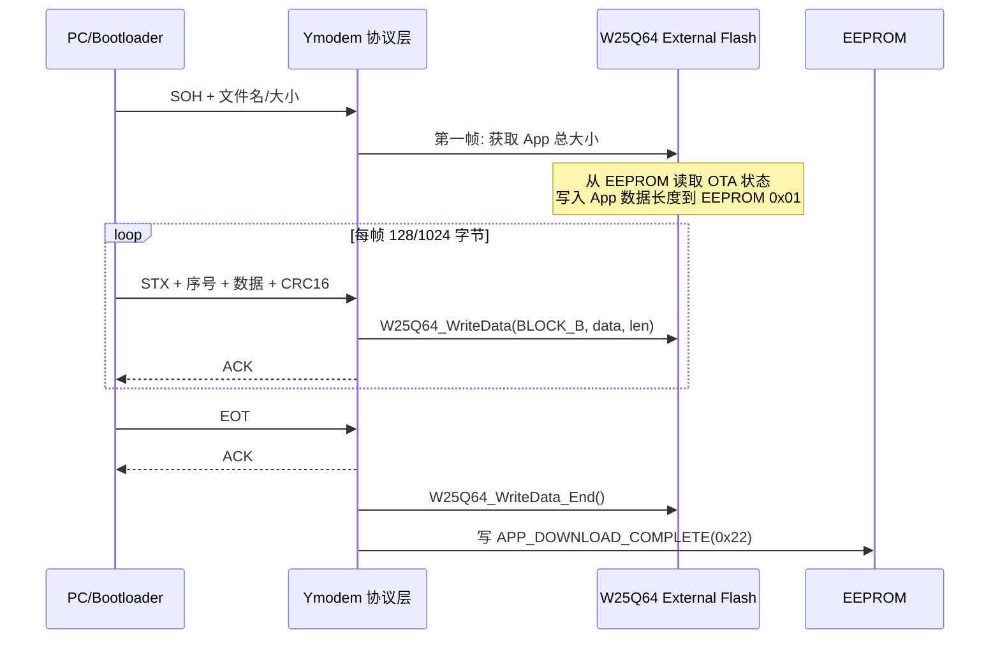

# ota-package

嵌入式 OTA（空中升级）固件包生成与测试工具。支持全量包、差分包（bsdiff）、压缩包（zlib）、
分段包（chunked）、ESP32 native OTA 格式、A/B 分区元数据、内建 HTTP 测试服务器。
适用于 ESP32 esp_https_ota、STM32 自定义 Bootloader OTA、以及通用二进制差分升级场景。

## 触发条件
- "OTA"、"空中升级"、"固件升级包"、"firmware update"
- "差分包"、"delta update"、"增量升级"、"bsdiff"
- "ESP32 OTA"、"esp_https_ota"
- "分段传输"、"chunked"、"大固件分包"
- "A/B 分区"、"双分区升级"、"rollback"
- "OTA 测试"、"固件升级服务器"
- "Ymodem OTA"、"串口 OTA"、"UART 升级"、"Xmodem/Ymodem"
- "EEPROM 状态机"、"OTA 状态机"、"Bootloader 升级状态"
- "双芯片 OTA"、"MCU+外部Flash"、"External Flash OTA"
- "IWDG 验证"、"看门狗验证 App"、"喂狗回退"

## 参数收集
- operation: full / delta / chunked / esp32 / ab-partition / ymodem / eeprom-state / dual-chip / server / verify
- firmware: 新版本固件文件路径（.bin）
- old_firmware: 旧版本固件路径（delta 操作必填）
- version: 固件版本号（x.y.z 格式）
- board: 目标板型号（esp32 / esp32s3 / esp32c3 / stm32 / generic）
- output: 输出目录（默认 ota_output/）
- sign_key: 签名私钥（可选，PEM 格式）
- compress: 是否启用 zlib 压缩（默认 true，chunked 时强制 false）
- chunk_size: 分段大小（默认 4096 字节）
- ab_active_slot: A/B 分区当前活动槽位（A/B）
- server_port: HTTP 测试服务器端口（默认 8070）
- server_bind: HTTP 测试服务器绑定地址（默认 0.0.0.0）
- eeprom_state_addr: EEPROM 中 OTA 状态存储地址（默认 0x0000）
- eeprom_size_addr: EEPROM 中 App 大小存储地址（默认 0x0001）
- ext_flash_type: 外部 Flash 型号（如 w25q64 / w25q128 / generic）
- transport: 传输方式（http / ymodem / uart，默认 http）
- encrypt_mode: 加密模式（gcm / cbc，默认 gcm，cbc 用于与传统工程兼容）

## OTA 包格式

### 通用 OTA 包格式（full / delta）
```
┌──────────────────────────────────┐  0x000
│  Magic     : 0x4F544150 "OTAP"  │
│  Version   : x.y.z (4字节)      │
│  Timestamp : Unix时间戳（4字节）│
│  FW Size   : 数据大小（4字节）  │
│  CRC32     : 校验（4字节）      │
│  Board ID  : 板型ID（4字节）    │
│  Flags     : 0x01=全量 0x02=差分 0x04=压缩 0x08=加密 0x10=AES-CBC │
│  SHA256    : 32字节哈希         │
│  Reserved  : 填充至 64 字节     │
├──────────────────────────────────┤  0x040
│  [Delta Only]                   │
│  Old SHA256 : 32 字节            │
│  Patch Size : 4 字节             │
├──────────────────────────────────┤
│  固件数据 / 差分补丁 / 压缩数据  │
├──────────────────────────────────┤
│  [Optional] 签名长度(2) + 签名   │
└──────────────────────────────────┘
```

### 分段包格式（chunked）— 大固件分片传输
```
每个 chunk:
┌──────────────────────────────────┐
│  Magic     : 0x4B4E5543 "CHNK"  │
│  Chunk ID  : 分片序号（4字节）   │
│  Total Chunks : 总分片数（4字节） │
│  Chunk Size : 数据大小（2字节）  │
│  CRC16     : 分片校验（2字节）   │
│  Data      : 分片数据             │
└──────────────────────────────────┘
```

### ESP32 Native OTA 包
直接生成符合 esp_https_ota 规范的 .bin 文件，包含 app 分区固件数据，支持 OTA 验证。

## 执行流程

### 全量包（full）
1. 读取固件 .bin → 2. 可选 zlib 压缩 → 3. 可选 ECDSA/RSA 签名 → 4. 写入 OTA 头部 → 5. 输出 .ota + .meta.json

### 差分包（delta）
1. 对比新旧固件 → 2. bsdiff4 生成补丁 → 3. 打包含差分头 → 4. 输出 .patch + 压缩率报告

### 分段包（chunked）
1. 固件分包 → 2. 每个 chunk 加 CRC16 → 3. 输出 chunk_0000.bin ~ chunk_NNNN.bin + manifest.json

### ESP32 OTA 包（esp32）
1. 解析 .bin → 2. 验证 esp_image_header → 3. 输出符合 OTA 规范的 .bin → 4. 可选生成 OTA URL 描述 JSON

### A/B 分区包（ab-partition）
1. 生成指定槽位（A/B）的 OTA 包 → 2. 输出 slot_a.bin / slot_b.bin → 3. 生成 slot_manifest.json（含版本、时间戳、槽位）

### HTTP 测试服务器（server）
1. 启动内建 HTTP 服务器 → 2. 提供 /firmware.bin 和 /version.json 端点 → 3. 打印设备和服务器日志

## EEPROM 状态机 OTA 模式（eeprom-state）

工业级 STM32 OTA 的典型设计：通过外部 EEPROM 存储 OTA 状态，复位后 Bootloader 根据状态决定行为。
适合 Ymodem/UART 纯文本传输场景，无需自包含包头。

### 5 状态 EEPROM 状态机

```
状态编码:  EEPROM[0x00]
┌──────────────────────────────────────────────────────┐
│ NO_APP_UPDATE (0x00)  ← 初始态 / App 验证失败         │
│   └─ 有按键? → Ymodem 接收 → AES解密 → 写入外部 Flash  │
│   └─ 无按键? → g_JumpInit=0x55AA55AA → 软复位         │
│                                                       │
│ APP_DOWNLOADING (0x11) ← App 写入中异常复位            │
│   └─ JumpToApp → 失败则重新 Ymodem 接收               │
│                                                       │
│ APP_DOWNLOAD_COMPLETE (0x22) ← 固件已下载到外部 Flash  │
│   └─ 解密 → 备份旧 App → 搬运到内部 Flash              │
│   └─ 写状态 0x33 → 软复位                             │
│                                                       │
│ APP_FIRST_CHECK_START (0x33) ← 首次启动验证中          │
│   └─ 写状态 0x44 → 开 IWDG → JumpToApp               │
│                                                       │
│ APP_FIRST_CHECKING (0x44) ← App 未在规定时间喂狗       │
│   └─ App 未喂狗 → IWDG 复位 → 状态回 0x00             │
│   └─ App 正常 → 标记为有效并正常运行                   │
└──────────────────────────────────────────────────────┘
```

### Bootloader C 代码示例

```c
#include "Boot_Manager.h"
#include "eeprom_driver.h"

#define EEPROM_OTA_STATE_ADDR  0x0000
#define EEPROM_APP_SIZE_ADDR   0x0001

#define NO_APP_UPDATE          0x00
#define APP_DOWNLOADING        0x11
#define APP_DOWNLOAD_COMPLETE  0x22
#define APP_FIRST_CHECK_START  0x33
#define APP_FIRST_CHECKING     0x44

/* 状态机入口 - Bootloader main() 中调用 */
void OTA_StateManager(void)
{
    uint8_t otastate;
    ee_ReadBytes(&otastate, EEPROM_OTA_STATE_ADDR, 1);

    switch(otastate) {
    case NO_APP_UPDATE:
        if (Key_Scan()) {
            // Ymodem 接收 + AES 解密 + 写入外部 Flash B 区
            int32_t fsize = Ymodem_Receive(buffer);
            ExA_To_ExB_AES(fsize);   // 解密并搬运到 Area B
            App_To_ExA(old_app_size); // 备份当前 App 到 Area A
            ExB_To_App();             // Area B → Internal Flash
            ee_WriteByte(EEPROM_OTA_STATE_ADDR, APP_FIRST_CHECK_START);
            System_SoftwareReset();
        } else {
            SetMagicWord(0x55AA55AA); // 跳过下次 Bootloader
            System_SoftwareReset();
        }
        break;

    case APP_FIRST_CHECK_START:
        ee_WriteByte(EEPROM_OTA_STATE_ADDR, APP_FIRST_CHECKING);
        IWDG_Init(IWDG_Prescaler_64, 3000); // 3 秒看门狗
        JumpToApp(0x08008000);               // 跳转到 App
        break;

    case APP_FIRST_CHECKING:
        // 如果执行到这里说明 App 未喂狗
        ee_WriteByte(EEPROM_OTA_STATE_ADDR, NO_APP_UPDATE);
        ExA_To_App(); // 从 Area A 回退旧版
        System_SoftwareReset();
        break;
    // ... 其他状态
    }
}
```

### IWDG App 有效性验证

**原理**：App 启动后在规定时间内（如 3 秒）喂狗，否则 IWDG 复位让 Bootloader 回退旧版。

```
复位链:
Bootloader → 状态 0x44 → 开 IWDG(3s) → JumpToApp
    ├─ App 正常 → 初始化完毕 → 喂狗(IWDG_ReloadCounter) → 正常运行
    └─ App 崩溃 → IWDG 复位 → Bootloader 读状态 0x44 → 回退旧版
```

App 侧代码：
```c
int main(void) {
    SystemInit();
    HAL_Init();
    // 在初始化末尾喂狗，清除 Bootloader 设置的定时器
    IWDG_ReloadCounter();
    // 写 EEPROM 状态为 NO_APP_UPDATE（App 已验证通过）
    uint8_t state = NO_APP_UPDATE;
    ee_WriteByte(EEPROM_OTA_STATE_ADDR, state);
    // 进入主循环
}
```

### 魔法字跳过机制

在 RAM 末尾设置标志，避免每次复位都进入 Bootloader 流程：

```c
// 链接脚本中保留一个 UNINIT 段
// MYRAM 0x2001FFF0 UNINIT 0x0000000F { .ANY (NO_INIT) }

uint32_t g_JumpInit __attribute__((section("NO_INIT")));

void JumpToApp(uint32_t app_addr) {
    // 检查 Stack Pointer 有效性
    if ((*(__IO uint32_t *)app_addr & 0x2FFE0000) == 0x20000000) {
        __disable_irq();
        SCB->VTOR = app_addr;  // F4: NVIC_SetVectorTable
        __set_MSP(*(__IO uint32_t *)app_addr);
        ((pFunction)(*(__IO uint32_t *)(app_addr + 4)))();
    }
}
```

## Ymodem 串口传输 OTA

通过 UART + Ymodem 协议接收固件，是 STM32 OTA 最常用的传输方式（无需网络协议栈）。

### 应用层（App）Ymodem 接收流程



### 双芯片架构（MCU Internal Flash + External SPI Flash）

常见于 STM32 无大容量内部 Flash 或需要双份备份的场景：

```
+─────────────────────────────────────────────────+
| STM32F411CEUx  (512KB Internal Flash)            |
|  0x08000000  Bootloader (32KB, Sector 0~1)      |
|  0x08008000  Application (480KB, Sector 2~N)    |
+─────────────────────────────────────────────────+
                         ↑ SPI
+─────────────────────────────────────────────────+
| W25Q64  (8MB External SPI Flash)                |
|  Area A (BLOCK_1): 旧版 App 备份（回退用）       |
|  Area B (BLOCK_2): 加密新固件（Ymodem写入）      |
+─────────────────────────────────────────────────+
                         ↑ I2C
+─────────────────────────────────────────────────+
| AT24C02  (256B EEPROM)                          |
|  0x00: OTA 状态 (1 byte)                        |
|  0x01: App 大小 (4 bytes)                       |
+─────────────────────────────────────────────────+
```

### Ymodem + AES-CBC 完整 OTA 流

```c
// Bootloader main() 核心逻辑
int main(void)
{
    // 1. 魔法字检测：跳过 Bootloader 直接启动
    if (g_JumpInit == 0x55AA55AA) {
        g_JumpInit = 0xFFFFFFFF;
        JumpToApp(0x08008000);
    }

    // 2. 初始化外设
    SystemInit();
    USART1_Init();
    SPI1_Init();
    W25Q64_Init();
    ee_Init();

    // 3. 进入状态机
    OTA_StateManager();

    while (1) {
        // 无有效 App 且按键按下 → Ymodem 接收
        if (Key_Scan()) {
            int32_t fsize = Ymodem_Receive(buffer);
            // AES-256-CBC 解密
            if (0 == ExA_To_ExB_AES(fsize)) {
                App_To_ExA(old_size);       // 备份当前 App
                ExB_To_App();               // 搬运新 App
                JumpToApp(0x08008000);
                ExA_To_App();               // 回退
                JumpToApp(0x08008000);
            }
        }
    }
}
```

## Bootloader 集成要点
```c
/* OTA 包头结构体 — 用于 Bootloader 解析 */
typedef struct __attribute__((packed)) {
    uint32_t magic;         // 0x4F544150 "OTAP"
    uint32_t fw_version;    // major<<16 | minor<<8 | patch
    uint32_t timestamp;     // Unix time
    uint32_t fw_size;       // 数据区域大小
    uint32_t crc32;
    uint32_t board_id;
    uint32_t flags;         // 0x01=full 0x02=delta 0x04=compressed 0x08=encrypted
    uint8_t  sha256[32];
    uint8_t  reserved[12];  // 填充至 64 字节
} OTA_Header_t;

bool OTA_Validate(const uint8_t *pkg, uint32_t total_len) {
    OTA_Header_t *hdr = (OTA_Header_t *)pkg;
    if (hdr->magic != 0x4F544150) return false;
    if (hdr->board_id != BOARD_ID) return false;

    uint8_t *payload = (uint8_t *)(hdr + 1);
    uint32_t payload_len = total_len - sizeof(OTA_Header_t);

    // 解压（如需要）
    if (hdr->flags & 0x04) {
        payload = OTA_Decompress(payload, payload_len, &payload_len);
    }

    uint32_t crc = CRC32_Calc(payload, hdr->fw_size);
    if (crc != hdr->crc32) return false;

    // SHA256
    uint8_t calc_sha[32];
    SHA256_Calc(payload, hdr->fw_size, calc_sha);
    if (memcmp(calc_sha, hdr->sha256, 32) != 0) return false;

    return true;
}
```

## 差分包说明
- 升级包体积减小 60~90%
- 适合 NB-IoT / LoRa 等低带宽场景
- 依赖 bsdiff4：`pip install bsdiff4`
- 需要 Bootloader 支持 apply_patch（bspatch 算法）

## 错误处理
| 错误 | 解决方案 |
|------|---------|
| bsdiff4 未安装 | `pip install bsdiff4` |
| 版本号格式错误 | 使用 x.y.z 格式（每部分 0~255） |
| 固件过大不能分段 | 检查 chunk_size 设置，建议不超过 MTU-64 |
| ESP32 固件校验失败 | 用 `esptool.py image_info firmware.bin` 检查格式 |
| 压缩后反而更大 | 自动跳过压缩（已内建检测） |
| EEPROM 状态读取异常 | 检查 I2C 通信、EEPROM 地址、上电时序（AT24C02 有 5ms 上电延迟） |
| Ymodem 传输失败 | 检查串口波特率（建议 115200/921600）、流控、接线，确认无 DMA 与中断冲突 |
| AES-CBC 解密后内容异常 | 确认 IV 与 Key 在 Bootloader 和打包工具两端一致，检查 AES 字节序（大端/小端） |
| IWDG 提前复位 | 增加 IWDG 超时时间或确保 App 在超时前完成初始化并喂狗 |
| 魔法字未生效 | 链接脚本中确认 NO_INIT 段地址正确（STM32F4: 0x2001FFF0），确认 SRAM 大小 |

## 边界定义

### 不该激活
- 用户讨论的是云平台 OTA 服务（AWS IoT OTA、Azure Device Update、阿里云 OTA）的**服务端配置**而非固件包生成
- 用户需要的是 Bootloader 本身的开发/调试（而非 OTA 包格式）
- 用户只提到"固件升级"但实际是 DFU（USB 直接升级）或 JTAG/SWD 烧录
- 工程没有新旧固件文件（做差分包时）
- 用户实际使用的是 MCUboot / TinyUF2 等标准 Bootloader（应使用对应框架的文档）
- Ymodem/EEPROM 场景中用户没有定义 EEPROM 存储布局或仅讨论 I2C 总线问题（应使用 i2c-bus skill）

### 不该做
- **禁止**在无固件版本号的情况下生成 OTA 包（版本号是 OTA 回滚判断的关键字段）
- **禁止**对压缩后大小反而增大的固件强制压缩（内建已跳过，不应覆盖此行为）
- **禁止**在分段包（chunked）模式中启用 zlib 压缩（chunk 级压缩破坏 CRC16 校验边界）
- **禁止**生成签名 OTA 包时使用与 `firmware-sign` 不同的签名算法（防止 Bootloader 验签失败）
- **Ymodem 模式**：禁止修改 Ymodem 帧格式（128/1024 字节、CRC16、ACK/NAK 协议），Bootloader 端必须兼容标准 Ymodem
- **EEPROM 状态机**：禁止使用 EEPROM 中未初始化的地址存储 OTA 状态（首次上电应写入初始值 0x00）
- **双芯片架构**：禁止在 Bootloader 阶段使用不依赖 RCC 的外部 Flash（如 W25Q64 需要 SPI 时钟，须确认 Bootloader 中 SPI 和 RCC 已初始化）

### 不该碰
- **不触碰**目标设备的 Flash 分区表：仅生成 OTA 包，不负责分区管理
- **不触碰** Bootloader 源码：仅生成 C 结构体参考，不修改用户 Bootloader 代码
- **不触碰** OTA 服务器部署（HTTP 测试服务器仅在本地 localhost 临时运行）
- **不触碰**操作系统级包管理器（apt/rpm/pip）：不用于嵌入式 OTA
- **EEPROM 状态机**：不触碰用户 EEPROM 地址分配决策（由底层驱动定义），只提供状态机逻辑参考
- **Ymodem 传输**：不负责串口物理层配置（波特率/流控/引脚），由 uart-module skill 覆盖
- **双芯片架构**：不负责 W25Q64/AT24C02 的底层驱动实现，由 spi-bus / i2c-bus 和 peripheral-driver skill 覆盖

## 输出约定

操作完成后输出：
- 生成的 OTA 包路径（.ota / .patch / chunk_*.bin）
- 差分包压缩率报告（新旧固件大小对比）
- HTTP 测试服务器地址（server 操作）
- manifest.json / slot_manifest.json（OTA 元数据）
- Ymodem 场景：EEPROM 状态机参考代码 + 帧接收时序说明

## 交接关系

- 上游：`firmware-sign`（签名/加密后的固件打包为 OTA）
- 上游：`build-keil` / `build-idf`（编译产出新旧固件）
- 辅助：`bootloader-design`（Bootloader OTA 状态机集成设计）
- 实测：`serial-monitor`（OTA 升级日志观察）/ `rtt-monitor`（RTT 实时日志）
- 参考：`option-bytes`（量产时配合 RDP1 保护 OTA 分区）
