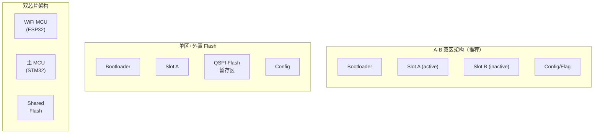

# 嵌入式 OTA 升级系统架构设计指南

> 与 `ota-package`（OTA 固件包生成工具脚本）和 `bootloader-design`（Bootloader 引导跳转）互补——本 skill 覆盖 OTA **系统的架构设计、协议选型、状态机、安全策略和量产部署**。

## 适用场景

- OTA 系统架构选型（A-B 双区/单区+恢复/外置 Flash/双芯片）
- OTA 状态机设计（Idle→Download→Verify→Apply→Rollback）
- 固件下载协议选型（HTTP/CoAP/MQTT/BLE/Ymodem）
- 双芯片 OTA 架构（WiFi MCU + 主 MCU 协同）
- STM32 / ESP32 平台 OTA 实现
- 升级安全设计（签名/加密/防回滚/防降级）
- 回滚与失败恢复策略
- 批量升级与灰度发布
- OTA 带宽优化（差分/压缩/分段）

## 必要输入

- MCU 平台（STM32/ESP32/其他）
- 可用 Flash/外部存储大小
- 通信通道（WiFi/蓝牙/蜂窝/有线）
- 双芯片架构或单芯片
- 安全等级要求

---

## 1. OTA 系统架构

### 架构对比

| 架构 | Flash 开销 | RAM 开销 | 回滚 | 复杂度 | 适用 |
|------|-----------|---------|------|--------|------|
| **A-B 双区** | 2× App | 低 | 硬件级 | 中 | 首选，Flash 够用 |
| **单区+外部暂存** | 1× App + 外部 RAM | 高 | 有限 | 高 | Flash 不足但有 SDRAM |
| **单区+外部 Flash** | 1× App + QSPI Flash | 低 | 中 | 中高 | H7 系列 QSPI 扩展 |
| **单区+网络暂存** | 1× App | 低 | 无 | 低 | Flash/RAM 都受限 |
| **双芯片** | 各自 1× App | 低 | 芯片级 | 中高 | WiFi MCU + 主 MCU |



### 架构选择决策树

```
Flash 足够大 (≥2× App) ?
  ├─ 是 → A-B 双区 ← 首选
  │      ├─ 需安全回滚 → 三区 (A+B+Recovery)
  │      └─ OK
  │
  └─ 否 → Flash 不够双区 ?
          ├─ 有外部 RAM (SDRAM) ?
          │   ├─ 是 → 单区+外部暂存下载
          │   └─ 否 → 有外部 QSPI Flash ?
          │           ├─ 是 → 单区+QSPI 暂存
          │           └─ 否 → 单区(下载失败无法回滚)
          │
          └─ 双芯片产品 ?
              └─ 是 → WiFi MCU 下载 + SPI 转发到主 MCU
```

---

## 2. OTA 状态机

### 五态设计

```text
         ┌────────────────────────────────────────────┐
         │                                            │
         ▼                                            │
   ┌──────────┐   开始下载    ┌──────────┐             │
   │  IDLE    │─────────────→│ DOWNLOAD │             │
   │ (空闲)   │              │ (下载中)  │             │
   └────┬─────┘              └─────┬────┘             │
        │                          │                  │
        │ 超时/失败                │ 下载完成          │
        │ (回退)                   ▼                  │
        │                    ┌──────────┐             │
        │                    │ VERIFY   │             │
        │                    │ (校验中)  │             │
        │                    └─────┬────┘             │
        │                          │                  │
        │                    ┌─────┴──────┐           │
        │                    │ 校验通过?   │           │
        │                    └─────┬──────┘           │
        │                    ┌─────┴────────┐         │
        │           ┌────────┤  PASS / FAIL ├───┐     │
        │           │        └──────┬───────┘   │     │
        │           ▼               ▼           ▼     │
        │    ┌──────────┐    ┌──────────┐   ┌──────┐ │
        │    │  APPLY   │    │ ROLLBACK │   │ IDLE │ │
        │    │ (应用)   │    │ (回滚)   │   │(重试)│ │
        │    └────┬─────┘    └──────────┘   └──────┘ │
        │         │                                   │
        │         │ 应用完成                           │
        │         ▼                                   │
        │    ┌──────────┐                             │
        │    │ REBOOT   │─────────────────────────────┘
        │    │ (重启)   │
        │    └──────────┘
        │         │
        │         │ Bootloader 验签通过
        │         ▼
        │    ┌──────────┐
        │    │   OK     │ (下次进入 IDLE)
        │    └──────────┘
        └──────────────────────────────────────────────────┘
```

### 状态存储结构

```c
// 状态存储在预分配的 Flash/EEPROM 扇区中
// 使用双缓冲模式：同一份数据在两个位置各存一份
// 写入前先校验，写入后立即回读确认

typedef struct {
    uint32_t magic;              // 0x4F544153 "OTAS"
    uint32_t state;              // 0=IDLE, 1=DOWNLOAD, 2=VERIFY,
                                 // 3=APPLY, 4=ROLLBACK
    uint32_t current_version;    // 当前固件版本
    uint32_t target_version;     // 目标固件版本
    uint32_t download_progress;  // 下载进度 (0~10000, 精确到 0.01%)
    uint32_t error_code;         // 0=无, >0=上次错误码
    uint32_t retry_count;        // 当前状态重试计数
    uint32_t crc32;              // 结构体校验
} ota_state_t;

// 状态迁移约束:
// IDLE → DOWNLOAD:   用户触发/服务器推送
// DOWNLOAD → VERIFY: 下载完成且 CRC 通过
// DOWNLOAD → IDLE:   下载超时/失败，可重试
// VERIFY → APPLY:    校验通过
// VERIFY → ROLLBACK: 校验失败（旧版正常则回滚）
// VERIFY → IDLE:     校验失败（无可用旧版则恢复空闲）
// APPLY → REBOOT:    应用完成
// ROLLBACK → REBOOT: 回滚完成
// REBOOT → IDLE:     Bootloader 引导成功
```

---

## 3. 下载协议与可靠性

### 协议对比

| 协议 | 传输层 | 典型吞吐 | 可靠性 | 适用终端 |
|------|--------|---------|--------|---------|
| **HTTPS** | TCP+TLS | 1~10 Mbps | 高 | ESP32/有网络 MCU |
| **CoAPS** | UDP+DTLS | 0.1~1 Mbps | 中 | 资源受限，低功耗 |
| **MQTT(S)** | TCP+TLS | 0.5~5 Mbps | 高 | IoT 设备，双向 |
| **BLE OTA** | BLE GATT | 0.01~0.1 Mbps | 低~中 | 可穿戴，小固件 |
| **Ymodem** | UART | 0.01~0.1 Mbps | 中 | 有线串口 |
| **CAN UDS** | CAN | 0.25~1 Mbps | 高 | 车载 |

### 下载可靠性策略

```c
// ── 分块下载 + 进度跟踪 ──
#define CHUNK_SIZE     4096     // 每块 4KB
#define MAX_RETRY      3        // 每块最多重试 3 次

typedef struct {
    uint32_t chunk_index;
    uint8_t  data[CHUNK_SIZE];
    uint32_t crc32;              // 每块独立 CRC
} chunk_packet_t;

int download_firmware(ota_state_t *state) {
    uint32_t total_chunks = (firmware_size + CHUNK_SIZE - 1) / CHUNK_SIZE;

    for (uint32_t i = 0; i < total_chunks; i++) {
        int retry = 0;
        while (retry < MAX_RETRY) {
            // 请求块 i
            if (request_chunk(i, CHUNK_SIZE, timeout_ms)) {
                // 校验当前块 CRC
                if (verify_chunk_crc(received_data, received_len, expected_crc)) {
                    // 写入 Flash/暂存区
                    write_to_storage(i * CHUNK_SIZE, received_data, received_len);
                    state->download_progress = (i + 1) * 10000 / total_chunks;
                    save_ota_state(state);     // 保存进度（用于断点续传）
                    break;                     // 块 i 完成
                }
            }
            retry++;
            // 指数退避: 1s, 2s, 4s
            delay_ms(1000 * (1 << (retry - 1)));
        }
        if (retry >= MAX_RETRY) {
            state->error_code = ERR_CHUNK_TIMEOUT + i;
            state->state = STATE_IDLE;         // 回到空闲，可重试
            save_ota_state(state);
            return -1;                         // 下载失败
        }
    }
    return 0;                                  // 下载完成
}

// ── 断点续传 ──
// 恢复流程:
// 1. 读取 OTA 状态 → state=DOWNLOAD, progress=4500 (45%)
// 2. 从第 45% 的块开始请求
// 3. 服务端根据 range 参数或块索引继续发送
// 注意: 写入 Flash 必须以页/扇区为单位，断点可能跨扇区

// ── 超时处理 ──
// 全局超时: 预计下载时间 × 2 (如 200KB@115200bps ≈ 17秒, 超时设为 34秒)
// 单块超时: 块大小 / 波特率 × 3 (如 4KB@115200bps ≈ 0.35秒, 超时 1秒)
// 空闲超时: 10秒无数据 → 认为连接断开
```

---

## 4. 双芯片 OTA 架构

### 典型架构

```
WiFi MCU (ESP32-S3)                主 MCU (STM32H7)
┌────────────────────────────────┐  ┌────────────────────────┐
│ Wi-Fi/以太网连接                │  │ 应用固件 v1.2          │
│ HTTPS 下载固件到外部 Flash      │  │ Bootloader v2.0        │
│ Shared Flash:                   │  │                        │
│  ┌─ Partition 1: ESP32 固件  ─┐│  │ Shared Flash (QSPI):   │
│  ├─ Partition 2: NEW_FW.bin  ─┤│  │  ┌─ v1.3_delta.bin  ─┐│
│  ├─ Partition 3: FW_META     ─┤│  │  ├─ fw_status       ─┤│
│  └─ Partition 4: STATUS      ─┘│  │  └─ ota_state       ─┘│
└────────────────────────────────┘  └────────────────────────┘
            │                               │
            └─────────── SPI/QSPI ──────────┘

OTA 升级流程:
  1. 云端推送新 v1.3 固件
  2. ESP32 下载到外部 Flash "NEW_FW" 分区
  3. ESC32 计算 SHA256 + 验签
  4. ESP32 写 STATUS 分区: status=PENDING, version=1.3
  5. ESP32 拉高 GPIO -> 触发 STM32 EXTI 中断
  6. STM32 进入 OTA 模式:
     a. 读取 STATUS 分区
     b. 通过 SPI 从 NEW_FW 分区读取固件
     c. 写入内部 Flash 的 B 区
     d. 验证签名
     e. 标记 Config 区: boot_slot=B, status=OK
  7. STM32 写 STATUS 分区: status=OK
  8. STM32 复位 -> Bootloader 跳转 B 区
  9. ESP32 检测 status=OK -> 清理 NEW_FW 分区
```

### 双芯片状态同步

```c
// 共享 STATUS 区（外部 Flash 固定分区）
typedef struct __attribute__((packed)) {
    uint32_t magic;                     // 0x4455414C "DUAL"
    uint32_t state;                     // 见下方枚举
    uint32_t stm32_version;             // STM32 固件版本
    uint32_t esp32_version;             // ESP32 固件版本
    uint32_t pending_fw_version;        // 待升级版本
    uint32_t pending_fw_size;           // 待升级固件大小
    uint8_t  pending_fw_sha256[32];     // 待升级固件 SHA256
    uint32_t crc32;
} dual_chip_status_t;

enum {
    DUAL_IDLE      = 0,   // 无操作
    DUAL_DOWNLOAD  = 1,   // ESP32 正在下载
    DUAL_PENDING   = 2,   // 下载完成，待 STM32 处理
    DUAL_APPLYING  = 3,   // STM32 正在应用
    DUAL_SUCCESS   = 4,   // 应用成功
    DUAL_FAILED    = 5,   // 应用失败
};
```

---

## 5. 版本管理与兼容性

### 语义版本

```c
// 使用 semver 2.0 格式: MAJOR.MINOR.PATCH
typedef struct {
    uint8_t major;        // 不兼容的 API 变更
    uint8_t minor;        // 向下兼容的功能新增
    uint16_t patch;       // 向下兼容的问题修正
} version_t;

#define VERSION_ENCODE(major, minor, patch) \
    (((uint32_t)(major) << 24) | ((uint32_t)(minor) << 16) | (uint32_t)(patch))

// 兼容性规则:
int is_compatible(uint32_t current_ver, uint32_t target_ver) {
    uint8_t cur_major = (current_ver >> 24) & 0xFF;
    uint8_t tgt_major = (target_ver >> 24) & 0xFF;

    // MAJOR 不同 → 不兼容（APIs/数据格式可能变化）
    if (cur_major != tgt_major) return 0;

    // MAJOR 相同 → 兼容
    return 1;
}
```

### 升级策略

| 策略 | 条件 | 行为 |
|------|------|------|
| **静默升级** | PATCH 版本变化 | 用户无感知，后台自动升级 |
| **可选升级** | MINOR 版本变化 | 通知用户，可选择立即/稍后/忽略 |
| **强制升级** | MAJOR 版本变化 | 强制立即升级，否则停止服务 |
| **灰度升级** | 指定设备组/批次 | 先 5% → 50% → 100% 逐步放量 |
| **条件升级** | 最低电池/网络/WiFi | 满足条件才允许下载 |

---

## 6. OTA 安全

### 安全层级

```text
Layer 0: 无安全
  裸固件传输，不验证 → 任何人可伪造固件刷入设备
  → 不推荐任何量产产品使用

Layer 1: 传输加密 (TLS/DTLS)
  防窃听，但服务器被攻破则固件仍可被篡改
  → 最基本的底线

Layer 2: 固件签名 (推荐)
  固件由私钥签名，设备端公钥验签
  服务器即使被攻破也不能伪造固件
  → 量产产品推荐配置

Layer 3: 签名 + 防回滚
  Layer2 + 版本号保护，禁止降级到旧版本
  防降级攻击 (Rollback Attack)
  → 安全敏感产品必须

Layer 4: 安全启动链
  Layer3 + 分级验签 (BootROM→BL1→BL2→APP)
  硬件信任根保护
  → 车规/金融/医疗
```

### 防回滚实现

```c
// ── 防降级攻击 ──
// Bootloader 拒绝引导版本号低于当前运行版本的固件

// 在 Config 区记录"最低可接受版本"
typedef struct {
    uint32_t min_accepted_version;   // 不可低于此版本
    // ...
} boot_config_t;

int boot_check_version(uint32_t new_ver) {
    boot_config_t cfg = read_boot_config();
    // 新固件版本若低于最小可接受版本 → 拒绝引导
    if (new_ver < cfg.min_accepted_version) {
        return -1;  // 降级攻击检测！
    }
    // 如果新固件 MAJOR 版本小于当前 → 拒绝（降级）
    if (GET_MAJOR(new_ver) < GET_MAJOR(cfg.firmware_version)) {
        return -1;
    }
    return 0;
}

// 版本号存储位置:
// 1. 固件头中
// 2. OTP (One-Time Programmable) 区域 → 硬件级防回滚
// 3. Secure Enclave / TrustZone (M33)
```

### 签名验证流程

```text
服务端:
  私钥 → SHA256(固件) → 签名
  固件发布: 固件头 + 数据 + 签名

设备端:
  1. 下载完整固件
  2. 公钥验签 SHA256(固件数据) vs 签名
  3. 签名通过 → Bootloader 标记可引导
  4. 签名失败 → 丢弃，回滚

重要: 公钥存储在 OTP/一次性写入区域
      即使 Flash 全擦，公钥也不会丢失
```

---

## 7. STM32 OTA 实现详解

### 方案 A: 内部 Flash 双区（Flash ≥ 2× App）

```c
// 分区布局 (STM32F411, 512KB Flash):
// ┌──────────────────────── 0x08000000
// │ Bootloader   (32KB)     扇区 0~1
// ├──────────────────────── 0x08008000
// │ Slot A       (224KB)    扇区 2~7
// ├──────────────────────── 0x0803C000
// │ Slot B       (224KB)    扇区 8~13
// ├──────────────────────── 0x08070000
// │ Config/State (4KB)      扇区 14
// └──────────────────────── 0x08071000

// OTA 下载流程:
// 下载新固件到 Slot B → 写入时逐页编程
// 写入完成 → 计算整个 Slot B 的 SHA256
// 签名验证 → 更新 Config 区 boot_slot=B
// 系统复位 → Bootloader 从 B 区引导

// 注意: 写入时不能改写正在运行的 Slot A！
//       Slot B 写入过程中断电 → Slot A 仍然完好
```

### 方案 B: 外部 Flash 暂存（Flash 不足时）

```c
// 适用于: F103RC (256KB Flash, App 占 200KB+)
// 使用外部 QSPI Flash 或 SD 卡暂存固件

// 流程:
// 1. 下载到外部 Flash/SD 卡
// 2. 校验完整性
// 3. 擦除内部 Flash 的 App 区
// 4. 从外部存储拷贝到内部 Flash
// 5. 验证拷贝结果
// 6. 复位

// 风险: 步骤 3~4 中断 → 固件损坏！
// 缓解: 保留 Bootloader 区写保护 (WRP)
//       步骤 3 前检查电量充足 (电池产品)
```

### 方案 C: 双 Bank Boot (STM32 G0/G4/H7 部分型号)

```c
// STM32 部分型号硬件支持双 Bank 切换:
// 例如 STM32G474: 2×256KB Bank, 可硬件交换
//
// 流程:
// 1. 当前在 Bank 1 运行
// 2. 将新固件写入 Bank 2（硬件写保护 Bank 1）
// 3. 校验 Bank 2
// 4. 通过 Option Bytes 或 FLASH_BKPR 切换启动 Bank
// 5. 复位 → 从 Bank 2 启动
//
// 优点: 硬件级切换，Bootloader 代码极简
//       切换失败可切回原 Bank
```

---

## 8. ESP32 OTA 实现

### ESP32 OTA 机制

```c
// ESP32 内置 OTA 支持:
// - 2 个 OTA 分区 (ota_0, ota_1) + factory 分区
// - esp_https_ota: 通过 HTTPS 下载并写入 OTA 分区
// - 硬件级回滚: boot_count 计数器 (与 STM32 看门狗回滚类似)

// ── ESP32 OTA 流程 ──
#include "esp_ota_ops.h"
#include "esp_https_ota.h"

void perform_ota(void) {
    esp_http_client_config_t http_cfg = {
        .url = "https://ota.example.com/firmware_v1_3.bin",
        .cert_pem = server_cert_pem,           // 服务端证书
        .timeout_ms = 10000,
        .keep_alive_enable = true,
    };

    esp_https_ota_config_t ota_cfg = {
        .http_config = &http_cfg,
    };

    esp_https_ota_handle_t ota_handle;
    esp_err_t err = esp_https_ota_begin(&ota_cfg, &ota_handle);
    if (err != ESP_OK) {
        ESP_LOGE(TAG, "OTA 开始失败");
        return;
    }

    // 分块接收并写入
    while (1) {
        err = esp_https_ota_perform(ota_handle);
        if (err != ESP_ERR_HTTPS_OTA_IN_PROGRESS) break;
    }

    if (esp_https_ota_is_complete_data_received(ota_handle)) {
        // 完成 OTA → 验证 → 设置下次启动分区
        err = esp_https_ota_finish(ota_handle);
        if (err == ESP_OK) {
            ESP_LOGI(TAG, "OTA 完成，准备重启");
            esp_restart();
        }
    } else {
        esp_https_ota_abort(ota_handle);
        ESP_LOGE(TAG, "OTA 数据不完整");
    }
}

// ── ESP32 回滚配置 ──
// menuconfig → Component config → ESP OTA:
//   [x] Enable app rollback support
//   [x] Enable anti-rollback support
//   Number of boot attempts (3)
//   CONFIG_BOOTLOADER_APP_ROLLBACK_ENABLE
//   CONFIG_BOOTLOADER_APP_ANTI_ROLLBACK
```

### ESP32 分区表

```csv
# OTA 分区表 (partitions.csv)
# Name,   Type, SubType, Offset,    Size,     Flags
nvs,      data, nvs,      0x9000,    0x5000,
otadata,  data, ota,      0xe000,    0x2000,
phy_init, data, phy,      0xf000,    0x1000,
factory,  app,  factory,  0x10000,   1M,
ota_0,    app,  ota_0,    0x110000,  1M,        encrypted
ota_1,    app,  ota_1,    0x210000,  1M,        encrypted
```

---

## 9. 批量升级与灰度发布

### 升级策略参数

```c
// ── 云端推送策略 ──
typedef struct {
    uint32_t batch_size;          // 每批设备数 (0=全部)
    uint32_t batch_interval_min;  // 批间间隔 (分钟)
    uint32_t max_failure_rate;    // 最大失败率 (百分比, 0~100)
    uint32_t min_battery_level;   // 最低电量 (百分比)
    bool     require_charging;    // 是否必须在充电时
    bool     require_wifi;        // 是否必须在 WiFi 下
    uint32_t force_after;         // 超过此天数未升级 → 强制
    uint32_t defer_max_days;      // 最多可推迟天数
} ota_deploy_config_t;

// ── 灰度发布示例 ──
// Phase 1 (Day 1):   5% 内部测试设备          → 验证功能
// Phase 2 (Day 3):  20% 尝鲜用户              → 收集反馈
// Phase 3 (Day 7):  50% 普通用户              → 稳定后扩量
// Phase 4 (Day 14): 100% 全部用户             → 完成发布
// ── 如果 Phase 1 失败率 > 5% → 终止发布，回滚
```

### 设备端升级确认

```c
// APP 启动后必须主动向服务器确认升级成功

// ── APP 端启动检查 ──
void app_check_ota_result(void) {
    boot_config_t cfg = read_boot_config();

    // 如果是新刷入的固件首次运行
    if (cfg.firmware_status == STATUS_PENDING) {
        // 执行功能自检
        if (self_test() == 0) {
            // 自检通过 → 标记 OK
            boot_set_status(STATUS_OK);
            // 通知服务器: 此设备升级成功
            http_post("/api/v1/ota/confirm", "version=1.3.0&status=ok");
        } else {
            // 自检失败 → 标记失败，Bootloader 下次会回滚
            boot_set_status(STATUS_FAILED);
            http_post("/api/v1/ota/confirm", "version=1.3.0&status=fail");
            // 复位触发回滚
            NVIC_SystemReset();
        }
    }
}
```

---

## 10. 带宽优化

### 策略对比

| 策略 | 节省带宽 | 额外计算 | MCU 负担 | 适用 |
|------|---------|---------|---------|------|
| 全量 | 0% | 无 | 低 | 小型固件 (<128KB) |
| **Gzip 压缩** | 30~50% | 低 | 低 | HTTP 传输默认支持 |
| **bsdiff 差分** | 80~95% | 中 (应用补丁) | 中 | 大固件迭代 |
| **分段(+增量)** | 按段变化 | 中 | 中 | 模块化固件 |
| **按需加载** | 仅更新变更模块 | 高 | 高 | 高级，如 LVGL 资源 |

```c
// ── 差分更新流程（服务端）──
// $ bsdiff old_firmware.bin new_firmware.bin patch.bin
// $ gzip patch.bin -> patch.bin.gz

// ── 差分更新流程（MCU 端）──
// 1. 下载 patch.bin.gz → 解压得到 patch.bin
// 2. 读取当前 App (old_firmware) 到外部 RAM 缓冲区
// 3. bspatch(old_buf, old_len, new_buf, &new_len, patch_buf, patch_len)
// 4. 写入新 App 到 Flash
// 5. 验证 → 重启

// 注意: bspatch 需要足够 RAM 同时保存旧固件 + 新固件 + 补丁
//       对于大固件，建议在外部 RAM 或 QSPI Flash 中操作
```

---

## 11. 故障恢复

### 恢复策略

| 故障场景 | 检测方式 | 恢复策略 |
|---------|---------|---------|
| 下载中断 | 块超时 | 断点续传，从断块重试 |
| 校验失败 | CRC/SHA 不匹配 | 重新下载 |
| 签名无效 | 验签失败 | 拒绝写入，保持旧版 |
| 写入中断(断电) | 启动后 Config 区不一致 | Magic 检查 → 标记 BAD → 回滚 |
| APP 死机 | IWDG 复位 | Bootloader 检测 boot_count → 回滚 |
| 硬件故障 | APP 自检失败 | 标记 FAILED → 回滚 |
| 降级攻击 | 版本号低于最小 | 拒绝引导 |

### Bad App 检测

```c
// Bootloader 中判断固件是否正常启动:
// 1. APP 必须在 N 秒内调用 boot_mark_ok()
// 2. 否则 IWDG 复位，boot_count++
// 3. boot_count 超过阈值 → 回滚

void bootloader_bad_app_detection(void) {
    boot_config_t cfg = read_boot_config();

    if (cfg.firmware_status == STATUS_PENDING) {
        // 新固件首次运行：设置 IWDG 短超时
        IWDG->KR = 0x5555;
        IWDG->PR = IWDG_PR_PR_1;   // 64 分频
        IWDG->RLR = 500;            // ~1 秒 (LSI=32kHz)
        IWDG->KR = 0xCCCC;          // 启动

        // APP 必须在 1 秒内喂狗 + 调 boot_mark_ok()
        // 如果 APP 死机 → IWDG 复位 → boot_count++
    }
}

// APP 端:
void main(void) {
    // ... 初始化 ...
    boot_mark_ok();      // 通知 Bootloader 启动成功 ← 必须在 1 秒内调用

    // 延长 IWDG 超时到正常值
    IWDG->KR = 0x5555;
    IWDG->PR = IWDG_PR_PR_3;   // 256 分频
    IWDG->RLR = 4000;           // ~32 秒
    IWDG->KR = 0xCCCC;

    while (1) {
        IWDG->KR = 0xAAAA;     // 定期喂狗
    }
}
```

---

## 12. OTA 调试与监控

### 升级日志输出

```c
// 推荐 OTA 调试输出格式:
void ota_log(ota_log_level_t level, const char *fmt, ...) {
    const char *tag[] = {"[OTA] ", "[OTA WARN] ", "[OTA ERR] ", "[OTA DBG] "};
    printf("%s%s", tag[level], buf);
}

// 典型升级日志:
// [OTA] Starting OTA update: v1.2.0 → v1.3.0
// [OTA] Downloading: chunk 12/48 (25%)
// [OTA] Downloading: chunk 24/48 (50%)
// [OTA] Downloading: chunk 36/48 (75%)
// [OTA] Downloading: chunk 48/48 (100%)
// [OTA] SHA256 verify: PASS
// [OTA] ECDSA signature verify: PASS
// [OTA] Writing to Slot B @ 0x0803C000
// [OTA] Flash write: page 0/14 (OK)
// [OTA] Flash write: page 14/14 (OK)
// [OTA] Firmware apply complete
// [OTA] Rebooting in 1 second...
```

### 监控指标

```c
// 需要监控的 OTA 指标:
// - 触发次数 (总/成功/失败)
// - 各阶段耗时 (下载/校验/写入/重启)
// - 平均吞吐 (bps)
// - 错误率分布 (网络/校验/写入/签名)
// - 失败固件版本分布
// - 回滚率
// - 设备离线数（升级后无法连接）
```

---

## 边界定义

### 不该激活
- 用户需要的是 OTA 固件包生成/打包（而非架构设计）→ 使用 `ota-package`
- 用户需要的是 Bootloader 引导跳转和 Flash 分区（而非 OTA 系统）→ 使用 `bootloader-design`
- 用户只需要 USB DFU 有线升级（不需要无线空中升级）
- 用户没有具体的 MCU 平台或硬件限制，纯概念性讨论

### 不该做
- **禁止**在没有评估 Flash 分区容量的情况下选择 A-B 双区方案
- **禁止**在 OTA 过程中跳过签名验证（安全风险）
- **禁止**在回滚策略中不保留出厂恢复区
- **禁止**批量发布无版本号管理的固件

### 不该碰
- **不触碰** OTA 包的生成和打包（由 ota-package 负责）
- **不触碰** Bootloader 的 JumpToApp 实现
- **不触碰** 用户 OTA 服务器的部署配置

## 交接关系

- 上游：`bootloader-design`（Bootloader 引导/分区策略）
- 下游：`ota-package`（OTA 包生成和打包工具）
- 辅助：`firmware-sign`（固件签名/加密）
- 参考：`flash-module`（Flash 分区/Sector 操作）

## 参考文档

- ESP32 OTA 文档: esp_https_ota, App Rollback
- STM32 AN2557 — IAP over USART
- STM32 AN4826 — STM32H7 OTA 方案
- bsdiff/bspatch 算法 (Colin Percival)
- RFC 7233 — HTTP Range Requests (断点续传)
- TLS 1.3 (RFC 8446) — 传输安全
- UDS ISO 14229 — 车载诊断升级 (CAN OTA)
- Matter OTA 规范 — IoT OTA 标准
