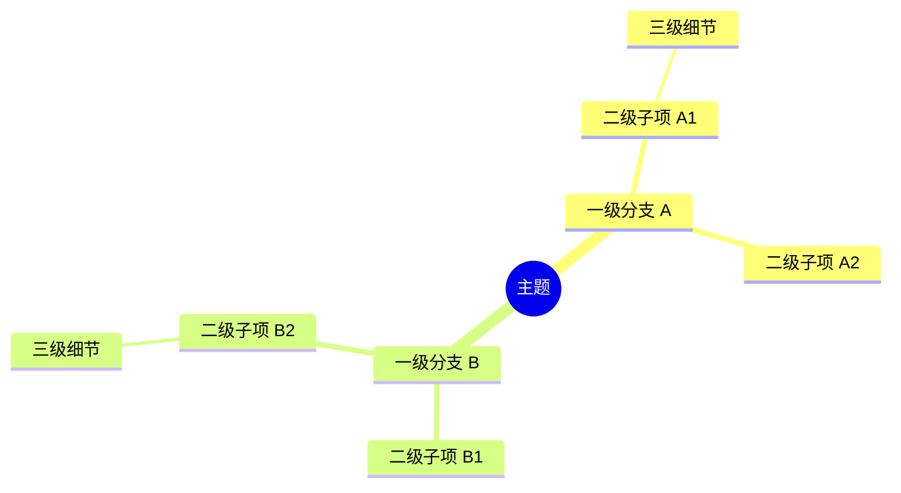

# 嵌入式学习笔记模板系统

> 萃取 STM32F411CEU6 项目 30+ 篇实战笔记（ADC/DMA/CmBacktrace/CRC/OTA/SystemView 等）的**一致化结构**。
> 以费曼学习法为底层，融合实际意义→场景→误区→图示→原理→公式→Q&A 的逐点精讲模式。
>
> 配套模板文件（Obsidian）：`领域/嵌入式/笔记系统/嵌入式学习_双模式笔记模板.md`

---

## 模板设计理念

### 核心理念：一个结构，两种节奏

不是"快速层 vs 深度层"两个独立模板，而是**同一个结构，填少=快速，填多=深度**：

```
只填顶部 3 节 → 5 分钟快速捕获（骨架）
  ↓
逐步填充逐点精讲 → 15 分钟实践笔记（血肉）
  ↓
填满 Q&A → 30 分钟深度笔记（灵魂）
```

模板采用 F411 笔记验证过的**线性展开结构**：

```
🎯 一句话费曼 → 📖 知识点总览 → 🔍 逐点精讲 → 📎 相关资料 → 💬 Q&A
```

每一节都有清晰的存在理由，不必在"该不该填"上纠结。

---

## 模板结构总览

### 1. YAML 前置元数据

```yaml
---
tags: [STM32, <category>]
date: {{date}}
---
```

| 字段 | 用途 | 必填 |
|------|------|:----:|
| `tags` | Obsidian 搜索/图谱过滤 | ✅ |
| `date` | 创建日期 | ✅ |

### 2. 🎯 费曼一句话（入口钩子）

```
> **用初中生都能听懂的话解释这个知识点，不许出现任何专业缩写。**
```

这是整篇笔记的**质量门**——如果你不能用大白话说清楚，说明你还没真懂。

### 3. 📖 学习内容（骨架）

**知识点总览表**：

| 序号 | 知识点 | 难度 |
|------|--------|:----:|
| 1 | xxx | ⭐ |
| 2 | xxx | ⭐⭐ |

**Mermaid 思维导图**：



知识点总览表控制笔记的范围和边界，思维导图建立知识之间的关系图。

> **思维导图风格要求**（取自 OTA/SystemView/SCT/CmBacktrace 等笔记的通用模式）：
>
> | 规则 | 说明 |
> |------|------|
> | 根节点 | `root((标题))`，居中，与笔记标题一致 |
> | 一级分支 | 2-4 个，对应笔记的主要概念区（如：原理/移植/诊断） |
> | 二级子项 | 每个分支下的具体类别 |
> | 嵌套深度 | 最多 4 层（根→一级→二级→三级），过深则拆分 |
> | 纯文本 | 节点内只用文字，不用 emoji、不用代码标记 |
> | 叶子节点 | 写具体的技术细节（寄存器名、函数名、配置项） |
> | 不用的分支 | 如果某个知识点只有一句话，不单独开分支 |

### 4. 🔍 逐点精讲（核心正文）

每个知识点从以下子节中**按需选用**（不同笔记选不同组合）：

```
实际意义 / 应用场景 / 常见误区 / 辅助图示（Mermaid+截图）/
通俗人话解释 / 核心逻辑/原理 / 关键公式/结论 / 实际操作步骤 / 常见问题
```

参考不同笔记的实际搭配：

| 子节 | 用途 | 常出现在 |
|------|------|---------|
| 实际意义 | 为什么要有这个东西？ | ADC/CmBacktrace/CRC/OTA |
| 应用场景 | 什么时候用它？ | ADC/DMA/CmBacktrace/CRC/OTA |
| 常见误区 | 最容易在哪踩坑？ | DMA/CRC/CmBacktrace/SCT |
| 辅助图示 | 一张图胜过千言万语 | 大多数笔记 |
| 通俗人话解释 | 费曼法核心——生活类比 | ADC/DMA/CmBacktrace/CRC/中断 |
| 核心逻辑/原理 | 技术深挖（①→②→③分段） | 全部 |
| 关键公式/结论 | 可量化的参数和结论 | ADC/DMA/CRC/中断 |
| 实际操作步骤 | 动手验证的具体操作 | DMA双缓冲/中断/CmBacktrace移植 |
| 常见问题 | 开发中遇到的典型问题汇总 | 中断/ADC/SPI |

### 5. 📎 相关资料（知识溯源）

四栏分类管理外部资源：

```
🎥 视频链接       → B 站 / YouTube，优先项目实战和原理动画
🔗 博客/文档链接   → CSDN / 博客园 / 飞书 / 官方手册
💻 仓库链接       → GitHub / Gitee，含 Demo 工程
📄 代码/附件       → 本地 PDF、代码包、工具链文件
```

### 6. 💬 Q&A（三级自测）

按难度递进排列：

| 级别 | 标记 | 考察点 | 例子 |
|:----:|:----:|--------|------|
| 基础 | 🟢 | 概念理解 | "什么是 xxx？" |
| 进阶 | 🟡 | 原理应用 | "xxx 和 yyy 有什么区别？" |
| 困难 | 🔴 | 工程权衡 | "生产环境开 -O2 导致回溯链断裂怎么办？" |

---

## 四种笔记类型速查

| 类型 | 适用场景 | 重点子节 | 可跳过 |
|------|---------|--------|--------|
| **原理** | 学新协议/外设/中间件 | 通俗人话、核心逻辑、Q&A | 实际操作步骤 |
| **实践** | 调通一个模块/移植 | 应用场景、操作步骤、相关资料 | 类比 |
| **踩坑** | 解决了一个 Bug | 常见误区、操作步骤、Q&A | 思维导图 |
| **速查** | 常用 API/配置/参数 | 关键公式、代码、相关资料 | Q&A |

---

## 快速开始

### 新建一篇笔记

```
1. 打开 Obsidian 模板文件
   领域/嵌入式/笔记系统/嵌入式学习_双模式笔记模板.md

2. 复制全文到新笔记

3. 按场景填表（参考"什么时候填哪些节"）

4. 最少 5 分钟只需填：
   🎯 费曼一句话 + 📖 知识点总览 + mindmap 思维导图

5. 将文件放入正确目录：
   领域/嵌入式/{分类}/{主题}/
```

### 目录归属

```
领域/嵌入式/
├── Driver 硬件抽象/     ← 寄存器/HAL/CMSIS
├── BSP 板级外设/        ← ADC/DMA/TIM/Flash
├── 通信协议/            ← I2C/SPI/UART/USB/BLE/WiFi
│   ├── 有线通信协议/
│   └── 无线通信协议/
├── 中间件/              ← FATFS/AES/LVGL/SFUD/RTT/elog/CmBacktrace
├── 操作系统/            ← FreeRTOS/RT-Thread
├── 系统级设计/          ← 低功耗/Bootloader/OTA
├── APP 业务逻辑/        ← 架构设计/业务代码
└── 笔记系统/            ← 模板 & 元笔记
```

### 图片存放

```
领域/嵌入式/{分类}/{主题}/assets/
├── {topic}-diagram.png    ← 核心框图
├── {topic}-timing.png     ← 时序图
├── {topic}-wiring.png     ← 接线图
├── {topic}-waveform.png   ← 波形
└── {topic}-result.png     ← 实验结果
```

---

## 学习流闭环

本 skill 与以下技能配合使用：

```
embedded-learning-path-framework      embedded-learning-notes
         ↓                                    ↓
    规划阶段                            记录阶段
    三步进阶模型  ──→  选定当前阶段  ──→  创建笔记  ──→  复习反馈
    HAL使用→寄存器→系统设计           使用本模板归档           更新盲区
```

---

## 边界

- **不覆盖** Obsidian 基本操作（创建仓库、插件管理）
- **不覆盖** 学习路径规划（那是 `embedded-learning-path-framework`）
- **不覆盖** 问题记录归档（那是 `kb-record`）
- **不覆盖** 笔记的复习安排（那是 Obsidian 插件 `spaced-repetition` 的范畴）
- 模板文件在 `领域/嵌入式/笔记系统/`，本 skill 提供结构指南和使用策略
