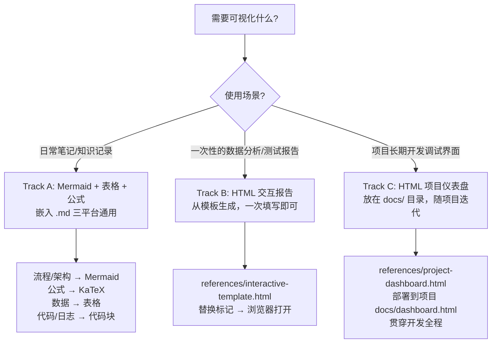
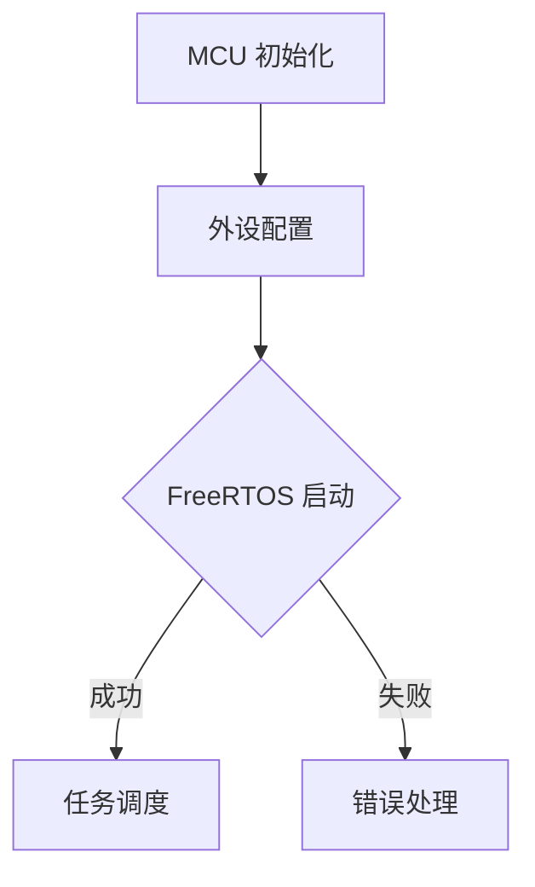
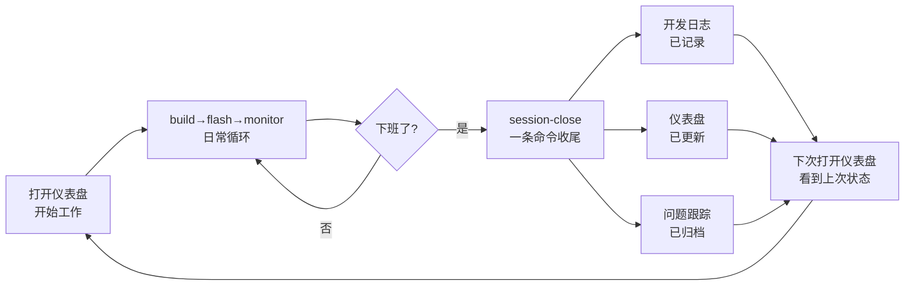
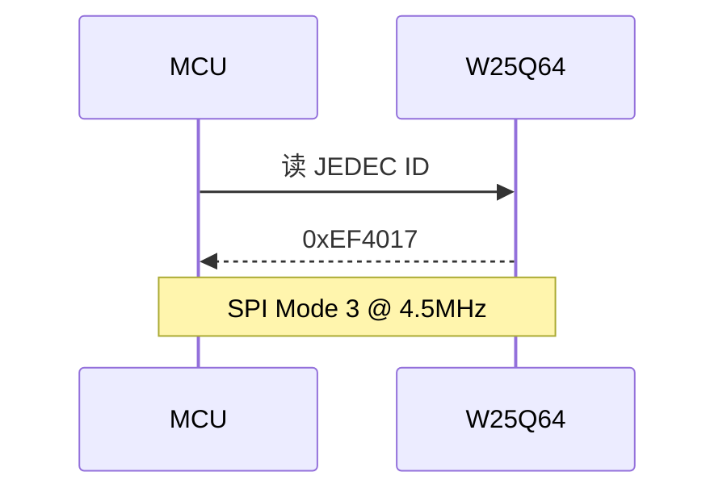

# Obsidian Viz v3.1.0 — 三轨可视化方案

## 核心原则

```
日常笔记/文档    → Mermaid + 表格 + KaTeX + 代码块 → 直接写 .md，三平台通吃
单次分析报告     → 自包含 HTML → 浏览器打开，一次生成
项目常驻仪表盘   → 自包含 HTML → 放在项目 docs/ 目录 → 长期维护，持续更新
```

**三平台通用**：Mermaid + 表格 + 公式 + 代码块 → Obsidian / Cherry Studio / VS Code
**交互补充**：自包含 HTML，浏览器打开，零本地依赖
**常驻工具**：每个项目一份 dashboard.html，随开发迭代更新，作为项目中枢

---

## 决策树 — 选哪个



---

## Track A：Mermaid + Markdown（静态跨平台）

### 图类型选择

| 场景 | Mermaid 图类型 | 说明 |
|------|---------------|------|
| 系统架构/模块关系 | flowchart 或 block-beta | 方框 + 箭头表示数据/控制流 |
| 通信协议/交互流程 | sequenceDiagram | 角色间消息交互，最常用 |
| 类/接口/继承关系 | classDiagram | 面向对象设计、驱动分层 |
| 状态机/状态迁移 | stateDiagram | 外设状态、任务调度 |
| 时间线/项目排期 | gantt | 开发计划、里程碑 |
| 思维导图/分类 | mindmap | 知识分类、功能树 |
| 资源占比 | pie | Flash/RAM 占用分布 |
| 实体关系 | erDiagram | 数据库表、数据结构 |
| 时间线叙事 | timeline | 版本演进、事件历程 |
| 对比/趋势 | xychart (Mermaid 11.5+) | 数值趋势 |

> 不确定时默认用 **flowchart** 或 **sequenceDiagram**，兼容性最高。

### Mermaid 语法要点

中文内容用引号包裹：



### 公式（KaTeX）

行内 `$E = mc^2$` 或块级 `$$...$$`：

$$f_{TIM} = \frac{f_{CK}}{(PSC+1)(ARR+1)}$$

---

## Track B：HTML 交互报告（单次动态分析）

### 适用场景

| 场景 | 为什么不直接用 Mermaid |
|------|----------------------|
| 数据波形/趋势 | Mermaid xychart 无交互，不能缩放/悬停 |
| 筛选/搜索日志 | 静态文本无法过滤 |
| 多图表联动 | 点击一个图表联动另一个 |
| 折叠展开诊断流程 | `<details>` 在 Cherry Studio 无效 |
| 暗色/亮色切换 | Mermaid 无主题联动 |

### 模板

路径：`references/interactive-template.html`

### 使用方式

```
cp references/interactive-template.html docs/分析报告.html
→ 替换 <!-- MARK --> 标记 → 浏览器打开
```

---

## Track C：HTML 项目仪表盘（常驻开发调试界面）

### 适用场景

**贯穿项目全生命周期**的调试界面。不是一次性报告，而是每次开发会话都打开的工具。

- 编译后：更新资源占用、粘贴编译日志
- 调试后：粘贴串口输出、记录问题
- 改引脚后：同步更新引脚配置表

### 包含内容

| 模块 | 内容 | 更新频率 |
|------|------|---------|
| 项目概览 | MCU、工具链、调试器、串口 | 项目创建时配置一次 |
| 资源占用 | Flash/RAM 仪表盘 + 按模块分布 | 每次编译后 |
| 引脚配置 | 引脚→功能→外设→配置表 | 修改引脚后 |
| 编译记录 | 最近编译输出、Code/RO/RW/ZI | 每次编译后 |
| 问题跟踪 | P0/P1/P2 状态（待解决/已解决） | 随时 |
| 运行日志 | 串口/RTT 输出粘贴区 | 每次调试后 |
| 系统架构 | Mermaid 架构图（可标记问题模块） | 架构变更时 |
| 快速参考 | 常用命令、时钟树、寄存器地址、文档链接 | 一次性填充 |

### 模板

路径：`references/project-dashboard.html`

### 部署规范

每个项目在 `docs/` 目录下放一份：

```
Project Root/
├── docs/
│   └── dashboard.html    ← 常驻，双击打开
├── Core/         (源文件)
├── MDK-ARM/      (Keil 工程)
├── Drivers/      (HAL 库)
└── ...
```

### 典型开发日使用流程

#### 开始 → 开发 → 收尾

```
1. 开始工作 → 打开 docs/dashboard.html
2. 改代码 → build → flash → monitor（日常循环）
3. 编译后 → 浏览器刷新仪表盘（数据自动更新）
4. 遇到 bug → 记录到问题跟踪 / kb-record 归档
5. 下班前 → session-close <项目目录>（关键一步）
              ├── 自动生成开发日志（devlog.py）
              ├── 自动刷新仪表盘（--update）
              └── 可选捕获串口日志
```

#### session-close 用法

```
# 基础收尾
session-close D:\...\08_UART_PRINTF_V1

# 带工作内容描述
session-close D:\...\08_UART_PRINTF_V1 ^
    --work-done "修复了 I2C BUSY 锁死|添加了 ADC 校准" ^
    --problems "I2C 从设备复位后主设备 BUSY 置位|GPIO 模拟9脉冲+SWRST|已解决" ^
    --progress 75

# 结束后捕获串口日志
session-close D:\...\08_UART_PRINTF_V1 --capture 10

# 交互模式（逐项问答）
session-close D:\...\08_UART_PRINTF_V1 --interactive

# 只更新仪表盘，不写日志
session-close D:\...\08_UART_PRINTF_V1 --no-devlog
```

#### 会话闭环示意图



### 和 Workflow Skill 联动

```
build → flash → monitor → capture → record → commit
                                          └── 更新 dashboard.html
                                               ├── .map 分析 → 资源占用
                                               ├── 编译日志 → 编译记录
                                               └── 串口日志 → 运行日志
```

---

## 自动初始化

### 用法

```
# 首次初始化（生成三件套）
init-project <项目目录>

# 编译后更新仪表盘资源占用（保留手动编辑内容）
init-project <项目目录> --update

# 仅创建日志/问题，不生成仪表盘
init-project <项目目录> --no-dashboard
```

> `init-project` 自动查找 Python 路径，无需关心 `python` 是否在 PATH 中。

### 生成内容

| 文件 | 路径 | 说明 |
|------|------|------|
| 仪表盘 | `docs/dashboard.html` | 双击浏览器打开，数据已预填 |
| 开发日志 | `docs/开发日志/` | 首条日志模板 + 自动计算会话编号 |
| 问题跟踪 | `docs/问题跟踪.md` | P0/P1/P2 模板，已有则跳过不覆盖 |

### 自动解析内容

| 信息来源 | 解析内容 |
|---------|---------|
| `.uvprojx` (XML) | 项目名、MCU 型号、编译器 (AC5/AC6) |
| `.map` (链接映射) | Code/RO-data/RW-data/ZI-data 大小 |
| `Core/Src/*.c` | MX_xxx_Init 外设函数、HAL_GPIO_Init 引脚配置 |
| `.git/HEAD` | 当前分支名 |

### --update 模式工作原理

1. 重新扫描 .map 获取最新 Flash/RAM 数据
2. 通过 `data-key` 属性精确定位 HTML 中的资源数值
3. 更新 gauge 图表数据（`g('gaugeFlash', ...)`）
4. **不修改**引脚配置、问题跟踪、日志、快速参考等手动编辑内容
5. 建议每次编译后执行一次，刷新浏览器即可看到最新资源占用

> 现成的项目模板目录 (`08_UART_PRINTF_V1`) 已部署完整仪表盘，可作为参考。

---

## 输出规范

### Track A — 直接嵌入笔记

````markdown


$$V_{DDA} = \frac{4096}{ADC_{VREFINT}} \times V_{REFINT}$$
````

### Track B — 生成 HTML 交互报告

复制 `references/interactive-template.html` → 替换标记内容 → 保存为 `项目名-分析报告.html` → 浏览器打开。

### Track C — 部署项目仪表盘

首次：复制 `references/project-dashboard.html` → 替换项目数据 → 保存到 `docs/dashboard.html`

更新：直接编辑 `docs/dashboard.html`，修改对应数据行 → 浏览器刷新即可

---

## 错误处理

| 现象 | 根因 | 处理 |
|------|------|------|
| Mermaid 不渲染 | 缩进错误 / 语法错误 | 检查引号、缩进、标签闭合 |
| KaTeX 显示源码 | 缺 `$` 闭合 / 特殊字符未转义 | 使用 `$$...$$` 完整包裹 |
| HTML 空白页面 | 浏览器安全策略阻塞 CDN | 确保网络可访问 jsdelivr.net |
| HTML 图表不显示 | canvas ID 冲突 / Chart.js 未加载 | 检查控制台报错，CDN URL 是否正确 |
| 仪表盘 Chart 饼图空转 | gauge 数据格式错误 | 确保 `g('gaugeFlash', 数值, '颜色')` 中数值为 Number |
| Mermaid 在深色模式错位 | 主题切换后未重绘 | 已自动绑定 themeToggle onclick 延时刷新 |
