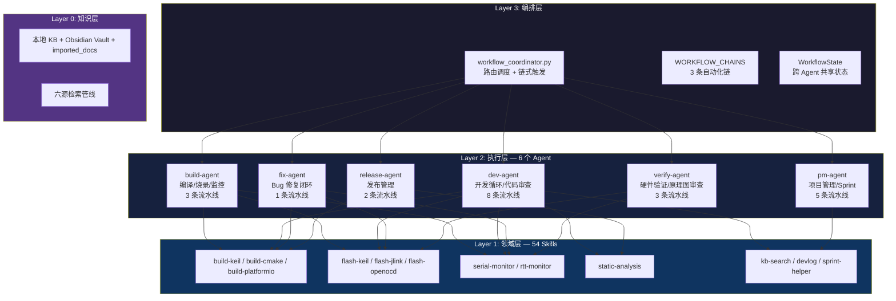
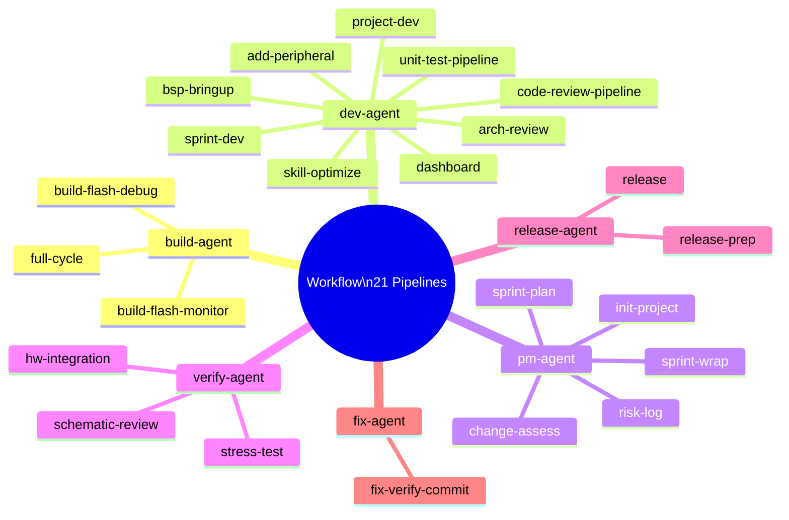
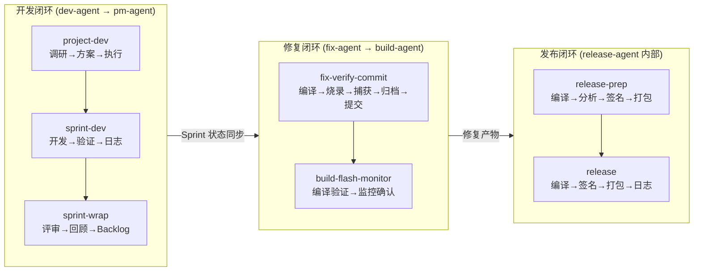
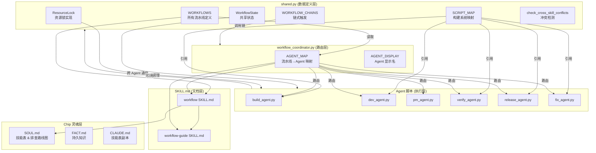
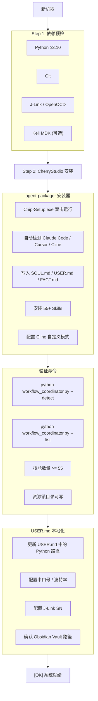
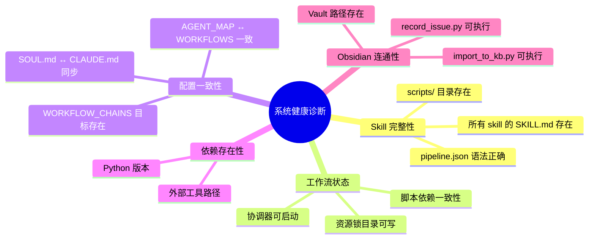
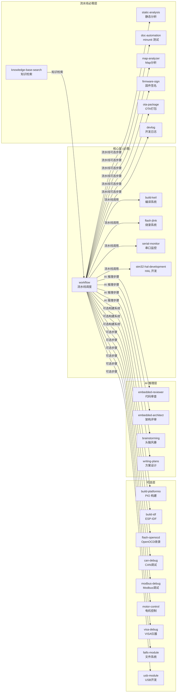

# Workflow 工作流体系 — 导航与维护指南

> 嵌入式全生命周期 6 Agent 多流水线系统。本 skill 提供完整的架构导航、配置参考、维护指南和故障排查手段，帮助你快速理解工作流全局并在需要时修改扩展。

## 架构总览

### 四层架构



### 6 Agent × 21 流水线总表

每条流水线由 `AGENT_MAP` 定义其归属的 Agent，协调器根据 `--run <pipeline>` 自动路由。



## 流水线详细参考

### build-agent (build_agent.py) — 3 条流水线

| 流水线 | 步骤链 | 典型场景 |
|--------|--------|---------|
| `build-flash-monitor` | 编译 → 烧录 → 串口监控 | 标准验证循环 |
| `build-flash-debug` | 编译 → 烧录 → GDB 调试 | 调试会话 |
| `full-cycle` | 编译 → 烧录 → 监控 → 开发日志 | 完整验证闭环 |

### dev-agent (dev_agent.py) — 9 条流水线

| 流水线 | 步骤链 | 典型场景 |
|--------|--------|---------|
| `project-dev` | 需求细化 → 调研 → 方案 → 执行 → 日志 | 前开发阶段完整闭环 |
| `bsp-bringup` | 编译 → 烧录 → 功能验证 → 开发日志 | 新板 BSP 初始化 |
| `add-peripheral` | 编译 → 烧录 → 外设测试 → OOP 检查 → 日志 | 添加新外设驱动 |
| `sprint-dev` | 编译 → 静态分析 → 烧录 → 监控 → 验证 → 日志 | Sprint 标准开发循环 |
| `code-review-pipeline` | 静态分析 → 代码审查 → 编译 → 验证 | 代码审查轮次 |
| `unit-test-pipeline` | 静态分析 → 单元测试 → 编译 | 单元测试轮次 |
| `arch-review` | 架构评审 | MCU 选型/引脚分配审查 |
| `dashboard` | 仪表盘 | 项目仪表盘生成 |
| `skill-optimize` | 技能扫描 → 调研 → 修复 → 日志 | 技能优化闭环 |

### pm-agent (pm_agent.py) — 5 条流水线

| 流水线 | 步骤链 | 典型场景 |
|--------|--------|---------|
| `init-project` | BSP 初始化 | 新项目敏捷管理初始化 |
| `sprint-plan` | Sprint 规划 | 选择 Backlog → 生成 Sprint Plan |
| `sprint-wrap` | 日志 → Sprint 评审 → Sprint 回顾 | Sprint 收尾 |
| `risk-log` | 风险登记 | 更新风险登记册 |
| `change-assess` | 变更评估 | 引脚变更七层审查 |

### verify-agent (verify_agent.py) — 3 条流水线

| 流水线 | 步骤链 | 典型场景 |
|--------|--------|---------|
| `hw-integration` | 编译 → 烧录 → 外设测试 → 稳定性测试 | 硬件集成验证 |
| `stress-test` | 烧录 → 长时间日志采集 → 结果分析 | 稳定性/压力测试 |
| `schematic-review` | 原理图审查 | BOM/电源树/引脚/网络/DRC 分析 |

### release-agent (release_agent.py) — 2 条流水线

| 流水线 | 步骤链 | 典型场景 |
|--------|--------|---------|
| `release-prep` | 编译 → 静态分析 → Map 分析 → 固件签名 → OTA 打包 | 发布准备 |
| `release` | 编译 → 固件签名 → OTA 打包 → 日志 | 正式发布 |

### fix-agent (fix_agent.py) — 1 条流水线

| 流水线 | 步骤链 | 典型场景 |
|--------|--------|---------|
| `fix-verify-commit` | 编译 → 烧录 → 日志采集 → 问题归档 → Git 提交 | Bug 修复闭环 |

## 跨 Agent 通信

### 链式触发 (WORKFLOW_CHAINS)

流水线完成后自动触发下一个流水线，定义在 `shared.py` 中：

| 触发流水线 | 触发的下一个 | 代理链 | 说明 |
|-----------|------------|-------|------|
| `sprint-dev` | `sprint-wrap` | dev-agent → pm-agent | 开发完自动收尾 |
| `fix-verify-commit` | `build-flash-monitor` | fix-agent → build-agent | 修复完自动验证 |
| `release-prep` | `release` | release-agent 内部链 | 准备完自动发布 |

**规则**：
- 仅在通过协调器 (`workflow_coordinator.py`) 执行时生效
- 直接调用 Agent 脚本不会被链
- 自动转发 `forward_args` 中定义的参数

### 共享状态 (WorkflowState)

文件 `~/.workflow_state.json`，用于跨流水线传递上下文：

```python
# 写入
WorkflowState.set("artifact_path", "build/UART.hex")
# 读取
artifact = WorkflowState.get("artifact_path")
# 清空
WorkflowState.clear()
```

CLI 查看：
```bash
python workflow_coordinator.py --state
python workflow_coordinator.py --clear-state
```

## 闭环线路管理

工作流的核心价值在于 **闭环** — 各 step/skill 之间不是孤立的，每一步的输出驱动下一步的输入，形成可追踪的自动化链路。

### 3 大闭环路线图



### 步骤间数据流

每一步的执行结果通过 `run_step()` 返回，决定流水线是否继续：

```
run_step(name, cmd) → (ok: bool, stdout: str, stderr: str)
                              │
                 ok=True  ────┤──── 继续下一步
                 ok=False ────┴──── 停止流水线，返回 exit=1，跳过链式触发
```

**中断传播规则**（Agent 脚本行为）：

| 场景 | 行为 |
|------|------|
| build 失败 (exit≠0) | stop chain，不执行 flash/monitor |
| flash 失败 | stop chain，不执行 monitor |
| static-analysis 有 error | stop chain（warning 不中断） |
| AI 推理步骤 (code-review/refine等) | 打印清单，返回 ok=True（由上层 Chip 处理） |
| 链式触发的前置流水线失败 | 不触发下一个链，递归终止 |

### 跨 Skill 数据传递键表

各流水线通过 `WorkflowState` 传递上下文。以下是所有已知的 key：

| Key | 写入步骤 | 读取步骤 | 说明 |
|-----|---------|---------|------|
| `artifact_path` | build | flash/debug | 编译产物路径 (.hex/.elf) |
| `artifact_type` | build | flash | 产物类型 (hex/elf/bin) |
| `current_sprint` | sprint-plan | sprint-dev/sprint-wrap | 当前 Sprint 编号 |
| `project_path` | init-project | 所有流水线 | 工程根目录 |
| `build_system` | init-project | build/flash | 构建系统类型 |
| `serial_port` | init-project | monitor/capture/stress-test | 串口号 |
| `last_build_ok` | build | chain trigger decision | 上次编译是否成功 |
| `capture_log_path` | capture | record | 采集日志保存路径 |
| `issue_record_path` | record | commit | 问题记录文件路径 |
| `release_version` | release-prep | release | 发布版本号 |
| `firmware_signed` | firmware-sign | ota-package | 固件是否已签名 |
| `ota_package_path` | ota-package | release/devlog | OTA 包路径 |

### 3 大闭环的完整数据流

**开发闭环** (project-dev → sprint-dev → sprint-wrap)：
```
project-dev (refine)     → 确定硬件上下文、功能、约束 → WorkflowState.set("requirements", ...)
project-dev (research)   → 多源检索方案 → WorkflowState.set("solution", ...)
project-dev (plan)       → 方案设计 → WorkflowState.set("design_doc", ...)
project-dev (execute)    → 选择目标流水线 → 触发 sprint-dev 或 bsp-bringup
sprint-dev (build)       → 读取 design_doc → 编译 → WorkflowState.set("artifact_path", ...)
sprint-dev (flash)       → 读取 artifact_path → 烧录
sprint-dev (verify)      → 验证功能 → WorkflowState.set("verification_result", "pass/fail")
sprint-dev (devlog)      → 日志归档 → WorkflowState.set("sprint_${n}_done", true)
                                            ↓ 链式触发
sprint-wrap (devlog)     → 读取 sprint_X_done → 生成本 Sprint 开发日志
sprint-wrap (review)     → Sprint 评审
sprint-wrap (retro)      → Sprint 回顾 → 更新 Backlog
```

**修复闭环** (fix-verify-commit → build-flash-monitor)：
```
fix-verify-commit (build)   → 编译修复后的代码 → WorkflowState.set("artifact_path", ...)
fix-verify-commit (flash)   → 烧录到目标板
fix-verify-commit (capture) → 日志采集 → WorkflowState.set("capture_log_path", ...)
fix-verify-commit (record)  → 问题归档 → WorkflowState.set("issue_record_path", ...)
fix-verify-commit (commit)  → Git 提交
                                            ↓ 链式触发
build-flash-monitor (build)  → 确认编译通过
build-flash-monitor (flash)  → 确认烧录正常
build-flash-monitor (monitor)→ 串口监控确认修复生效
```

**发布闭环** (release-prep → release)：
```
release-prep (build)          → Release 编译 → WorkflowState.set("artifact_path", ...)
release-prep (static-analysis)→ 最终静态分析
release-prep (map-analyze)    → Flash/RAM 用量 → WorkflowState.set("map_report", ...)
release-prep (firmware-sign)  → 固件签名 → WorkflowState.set("firmware_signed", true)
release-prep (ota-package)    → OTA 打包 → WorkflowState.set("ota_package_path", ...)
                                             ↓ 链式触发
release (build)               → 确认编译
release (firmware-sign)       → 最终签名
release (ota-package)         → 最终 OTA 包
release (devlog)              → 发布日志归档
```

### 闭环完整性检查清单

用于验证某条闭环线路的所有环节是否完整：

```bash
# 1. 检查闭环涉及的流水线是否存在
python workflow_coordinator.py --list | findstr "sprint-dev sprint-wrap"

# 2. 检查链式触发配置
python workflow_coordinator.py --detect

# 3. 检查 WorkflowState key 传递
python workflow_coordinator.py --state

# 4. 检查闭环涉及的所有底层脚本是否存在
python workflow_coordinator.py --detect
```

## 工作流文件闭环升级

工作流系统自身的文件之间存在严格的依赖关系。修改一个文件时，必须同步检查其他文件以保证系统一致性。

### 文件依赖关系图



### 文件变更影响范围

| 变更场景 | 必须同步修改的文件 | 建议检查的文件 |
|---------|------------------|--------------|
| **添加新流水线** | `shared.py` (WORKFLOWS) + `workflow_coordinator.py` (AGENT_MAP) + `SKILL.md` | 如果是新 Agent: 创建 `xx_agent.py` + 更新 `AGENT_DISPLAY` + `STEP_LABELS` |
| **修改流水线步骤** | `shared.py` (WORKFLOWS) + `SKILL.md` | `resolve_script()` 中是否有对应映射; `STEP_LABELS` 是否缺新步骤 |
| **删除流水线** | `shared.py` (WORKFLOWS) + `workflow_coordinator.py` (AGENT_MAP) + `SKILL.md` | `WORKFLOW_CHAINS` 中是否有对它的引用 |
| **添加构建系统** | `shared.py` (SCRIPT_MAP) + `resolve_script()` + `SKILL.md` | 对应的 build/flash skill 是否已安装 |
| **修改链式触发** | `shared.py` (WORKFLOW_CHAINS) + `SKILL.md` + `workflow-guide/SKILL.md` | 目标流水线的 forward_args 是否兼容 |
| **添加新 Agent** | `xx_agent.py` (新文件) + `workflow_coordinator.py` (AGENT_MAP + AGENT_DISPLAY) + `SKILL.md` | `shared.py` 的 `add_common_args()` 是否需要扩展参数 |
| **添加新步骤类型** | `shared.py` (STEP_LABELS + resolve_script) + `SKILL.md` | 是否需要加入 `CROSS_SKILL_RULES`; `SCRIPT_MAP` 是否需要扩展 |
| **修改 ResourceLock** | `shared.py` (RESOURCE_TYPES / ResourceLock 类) | 所有使用该锁的 Agent 脚本 |
| **修改 WorkflowState** | `shared.py` (WorkflowState 类) | 所有 `WorkflowState.set/get` 调用的 Agent 脚本 |
| **添加新 Skill** | 无直接影响（被 pipeline.json 动态发现） | 是否需要加 `CROSS_SKILL_RULES`; 是否要在某流水线中加入新步骤 |
| **删除 Skill** | 如果涉及到流水线步骤: `shared.py` (WORKFLOWS) + `resolve_script()` | `check_cross_skill_conflicts()` 是否会报缺失脚本 |
| **修改 SOUL.md 技能表** | `CLAUDE.md` (副本同步) | `workflow-guide` 是否需要更新; `embedded-skills-map` 是否需要更新 |
| **修改 workflow-guide** | 自身 SKILL.md + `SOUL.md` (技能表版本号) | `FACT.md` 中的技能统计; 检查是否影响 `embedded-skills-map` |

### 版本升级检查清单

当 workflow 版本升级时，按以下顺序验证完整性：

```bash
# Step 1: 基本结构检查
python workflow_coordinator.py --list          # 所有流水线是否加载正常
python workflow_coordinator.py --detect         # 脚本存在性 + 锁 + 链配置

# Step 2: 冲突检测（遍历所有流水线 + 构建系统）
python -c "
from scripts.shared import check_cross_skill_conflicts, print_conflict_report
for bs in ['keil', 'cmake', 'platformio']:
    for name in ['build-flash-monitor', 'sprint-dev', 'release-prep']:
        result = check_cross_skill_conflicts(bs, name)
        if not result.passed:
            print(f'[X] {name} @ {bs}: 冲突!')
            print_conflict_report(result)
"

# Step 3: 共享状态一致性
python workflow_coordinator.py --state

# Step 4: Soul 层同步（如果新增了 skill）
# 检查 SOUL.md 技能表是否需更新
# 检查 FACT.md 技能总数是否需要更新
# 检查 ~/.claude/CLAUDE.md 是否同步

# Step 5: 文档同步（如果新增了流水线/步骤）
# 检查 SKILL.md 文档是否与代码一致
# 检查 workflow-guide/SKILL.md 是否需更新
```

### 升级触发规则

| 触发事件 | 需要升级的版本位 | 影响范围 |
|---------|---------------|---------|
| 新增流水线 | MINOR+ | SKILL.md + workflow-guide/SKILL.md |
| 新增 Agent | MINOR+ | 创建新文件 + coordinator 注册 + 两份文档 |
| 新增构建系统 | MINOR+ | SCRIPT_MAP + resolve_script + 文档 |
| 修改 ResourceLock 机制 | MINOR+ | shared.py + 影响跨 Agent 行为 |
| 修改 WorkflowState 机制 | MINOR+ | shared.py + 破坏已有 key 兼容性 |
| 修改链式触发 | PATCH+ | WORKFLOW_CHAINS + 文档 |
| 修改步骤顺序/描述 | PATCH | WORKFLOWS + 文档 |
| 修复脚本 Bug | PATCH | 具体 Agent 脚本 |
| Skill 重命名/删除 | MAJOR | 全线文件 + 需要重新导出 .agentpkg |

### 灵魂层同步规则

每次对工作流（workflow）相关的内容进行增删改查操作时，必须同步检查以下关联关系：

1. **embedded-skills-map** — 技能导航的分类表、推荐矩阵、关系图、技能映射参考
2. **SOUL.md** — 第1节 Skill 优先表的技能映射、第6节 通用排查路线图
3. **workflow SKILL.md** — 流水线编排是否涉及该 skill
4. **workflow-guide SKILL.md** — 本文件，闭环线路和文件升级部分是否需要更新
5. **FACT.md** — 工作流编排描述、分发链路、规则
6. **CLAUDE.md** — `~/.claude/CLAUDE.md` 和 agent 目录 `CLAUDE.md` 的副本同步

> 以上 6 条构成工作流变更的最小闭合集，任何一条遗漏都视为不完整。

### 版本历史同步

| workflow 版本 | SKILL.md 版本 | workflow-guide 版本 | 说明 |
|-------------|--------------|-------------------|------|
| v3.1.0 | v3.1.0 (SKILL.md) | v1.1.0 | 首次加入闭环管理和文件升级文档 |
| v3.0.0 | v3.0.0 | — | 多 Agent 重构 |

> **维护原则**：每次升级 workflow 时，在 SKILL.md 和 workflow-guide/SKILL.md 的版本历史中同步记录，保持版本号关联可追溯。

## 系统初始化

在新机器上一键部署 Chip 体系的完整流程和依赖预检清单。

### 初始化流程图



### 依赖预检清单

| 依赖 | 必要/可选 | 验证命令 | 备注 |
|------|---------|---------|------|
| Python ≥3.10 | 必要 | `python --version` | Chip 全部脚本依赖 |
| CherryStudio | 必要 | 检查 Data/ 目录 | Agent 运行载体 |
| Git | 必要 | `git --version` | 流水线 commit 步骤需要 |
| J-Link (Windows) | 可选 | `JLink.exe` 可执行 | 烧录/调试 |
| Keil MDK (Windows) | 可选 | `UV4.exe` 路径配置 | ARMCC 编译 |
| OpenOCD | 可选 | `openocd --version` | 烧录/调试（cmake 用） |
| Obsidian | 可选 | 检查 Vault 目录 | 问题记录/知识库 |
| PlatformIO | 可选 | `pio --version` | 跨平台构建 |
| ESP-IDF | 可选 | `idf.py --version` | ESP32 开发 |

### 初始化执行脚本

在新机器上按顺序执行以下命令完成初始化：

```bash
# Step 1: 双击 Chip-Setup.exe
# Step 2: 验证安装
cd %USERPROFILE%\.claude\skills\workflow\scripts
python workflow_coordinator.py --detect
python workflow_coordinator.py --list

# Step 3: 确认技能数量
python -c "
from pathlib import Path
skills_dir = Path.home() / 'AppData' / 'Roaming' / 'CherryStudio' / 'Data' / 'Skills'
count = sum(1 for d in skills_dir.iterdir() if (d / 'SKILL.md').exists())
print(f'[OK] Skills installed: {count}')
assert count >= 50, f'Skills 不足: {count}'
"

# Step 4: 更新 USER.md（手动编辑）
# 路径: %APPDATA%\CherryStudio\Data\Agents\5zvr5dykd\USER.md
```

## 系统健康诊断

统一的系统健康检查入口，一键确认整个 Chip 工作流体系是否完整可用。

### 健康诊断维度



### 一键健康检查

```bash
# 方式 1: 使用诊断脚本
python scripts/system_health.py

# 方式 2: 使用协调器
python workflow_coordinator.py --detect
python workflow_coordinator.py --list

# 方式 3: 快速自检（无脚本环境）
python -c "
from pathlib import Path
import json, sys

issues = []
skills_dir = Path.home() / 'AppData' / 'Roaming' / 'CherryStudio' / 'Data' / 'Skills'
agent_dir = Path.home() / 'AppData' / 'Roaming' / 'CherryStudio' / 'Data' / 'Agents' / '5zvr5dykd'

# 1. Skill 完整性
missing_sk = [d.name for d in skills_dir.iterdir() if d.is_dir() and not (d / 'SKILL.md').exists()]
if missing_sk: issues.append(f'[X] {len(missing_sk)} skills 缺少 SKILL.md')

# 2. 核心文件存在性
for f in ['SOUL.md', 'USER.md', 'CLAUDE.md', 'memory/FACT.md']:
    if not (agent_dir / f).exists(): issues.append(f'[X] 缺少 {f}')

# 3. Workflow 脚本存在性
wf_dir = skills_dir / 'workflow' / 'scripts'
for s in ['shared.py', 'workflow_coordinator.py', 'build_agent.py', 'dev_agent.py',
          'pm_agent.py', 'verify_agent.py', 'release_agent.py', 'fix_agent.py']:
    if not (wf_dir / s).exists(): issues.append(f'[X] workflow 缺失 {s}')

# 4. CLAUDE.md 同步
soul = (agent_dir / 'SOUL.md').read_text(encoding='utf-8')
claude = (agent_dir / 'CLAUDE.md').read_text(encoding='utf-8')
if soul != claude: issues.append('[!] SOUL.md 与 CLAUDE.md 不同步')

if issues:
    print(f'系统健康检查: [X] {len(issues)} 个问题')
    for i in issues: print(f'  {i}')
else:
    print('[OK] 系统健康检查: 全部通过')
"

# 清理僵死锁
python -c "from scripts.shared import ResourceLock; ResourceLock.cleanup_stale()"
```

### 健康评分标准

| 等级 | 评分 | 含义 | 行动 |
|------|------|------|------|
| **健康** | 100% | 全部检查通过 | 无需操作 |
| **警告** | 80-99% | 可选依赖缺失（如缺少 J-Link 但项目只用串口） | 检查是否影响当前项目 |
| **异常** | 50-79% | 核心脚本缺失或配置不同步 | 执行升级检查清单修复 |
| **损坏** | <50% | 系统无法正常工作 | 重新运行安装器 Chip-Setup.exe |

## 系统升级流程

将 Chip 体系从当前版本升级到新版本的标准化操作流程。

### 升级流程


### 升级标准操作流程 (SOP)

```
Phase 1: 准备工作
━━━━━━━━━━━━━━━━━━━━━━━━━━━━━━━━━━
[ ] 确认变更范围（新建/修改/删除）
[ ] 确定版本位（参考"升级触发规则"表）
[ ] 备份当前状态
     → python -c "from scripts.shared import WorkflowState; WorkflowState.snapshot()"

Phase 2: 代码变更
━━━━━━━━━━━━━━━━━━━━━━━━━━━━━━━━━━
[ ] 修改目标文件
[ ] 根据"文件变更影响范围"表同步修改关联文件
[ ] 运行冲突检测
     → python -c "from scripts.shared import check_cross_skill_conflicts; ..."

Phase 3: 灵魂层同步
━━━━━━━━━━━━━━━━━━━━━━━━━━━━━━━━━━
[ ] SOUL.md — 技能表 / 排查路线图是否需更新
[ ] FACT.md — 技能数量 / 工作流描述是否需更新
[ ] CLAUDE.md — 副本同步
[ ] workflow-guide SKILL.md — 本文件是否需同步

Phase 4: 文档更新
━━━━━━━━━━━━━━━━━━━━━━━━━━━━━━━━━━
[ ] workflow SKILL.md 版本历史和内容更新
[ ] workflow-guide SKILL.md 版本历史和内容更新
[ ] embedded-skills-map 是否需同步（如果新增了 skill 分类）

Phase 5: 打包与分发
━━━━━━━━━━━━━━━━━━━━━━━━━━━━━━━━━━
[ ] 重建 .agentpkg
     → python packager_export.py ...
[ ] 重建 .exe（可选，仅 Windows 分发给其他人时需要）
     → python packager_build_exe.py ...
[ ] 验证包完整性
     → python packager_verify.py --package *.agentpkg

Phase 6: 部署验证
━━━━━━━━━━━━━━━━━━━━━━━━━━━━━━━━━━
[ ] 目标机器上运行 --detect
[ ] 确认技能数量正确
[ ] 执行一条基本流水线验证功能
     → python workflow_coordinator.py --run build-flash-monitor --build-system keil ...
```

### 升级版本模板

当需要记录一次升级时，使用以下格式：

```markdown
## vX.Y.Z (YYYY-MM-DD)

### 变更范围
- [新增/修改/删除] 内容描述

### 涉及文件
- shared.py: 修改了 xxx
- workflow_coordinator.py: 修改了 xxx
- SKILL.md: 更新了 xxx

### 灵魂层同步
- SOUL.md: [是/否] 需要更新
- FACT.md: [是/否] 需要更新
- CLAUDE.md: [是/否] 需要同步
- workflow-guide: [是/否] 需要同步

### 验证结果
- [ ] --detect 通过
- [ ] --list 显示正常
- [ ] 冲突检测通过
- [ ] .agentpkg 重新导出
- [ ] .exe 重新构建（如需）
```

## 系统快照与回滚

当升级出现问题时，快速回滚到安全版本的机制。

### 快照管理

```bash
# 创建快照（升级前执行）
python -c "
from scripts.shared import WorkflowState
import json, shutil, os, datetime
from pathlib import Path

snap_dir = Path.home() / '.workflow_snapshots'
snap_dir.mkdir(parents=True, exist_ok=True)

timestamp = datetime.datetime.now().strftime('%Y%m%d_%H%M%S')
snapshot = {
    'timestamp': timestamp,
    'version': 'v2.1.0',
    'workflow_state': WorkflowState.snapshot(),
    'agent_files': {},
}

# 备份关键文件
agent_dir = Path.home() / 'AppData' / 'Roaming' / 'CherryStudio' / 'Data' / 'Agents' / '5zvr5dykd'
for f in ['SOUL.md', 'CLAUDE.md', 'memory/FACT.md']:
    fp = agent_dir / f
    if fp.exists():
        snapshot['agent_files'][f] = fp.read_text(encoding='utf-8')

snap_file = snap_dir / f'snapshot_{timestamp}.json'
snap_file.write_text(json.dumps(snapshot, indent=2, ensure_ascii=False), encoding='utf-8')
print(f'[OK] 快照已创建: {snap_file}')
"
```

### 回滚触发条件

| 症状 | 回滚必要性 | 操作 |
|------|-----------|------|
| 升级后 --list 报错（流水线丢失） | 必须回滚 | 回滚 shared.py + coordinator |
| 升级后 --detect 显示脚本缺失 | 必须回滚 | 回滚 skill 目录或补装缺失 skill |
| 升级后流水线执行异常 | 强烈建议回滚 | 确认是脚本逻辑错误还是配置问题 |
| 升级后灵魂层不同步 | 无需回滚 | 执行灵魂层同步即可修复 |
| 升级后文档描述与实际不符 | 无需回滚 | 更新文档即可 |

### 回滚验证清单

```bash
# Step 1: 停止所有正在运行的流水线
# （无工具操作，确认无后台进程占用 workflow 脚本）

# Step 2: 从快照恢复文件
python -c "
import json, os
from pathlib import Path

snap_dir = Path.home() / '.workflow_snapshots'
snaps = sorted(snap_dir.glob('snapshot_*.json'))
if not snaps:
    print('[X] 无可用快照')
    exit(1)

latest = snaps[-1]
data = json.loads(latest.read_text(encoding='utf-8'))
print(f'[i] 使用快照: {data[\"timestamp\"]}')
print(f'    版本: {data[\"version\"]}')

agent_dir = Path.home() / 'AppData' / 'Roaming' / 'CherryStudio' / 'Data' / 'Agents' / '5zvr5dykd'
for fname, content in data['agent_files'].items():
    fp = agent_dir / fname
    fp.write_text(content, encoding='utf-8')
    print(f'    [OK] 恢复: {fname}')

# 恢复 WorkflowState（不执行，仅展示）
print(f'    [!] WorkflowState 回滚需要手动确认: {data[\"workflow_state\"]}')
print(f'    (执行 WorkflowState.clear() 后重新设置)')
"

# Step 3: 验证回滚后状态
python workflow_coordinator.py --detect
python workflow_coordinator.py --list

# Step 4: 记录回滚操作到版本历史
# 在 workflow-guide SKILL.md 版本历史中添加回滚记录
```

### 回滚记录模板

```markdown
### vX.Y.Z Rollback (YYYY-MM-DD HH:MM)
- 回滚原因: 升级后出现 xxx 问题
- 回滚前版本: vX.Y.Z
- 回滚后版本: vX.Y-1.Z-1
- 快照文件: snapshot_YYYYMMDD_HHMMSS.json
- 验证结果: --list / --detect 通过
```

## 技能依赖关系管理

明确整个 Chip 体系中各 skill 之间的依赖关系，区分核心/必需/可选三层。

### 工作流调用依赖图



### 依赖分层说明

| 层级 | 定义 | 数量 | 缺失影响 |
|------|------|------|---------|
| **核心层** | workflow 体系运行的基础设施，任何流水线都需要 | ~6 | 系统不可用 |
| **流水线必需层** | 特定流水线步骤依赖 | ~7 | 对应步骤无法执行 |
| **可选层** | 特定平台/协议场景才需要 | ~13 | 不影响主流程 |
| **AI 推理层** | 纯 AI 交互，无脚本依赖 | ~5 | 不影响编译烧录 |
| **知识层** | 知识库/Obsidian/检索系统 | ~3 | 不影响编译烧录，影响知识闭环 |

### skill → 流水线映射

| 流水线 | 核心依赖 | 可选依赖 |
|--------|---------|---------|
| build-flash-monitor | build-keil + flash-jlink + serial-monitor | — |
| build-flash-debug | build-keil + flash-jlink + debug-gdb-openocd | — |
| full-cycle | build-keil + flash-jlink + serial-monitor + devlog | — |
| fix-verify-commit | build-keil + flash-jlink + serial-monitor + knowledge-base-search | — |
| sprint-dev | build-keil + flash-jlink + serial-monitor + devlog | static-analysis |
| bsp-bringup | build-keil + flash-jlink + serial-monitor + devlog | — |
| add-peripheral | build-keil + flash-jlink + serial-monitor + devlog | — |
| code-review-pipeline | build-keil | static-analysis + embedded-reviewer (AI) |
| unit-test-pipeline | build-keil | static-analysis |
| release-prep | build-keil | static-analysis + map-analyzer + firmware-sign + ota-package |
| release | build-keil + devlog | firmware-sign + ota-package |
| hw-integration | build-keil + flash-jlink + serial-monitor | — |
| stress-test | flash-jlink + serial-monitor | — |
| schematic-review | pcb-analysis | ai-eda bridge (aiohttp + LCEDA Pro 插件) |
| project-dev | devlog | knowledge-base-search + brainstorming + writing-plans |
| skill-optimize | devlog | knowledge-base-search |

### 依赖一致性检查

```bash
# 检查所有流水线的核心依赖 skill 是否存在
python -c "
from pathlib import Path

skills_dir = Path.home() / 'AppData' / 'Roaming' / 'CherryStudio' / 'Data' / 'Skills'
required = ['build-keil', 'flash-jlink', 'serial-monitor', 'workflow',
            'stm32-hal-development', 'devlog']

missing = [s for s in required if not (skills_dir / s / 'SKILL.md').exists()]
if missing:
    print(f'[X] 缺失核心 skill: {missing}')
else:
    print('[OK] 所有核心 skill 已安装')
"
```

基于 `os.mkdir()` 原子性的跨平台文件锁，防止多 Agent 竞争资源。

| 资源类型 | 用途 | 默认超时 | 典型使用 Agent |
|---------|------|---------|---------------|
| `serial` | 串口独占 | 30s | build/dev/verify/fix |
| `jlink` | J-Link 探针独占 | 60s | build/dev/fix |
| `project` | 工程目录独占 | 30s | pm |
| `flash` | 烧录通道独占 | 30s | build/dev/verify/fix |
| `git` | Git 操作互斥 | 30s | fix |

使用方式：
```python
with ResourceLock("serial", "{SERIAL_PORT}", timeout=30) as lock:
    if lock.acquired:
        # 安全使用串口
        ...
```

锁目录：`~/.workflow_locks/`，锁文件命名规则：`{resource}_{scope}.lockdir`

## 构建系统 (SCRIPT_MAP)

支持三种构建系统，映射到不同的底层 skill：

| 构建系统 | 编译 | 烧录 | 调试 | 串口监控 |
|---------|------|------|------|---------|
| `keil` | build-keil | flash-keil | debug-gdb-openocd | serial-monitor |
| `cmake` | build-cmake | flash-openocd | debug-gdb-openocd | serial-monitor |
| `platformio` | build-platformio | flash-platformio | debug-platformio | serial-monitor |

## AI 推理步骤

不需要脚本的 AI 交互步骤，Agent 打印提示清单后由 Chip 上层处理：

| 步骤 | 所属 Agent | 触发 Skill |
|------|-----------|-----------|
| `code-review` | dev-agent | embedded-reviewer |
| `arch-review` | dev-agent | embedded-architect |
| `refine` | dev-agent | brainstorming |
| `research` | dev-agent | knowledge-base-search + verify_claims |
| `plan` | dev-agent | writing-plans |
| `execute` | dev-agent | workflow routing |
| `skill-scan` | dev-agent | 技能扫描 |

## 跨 Skill 冲突检测

`shared.py` 中的 `check_cross_skill_conflicts()` 函数检查流水线是否存在潜在冲突：

| 规则 | 类型 | 说明 |
|------|------|------|
| `missing-step-mapping` | error | 步骤未在构建系统中注册 |
| `unknown-build-system` | error | 不支持的构建系统 |
| `esp-build-vs-jlink` | warning | ESP32 使用 J-Link 警告 |
| `keil-build-platform-check` | warning | Keil 仅 Windows |
| `jlink-serial-contention` | warning | 烧录和监控同时进行 |
| `git-conflict-risk` | warning | Git 和归档同时进行 |
| `debug-requires-elf` | warning | 调试需要先构建 |

通过 `--skip-conflict-check` 跳过检测。

## 动态流水线扩展

其他 skill 可通过 `pipeline.json` 注册自定义流水线，协调器自动发现：

```json
// 在任意 skill 目录下创建 pipeline.json
{
  "pipelines": {
    "my-custom-pipeline": {
      "description": "描述",
      "steps": ["build", "flash", "monitor"],
      "phase": "Phase 6: 扩展流水线"
    }
  }
}
```

扫描由 `scan_all_skills_for_pipelines()` 在 `shared.py` 中完成。

## 维护指南

### 添加新流水线

1. **定义流水线步骤** — 在 `shared.py` 的 `WORKFLOWS` 字典中添加：
   ```python
   "my-new-pipeline": {
       "description": "新的流水线",
       "steps": ["build", "flash", "monitor"],
       "agent": "build-agent",
   }
   ```

2. **注册到 AGENT_MAP** — 在 `workflow_coordinator.py` 中：
   ```python
   "my-new-pipeline": "build_agent.py",
   ```

3. **添加步骤标签**（可选）— 在 `STEP_LABELS` 中：
   ```python
   "my-step": "我的步骤",
   ```

4. **注册脚本映射**（可选）— 在 `SCRIPT_MAP` 或 `resolve_script()` 中。

5. **配置链式触发**（可选）— 在 `WORKFLOW_CHAINS` 中。

### 添加新 Agent

1. 在 `workflow/scripts/` 下创建 `xx_agent.py`
2. 在 `AGENT_MAP` 中添加流水线 → Agent 映射
3. 在 `AGENT_DISPLAY` 中添加显示名称
4. 更新 `WORKFLOWS` 中的流水线定义（如果独立路由）
5. 更新 `STEP_LABELS` 中步骤的中文标签
6. 更新本 SKILL.md

### 添加构建系统

在 `shared.py` 的 `SCRIPT_MAP` 中添加：
```python
"mybuild": {
    "build": "mybuild-skill/scripts/builder.py",
    "flash": "flash-mybuild/scripts/flasher.py",
    ...
}
```

对应的 skill 必须安装在 CherryStudio Data/Skills/ 目录下。

### 修改现有流水线

1. 修改 `shared.py` 中 `WORKFLOWS[pipe_name]["steps"]`
2. 如果步骤不存在，添加到 `STEP_LABELS`
3. 如果涉及新脚本，添加到 `resolve_script()` 或 `SCRIPT_MAP`
4. 运行 `--detect` 验证环境完整性

## 故障排查

### 常用诊断命令

```bash
# 按 Agent 分组列出所有流水线
python workflow_coordinator.py --list

# 全环境探测（脚本存在性、锁状态、链配置、构建系统）
python workflow_coordinator.py --detect

# 查看跨 Agent 共享状态
python workflow_coordinator.py --state

# 查看当前活跃资源锁
python -c "from scripts.shared import ResourceLock; print(ResourceLock.list_locks())"

# 清理僵死锁
python -c "from scripts.shared import ResourceLock; ResourceLock.cleanup_stale()"
```

### 常见问题

| 症状 | 根因 | 解决方案 |
|------|------|---------|
| `[X] 未知流水线: xxx` | 流水线未在 AGENT_MAP 中注册 | 添加到 `AGENT_MAP` 或检查拼写 |
| `[X] Agent 脚本不存在` | 依赖的 skill 未安装 | `--detect` 查看缺少的脚本 |
| 链式触发不工作 | 直接调用 Agent 而非协调器 | 通过 `workflow_coordinator.py --run` 执行 |
| 串口/J-Link 被占用 | 锁未释放或僵死锁 | `ResourceLock.cleanup_stale()` 清理 |
| build-agent 找不到串口 | 串口被其他程序占用 | 检查串口锁，确认 port 参数正确 |
| dev-agent 的 AI 步骤不触发 | 直接执行而非上层调用 | AI 步骤需要 Chip 上层处理 |
| sprint-wrap 没有数据 | 前序 sprint-dev 未通过协调器执行 | 链式触发需要协调器路由 |
| 动态流水线未出现 | pipeline.json 格式错误 | 检查 JSON 格式和 skill 目录位置 |
| 跨系统构建（Linux 运行 Keil） | Keil 仅 Windows | 使用 cmake + ARM GCC 替代 |

## 关键文件索引

| 文件 | 功能 | 关键内容 |
|------|------|---------|
| `scripts/shared.py` | 公共模块 | WORKFLOWS、SCRIPT_MAP、ResourceLock、WorkflowState、WORKFLOW_CHAINS、check_cross_skill_conflicts |
| `scripts/workflow_coordinator.py` | 协调器 | AGENT_MAP、AGENT_DISPLAY、dispatch()、list_all()、detect_all() |
| `scripts/build_agent.py` | build-agent | 编译/烧录/监控流水线实现 |
| `scripts/dev_agent.py` | dev-agent | 开发循环/代码审查/技能优化流水线 |
| `scripts/pm_agent.py` | pm-agent | Sprint 管理流水线 |
| `scripts/verify_agent.py` | verify-agent | 硬件验证/压力测试/原理图审查 |
| `scripts/release_agent.py` | release-agent | 发布管理 |
| `scripts/fix_agent.py` | fix-agent | Bug 修复闭环 |
| `scripts/sprint_helper.py` | Sprint 工具 | 命令行 Backlog 管理 |
| `SKILL.md` | 工作流 skill 定义 | 用户可见的完整文档 |

## 版本历史

| 版本 | 日期 | 变更 |
|------|------|------|
| **v1.3.0** | 2026-06-01 | 同步 workflow v3.2.0：新增 Agent 优先级 + 优先级继承协议说明 |
| **v1.2.0** | 2026-05-29 | 新增「系统初始化」+「系统健康诊断」+「系统升级流程」+「系统快照与回滚」+「技能依赖关系管理」|
| **v1.1.0** | 2026-05-29 | 新增「闭环线路管理」章节（3 大闭环路线图、步骤间数据流/中断传播、WorkflowState 键表、完整数据流) + 新增「工作流文件闭环升级」章节（文件依赖关系图、变更影响范围表、版本升级检查清单、灵魂层同步规则） |
