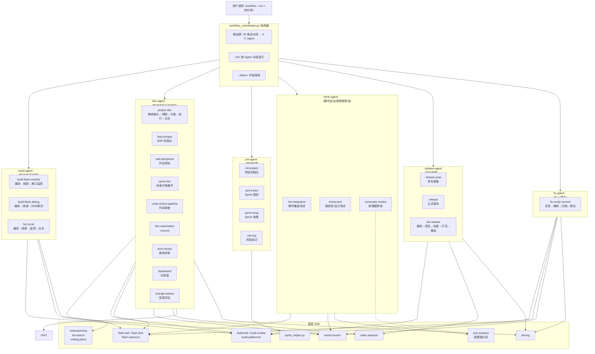

# Workflow 嵌入式开发流水线（多 Agent 架构）

> v3.1.0 — 从单体 1854 行 workflow_runner.py 重构为 6 个职能 Agent + 1 个协调器的多 Agent 系统。新增前开发阶段流水线 project-dev（需求细化→多源调研→方案设计→执行开发→日志）。新增跨 Agent 通信：WorkflowState 共享状态 + WORKFLOW_CHAINS 链式触发（sprint-dev→sprint-wrap, fix-verify-commit→build-flash-monitor, release-prep→release）。

## 总体架构



## Agent 职责一览

| Agent | 负责的流水线 | 资源锁 | 执行方式 |
|-------|------------|--------|---------|
| **build-agent** | build-flash-monitor, build-flash-debug, full-cycle | J-Link, 串口 | 子进程脚本 |
| **dev-agent** | bsp-bringup, add-peripheral, sprint-dev, code-review-pipeline, unit-test-pipeline, arch-review, dashboard, **project-dev** | J-Link, 串口 | 子进程 + 推理步骤(AI) |
| **pm-agent** | init-project, sprint-plan, sprint-wrap, risk-log, change-assess | 工程目录 | sprint_helper.py |
| **verify-agent** | hw-integration, stress-test, schematic-review | 串口(独占) | 子进程脚本 |
| **release-agent** | release-prep, release | 无 | 子进程脚本 |
| **fix-agent** | fix-verify-commit | J-Link, 串口, Git | 子进程脚本 |

## 使用方法

### 统一入口（推荐）

通过协调器自动路由到目标 Agent：

```bash
# 列出所有流水线（按 Agent 分组）
python scripts/workflow_coordinator.py --list

# 探测环境
python scripts/workflow_coordinator.py --detect

# 执行流水线（自动路由）
python scripts/workflow_coordinator.py --run build-flash-monitor \
    --build-system keil --project /path/MDK-ARM --target TARGET \
    --port {SERIAL_PORT} --baud 115200
```

### 直接调用 Agent（绕过协调器）

```bash
# build-agent
python scripts/build_agent.py --run build-flash-monitor \
    --build-system keil --project /path/MDK-ARM --port {SERIAL_PORT}

# dev-agent
python scripts/dev_agent.py --run sprint-dev \
    --build-system keil --project /path/MDK-ARM --port {SERIAL_PORT}

# dev-agent: 代码审查
python scripts/dev_agent.py --run code-review-pipeline \
    --build-system keil --project /path/MDK-ARM

# dev-agent: 完整开发闭环（需求→调研→方案→执行→日志）
python scripts/dev_agent.py --run project-dev \
    --project /path

# pm-agent
python scripts/pm_agent.py --run sprint-plan \
    --project /path --sprint 2

# fix-agent: Bug 修复闭环
python scripts/fix_agent.py --run fix-verify-commit \
    --build-system keil --project /path/MDK-ARM --target TARGET \
    --duration 5 --save capture.log \
    --issue "问题记录/项目名/2026-xx-xx-问题.md" \
    --result "验证通过" \
    --commit-msg "fix: 修复串口 DMA 接收超时"

# verify-agent: 压力测试
python scripts/verify_agent.py --run stress-test \
    --build-system keil --project /path/MDK-ARM \
    --port {SERIAL_PORT} --baud 115200 --duration 300

# verify-agent: 原理图审查 (无构建系统依赖)
python scripts/verify_agent.py --run schematic-review

# release-agent
python scripts/release_agent.py --run release-prep \
    --build-system keil --project /path/MDK-ARM
```

### 各 Agent 查看管理范围

```bash
python scripts/build_agent.py --list
python scripts/dev_agent.py --list
python scripts/pm_agent.py --list
python scripts/verify_agent.py --list --detect
python scripts/release_agent.py --list
python scripts/fix_agent.py --list
```

## 资源冲突管理（优先级 + 继承协议）

多 Agent 同时操作时，通过文件级资源锁防止硬件/文件竞争，引入 RTOS 式优先级防止锁竞争死锁。

### Agent 优先级

| Agent | 优先级 | 说明 |
|-------|--------|------|
| `fix-agent` | 5（最高） | 修复闭环，高优抢锁 |
| `build-agent` | 4 | 编译/烧录关键路径 |
| `release-agent` | 3 | 发布有时限 |
| `verify-agent` | 2 | 验证串行依赖 |
| `dev-agent` | 1 | 稳态开发工作 |
| `pm-agent` | 0（最低） | 后台管理任务 |

### 优先级继承协议

高优 Agent 等锁时自动提升低优持有者的有效优先级，防止反转死锁：

```
fix-agent (P5) 请求 jlink 锁 → 锁被 dev-agent (P1) 持有
  → shared.py 自动标记继承锁 (inherit.json)
  → dev-agent 的有效优先级临时提升为 P5
  → dev-agent 尽快释放 → fix-agent 拿到锁
```

### 锁类型

| 资源类型 | 用途 | 超时默认值 |
|---------|------|-----------|
| `serial` | 串口独占（监控/日志采集） | 30s |
| `jlink` | J-Link 探针独占（烧录） | 60s |
| `project` | 工程目录独占（git/build） | 30s |
| `git` | Git 操作互斥（add/commit/push） | 30s |

## 消息队列（Phase 2）

基于文件的消息队列，替代轮询 WorkflowState，实现零延迟跨 Agent 通信。

### 预定义队列

| 队列 | 消费者 | 典型消息 |
|------|--------|---------|
| `build` | build-agent | `run_pipeline: build-flash-monitor` |
| `dev` | dev-agent | `run_pipeline: sprint-dev` |
| `fix` | fix-agent | `run_pipeline: fix-verify-commit` |
| `release` | release-agent | `run_pipeline: ota-release` |
| `verify` | verify-agent | `run_pipeline: hw-integration` |
| `pm` | pm-agent | `run_pipeline: sprint-plan` |

### 队列操作

```bash
# 启动队列监听（消费端）
python workflow_coordinator.py --queue all

# 发送消息触发流水线
python workflow_coordinator.py --queue-send build build-flash-monitor

# 查看队列状态
python workflow_coordinator.py --queue-list

# 清空队列
python workflow_coordinator.py --queue-purge build dev fix
```

### 消息优先级

| 级别 | 值 | 说明 |
|------|-----|------|
| critical | 3 | 紧急修复，插队处理 |
| high | 2 | 高优任务 |
| normal | 1 | 普通任务 |
| low | 0 | 后台任务 |

## 看门狗（Phase 4）

自动检测并回收超时未释放的资源锁，防止锁泄漏。

### 机制

```
Agent 持锁后，锁目录内创建 wdt.json，定期喂狗更新 tick
看门狗守护进程每 15s 扫描所有锁
  如果某锁的 wdt.tick 超过 60s 未更新 → 判定超时 → 强制回收
```

### 使用

```bash
# 启动看门狗守护进程（推荐后台运行）
python workflow_coordinator.py --watchdog

# 手动扫描回收
python workflow_coordinator.py --watchdog-scan
```

## 中断系统（Phase 3）

高优先级 Agent 可发送中断信号打断低优 Agent 的流水线，类似 RTOS 中断抢占。

### 机制

```
fix-agent(P5) 需要紧急烧录 → coordinator --interrupt build-agent '紧急修复'
  → build-agent 当前步骤完成后检测到中断信号
  → 挂起流水线，释放资源锁
  → fix-agent 获取锁执行紧急操作
  → 完成后通知用户手动恢复 build-agent
```

### 使用

```bash
# 发送中断（从用户/coordinator）
python workflow_coordinator.py --interrupt build-agent '紧急烧录验证'

# 查看待处理中断
python workflow_coordinator.py --interrupt-list

# 清除中断
python workflow_coordinator.py --interrupt-clear all
```

### 在 Agent 中的使用

```python
# build-agent flash 步骤：持 J-Link 锁
with ResourceLock("jlink", "default", timeout=60) as lock:
    if not lock.acquired:
        print("J-Link 被占用，跳过烧录")
        return 1
    cmd = make_flash_cmd(script, args, artifact)

# fix-agent capture 步骤：持串口锁
with ResourceLock("serial", args.port, timeout=30) as lock:
    if not lock.acquired:
        print("串口被占用，日志采集跳过")
        return 1
    cmd = make_capture_cmd(script, args)

# pm-agent：持项目锁
with ResourceLock("project", args.project, timeout=30) as lock:
    cmd = make_sprint_cmd(script, step, args)
```

### 手动管理

```bash
# 查看活跃锁
python -c "from scripts.shared import ResourceLock; print(ResourceLock.list_locks())"

# 清理僵死锁
python -c "from scripts.shared import ResourceLock; ResourceLock.cleanup_stale()"
```

## 跨 Agent 通信

多 Agent 之间通过两种机制协作实现自动化闭环。

### 1. 共享状态 (WorkflowState)

文件级 JSON 状态存储 `~/.workflow_state.json`，用于跨流水线传递上下文：

```python
# Agent A 写入
WorkflowState.set("artifact_path", "build/UART.hex")
WorkflowState.set("current_sprint", 2)

# Agent B 读取（另一个流水线）
artifact = WorkflowState.get("artifact_path")
sprint = WorkflowState.get("current_sprint", 1)
```

```bash
# 查看当前状态
python workflow_coordinator.py --state

# 清空状态（新项目开始时）
python workflow_coordinator.py --clear-state
```

### 2. 链式触发 (WORKFLOW_CHAINS)

流水线完成后自动触发下一个流水线，实现跨 Agent 闭环：

| 源流水线 | 自动触发 | 说明 |
|---------|---------|------|
| `sprint-dev` | `sprint-wrap` | Sprint 开发完成 → 自动 Sprint 收尾 (dev-agent → pm-agent) |
| `fix-verify-commit` | `build-flash-monitor` | Bug 修复完成 → 自动编译烧录验证 (fix-agent → build-agent) |
| `release-prep` | `release` | 发布准备完成 → 自动正式发布 (release-agent 内部链) |

链式触发仅在**通过协调器执行**时生效（直接调用 Agent 脚本不会被链）。触发时会自动转发关键参数（如 `--project`、`--sprint`）。

### 3. project-dev execute 步骤

`project-dev` 流水线的第 4 步 `execute` 是 AI 交互步骤，Chip 根据方案选择目标流水线后，调用 `run_next_pipeline()` 触发执行。开发日志会记录整个闭环过程。

## AI 推理步骤

部分步骤需要 AI 推理能力。Agent 脚本执行到这些步骤时打印提示清单，由上层（Chip）通过 `Agent` 工具 spawn 子 Agent 处理：

| 步骤 | 所属 Agent | 处理方式 | 触发的 Skill |
|------|-----------|---------|-------------|
| `code-review` | dev-agent | 打印审查清单 → 用户/Chip 调用 | embedded-reviewer |
| `arch-review` | dev-agent | 打印评审范围 → 用户/Chip 调用 | embedded-architect |
| `oop-check` | dev-agent | 打印检查清单 → 手动检查 BSP 代码 | — |
| `refine` | dev-agent | 打印需求检查清单 → 逐项确认硬件上下文/功能/约束 | brainstorming |
| `research` | dev-agent | 打印六源检索管线 → 逐级检索+真伪验证 | knowledge-base-search, verify_claims |
| `plan` | dev-agent | 打印方案设计清单 → 架构/引脚/实施/测试 | writing-plans |
| `execute` | dev-agent | 打印可选流水线清单 → 选择后调用 workflow | workflow |

## 向后兼容

旧版单体 `workflow_runner.py` 保留，接口完全兼容：

```bash
python scripts/workflow_runner.py --run build-flash-monitor \
    --build-system keil --project /path/MDK-ARM --target TARGET \
    --port {SERIAL_PORT} --baud 115200
```

## Sprint 数据管理（pm-agent 专用）

```bash
python scripts/sprint_helper.py --project /path --backlog --list
python scripts/sprint_helper.py --project /path --init-project
python scripts/sprint_helper.py --project /path --plan --sprint 2 --backlog-ids 1 2 3
python scripts/sprint_helper.py --project /path --change --assess "PC0→PC2 引脚重映射"
```

## Definition of Done

### 开发阶段 DoD
```
[X] 编译 0 Error 0 Warning
[X] 静态分析通过 (cppcheck)
[X] 烧录到目标板验证通过
[X] 串口/RTT 日志确认功能正常
[X] 代码审查通过（七层引脚 / ISR 安全 / DMA 生命周期 / 并发竞态）
[X] 开发日志已记录（devlog）
[X] 硬件引脚变更已执行七层审查
[X] 问题/异常已归档到 Obsidian
[X] 文档已同步（注释/接口说明）
```

### 前开发阶段 DoD（project-dev 流水线）
```
[X] 需求细化: 硬件上下文 / 功能 / 约束 / 依赖 / 风险全部确认
[X] 多源调研: 至少 2-3 套方案对比，已通过真伪验证 (评分≥0.70)
[X] 方案设计: 架构 / 引脚分配 / 实施步骤 / 测试方案 / 回滚方案
[X] 执行开发: 根据方案选择对应流水线完成开发
[X] 开发日志: 整个闭环过程已记录归档
```

## 文件结构

```
workflow/
├── agents/
│   ├── build-agent.yaml     # 编译/烧录/监控 Agent 定义
│   ├── dev-agent.yaml       # 开发循环 Agent 定义
│   ├── pm-agent.yaml        # 项目管理 Agent 定义
│   ├── verify-agent.yaml    # 硬件验证 Agent 定义
│   ├── release-agent.yaml   # 发布管理 Agent 定义
│   └── fix-agent.yaml       # Bug 修复 Agent 定义
├── scripts/
│   ├── shared.py             # 公共模块（类型/工具/资源锁/错误提取）
│   ├── workflow_coordinator.py  # 协调器（路由到各 Agent）
│   ├── workflow_runner.py    # [保留] 旧版单体脚本
│   ├── sprint_helper.py      # Sprint 数据管理
│   ├── build_agent.py        # build-agent 实现
│   ├── dev_agent.py          # dev-agent 实现
│   ├── pm_agent.py           # pm-agent 实现
│   ├── verify_agent.py       # verify-agent 实现
│   ├── release_agent.py      # release-agent 实现
│   └── fix_agent.py          # fix-agent 实现
├── references/               # 参考文档（保留）
└── SKILL.md                  # 本文件
```

## 动态流水线扩展

其他 Skill 可通过 `pipeline.json` 注册新流水线，协调器自动发现并执行：

```json
{
  "pipelines": {
    "my-custom-pipeline": {
      "description": "自定义流水线功能说明",
      "steps": ["build", "flash", "monitor"],
      "phase": "Phase 6: 扩展流水线"
    }
  }
}
```

## 构建系统支持

| 构建系统 | 编译 | 烧录 | 调试 | 监控 |
|---------|------|------|------|------|
| keil | build-keil | flash-keil | debug-gdb-openocd | serial-monitor |
| cmake | build-cmake | flash-openocd | debug-gdb-openocd | serial-monitor |
| platformio | build-platformio | flash-platformio | debug-platformio | serial-monitor |

## 版本历史

| 版本 | 日期 | 变更 |
|------|------|------|
| **v3.3.0** | 2026-06-01 | **看门狗（Phase 4）**：ResourceLock 看门狗超时自动回收 + coordinator --watchdog 守护进程 + 集成测试 6/6 通过 |
| **v3.2.0** | 2026-06-01 | **Agent 优先级系统 + 消息队列 + 中断**：Phase 1-3 完整 RTOS 化 |
| **v3.1.0** | 2026-05-29 | 多 Agent 链式触发 + WorkflowState 共享状态 + project-dev 流水线 |
| **v3.0.0** | 2026-05-26 | **多 Agent 重构**：6 个职能 Agent + shared.py + ResourceLock |
| v2.0.0 | 2026-05-25 | Sprint 管理全生命周期重构 |
| v1.0.0 | 2026-05-24 | 初始版本 |
